# 🎓 คู่มือฝึกปฏิบัติ PD Monitor — เดินงานจริง 1 ล็อต ตั้งแต่ต้นจนปิดงาน

> **ทำตามทีละขั้น ด้วยสินค้ายา "สมมุติ" — กรอกค่าตามที่บอกได้เลย**
> คู่มือเล่มนี้จะพาคุณ "ลงมือทำจริง" ในระบบ ตั้งแต่ตั้งค่าเริ่มต้น → สร้างงาน → ผลิต → ตรวจคุณภาพ → ปิดงานเข้าคลัง
> ใช้คู่กับคู่มืออ้างอิง `user-guide.pdf` (เล่มนั้นอธิบายภาพรวม · เล่มนี้ให้ลงมือทำตาม)
> เว็บไซต์: **https://pd-monitor.vercel.app**

---

## 🧰 เตรียมตัวก่อนเริ่ม

### บัญชีทดลอง (demo) — รหัสผ่านทุกบัญชีคือ `123`
ระบบนี้แต่ละฝ่ายมีบัญชีของตัวเอง คุณจะ **สลับบัญชีไปมา** ตามบทบาทในแต่ละขั้น
(วิธีสลับ: กด **ออกจากระบบ** มุมล่างซ้าย แล้วเข้าด้วยบัญชีใหม่)

| บัญชี (อีเมล) | บทบาท | ใช้ทำขั้นไหน |
|---|---|---|
| `cat@test.com` | ผู้ดูแลระบบ (Admin) | ตั้งค่าเริ่มต้น (Part A) |
| `manager@test.com` | ผู้บริหาร | สร้างงาน · ยืนยันแผน · ดูรายงาน |
| `production@test.com` | ฝ่ายผลิต | เบิกของ · เคลียร์ไลน์ · ผลิต · บันทึกผล |
| `qc@test.com` | QC | ตรวจระหว่างผลิต · ตรวจรับเคลียร์ไลน์ · ลงนาม QC |
| `qa@test.com` | QA | เก็บตัวอย่าง · deviation · ปล่อยผ่าน FG |
| `warehouse@test.com` | คลังสินค้า | จ่ายวัตถุดิบ · รับสินค้าเข้าคลัง |

> 💡 บัญชี `cat@test.com` (admin) ทำได้ทุกอย่าง — ถ้าขี้เกียจสลับบัญชี จะใช้ admin ทำทุกขั้นก็ได้
> แต่การสลับบัญชีตามจริงจะช่วยให้เข้าใจว่า "ใครทำอะไร" ชัดกว่า

### 🧪 สินค้ายาสมมุติที่เราจะใช้ตลอดเล่ม
เราจะผลิต **"พาราเซตามอล 500 มก. ชนิดเม็ด"** 1 ล็อต ให้ลูกค้า "บริษัท ฟาร์มาดี จำกัด" จำนวน 10,000 เม็ด
ค่าทุกอย่างในคู่มือนี้ถูกสร้างไว้แล้วในระบบเดโม (รูปประกอบคือของจริงจากระบบ)

> ⚠️ **ถ้าคุณจะลองพิมพ์สร้างเองจริง ๆ** ให้เปลี่ยน "รหัส" กับ "เลขล็อต" เป็นของคุณเอง (เช่นเติมชื่อย่อ)
> เพราะรหัสที่ซ้ำกับที่มีอยู่แล้วระบบจะไม่ให้บันทึก

# Part A — ตั้งค่าระบบ (ทำครั้งเดียว) 🔧
> 🔑 เข้าด้วยบัญชี **`cat@test.com`** (admin) — รหัส `123`

## A1 · ดูหน้าจัดการผู้ใช้
📍 เมนูซ้าย → **จัดการผู้ใช้**
หน้านี้คือที่ที่ผู้ดูแลสร้างบัญชีให้พนักงาน · กำหนดบทบาท · รีเซ็ตรหัส · ระงับบัญชี
(บัญชีทั้ง 6 ข้างบนถูกสร้างไว้ที่นี่แล้ว)

> 💡 1 คนมีได้หลายบทบาท · พนักงานใหม่เข้าระบบไม่ได้จนกว่าจะมีบัญชีที่นี่

## A2 · เพิ่มเครื่องจักร
📍 เมนูซ้าย → **เครื่องจักร** → กด **＋ เพิ่มเครื่องจักร**

✍️ กรอก (เพิ่มทีละเครื่อง รวม 3 เครื่อง):

| รหัสเครื่อง | ชื่อเครื่อง | สถานี |
|---|---|---|
| `MIX-01` | เครื่องผสม A | ผสม |
| `TBL-01` | เครื่องตอกเม็ด A | ตอกเม็ด |
| `PAC-01` | เครื่องบรรจุ A | บรรจุ |

🖱️ กด **เพิ่มเครื่องจักร** หลังกรอกแต่ละเครื่อง

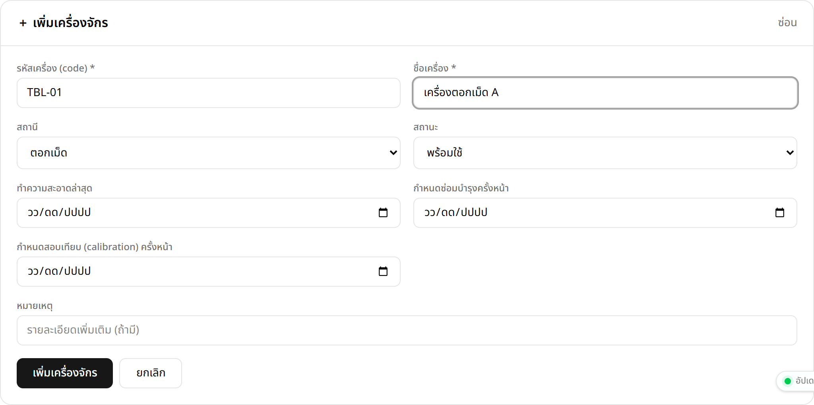

✅ จะเห็นเครื่องทั้ง 3 ในรายการ พร้อมป้ายสถานี

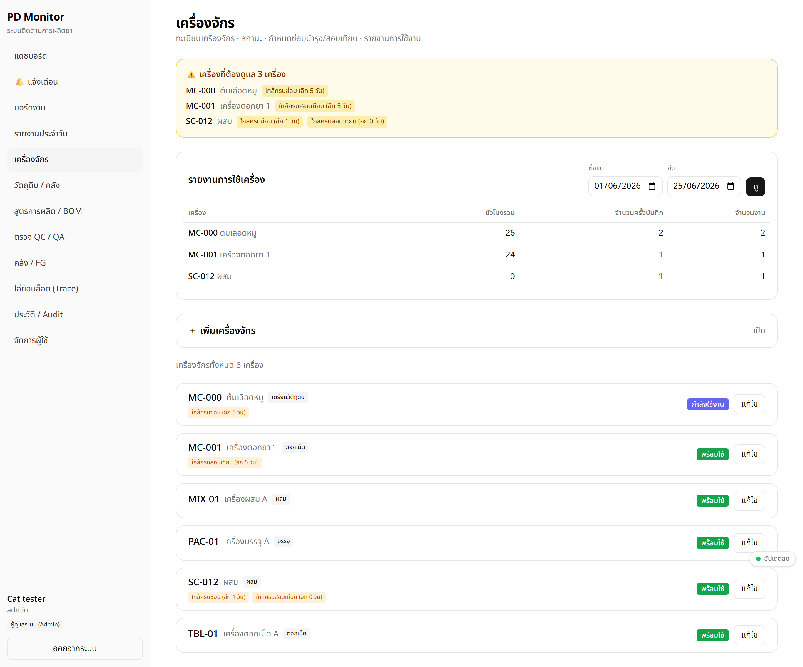

> 💡 ผูกเครื่องกับ "สถานี" ไว้ เวลาบันทึกผลผลิตระบบจะกรองให้เลือกเฉพาะเครื่องของสถานีนั้น · เครื่องที่ตั้งสถานะ "ซ่อม" จะไม่ถูกให้เลือก

## A3 · เพิ่มวัตถุดิบ + ล็อต
📍 เมนูซ้าย → **วัตถุดิบ / คลัง** → กด **＋ เพิ่มวัตถุดิบ/บรรจุภัณฑ์**

✍️ เพิ่มวัตถุดิบ 3 รายการ:

| รหัส | ชื่อ | ประเภท | หน่วย |
|---|---|---|---|
| `RM-PARA` | ผงพาราเซตามอล | วัตถุดิบ (RM) | kg |
| `RM-CORN` | แป้งข้าวโพด | วัตถุดิบ (RM) | kg |
| `PM-FOIL` | ฟอยล์แผง | บรรจุภัณฑ์ (PM) | แผ่น |

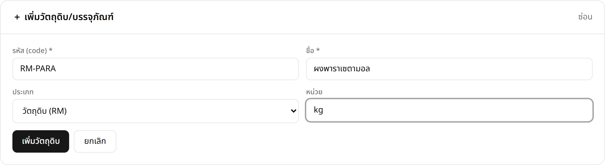

จากนั้นในการ์ดของวัตถุดิบแต่ละตัว กด **＋ เพิ่มล็อต** แล้วกรอก:

| วัตถุดิบ | เลขล็อต | คงเหลือ | สถานะ QC | วันหมดอายุ |
|---|---|---|---|---|
| RM-PARA | `RMPARA-01` | 6 | **พร้อมใช้** | +2 ปี |
| RM-CORN | `RMCORN-01` | 2 | **พร้อมใช้** | +2 ปี |
| PM-FOIL | `PMFOIL-01` | 500 | **พร้อมใช้** | +3 ปี |

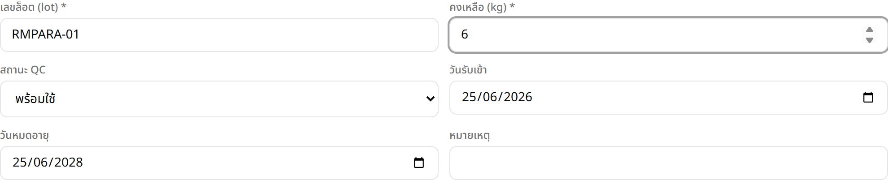

> ⚠️ **สำคัญ:** ตั้งสถานะ QC เป็น **"พร้อมใช้"** มิฉะนั้นจะเบิกไปใช้ไม่ได้ (ระบบกันล็อตที่ยังไม่ผ่าน QC / หมดอายุ)

✅ รายการวัตถุดิบจะแสดงสต็อกพร้อมใช้และวันหมดอายุของแต่ละล็อต

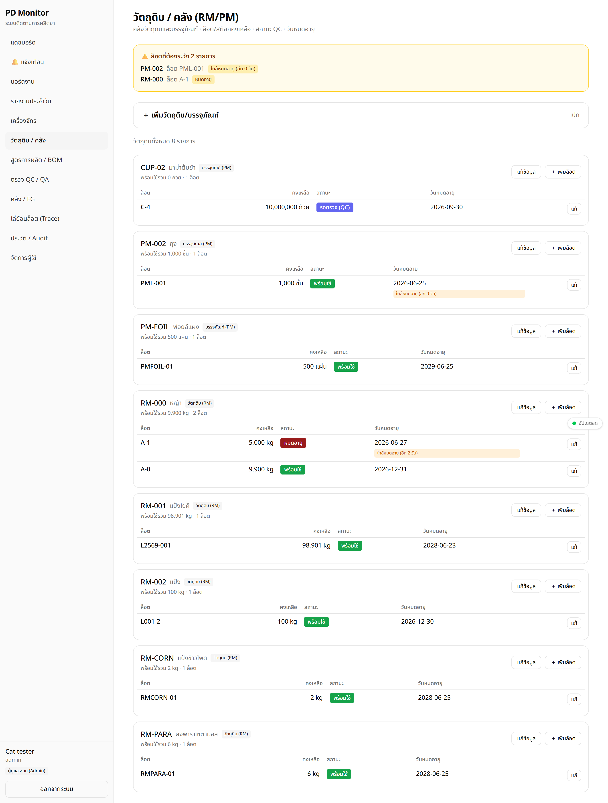

# Part B — สร้างงานผลิต + สูตร 📝
> 🔑 เข้าด้วยบัญชี **`manager@test.com`** (ผู้บริหาร)

## B1 · สร้างงานผลิตใหม่ (พร้อมเพิ่มยาใหม่)
📍 เมนูซ้าย → **บอร์ดงาน** → กด **＋ สร้างงานใหม่**

ก่อนอื่นกด **＋ เพิ่มยาใหม่** แล้วกรอกข้อมูลยา:

| ช่อง | ค่าที่กรอก |
|---|---|
| รหัสยา (code) | `PARA-500` |
| ชื่อยา | พาราเซตามอล 500 มก. |
| รูปแบบ | เม็ด |
| เวลามาตรฐาน (ชม.) | 8 |

🖱️ กด **บันทึกยาใหม่** → ยาจะถูกเลือกให้อัตโนมัติ

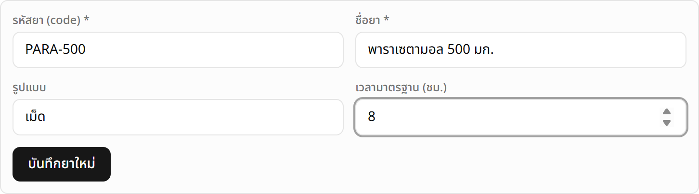

จากนั้นกรอกข้อมูลงานที่เหลือ:

| ช่อง | ค่าที่กรอก |
|---|---|
| เลขงาน (Job No) | `PARA-001` *(หรือเว้นว่างให้ระบบออกให้)* |
| ลูกค้า | บริษัท ฟาร์มาดี จำกัด |
| จำนวน | 10000 |
| หน่วย | เม็ด |
| กำหนดส่ง | + 14 วัน |
| เลขล็อต (Lot) | `6807A01` |
| แผนเริ่มผลิต / แผนเสร็จ | วันนี้ / +7 วัน |

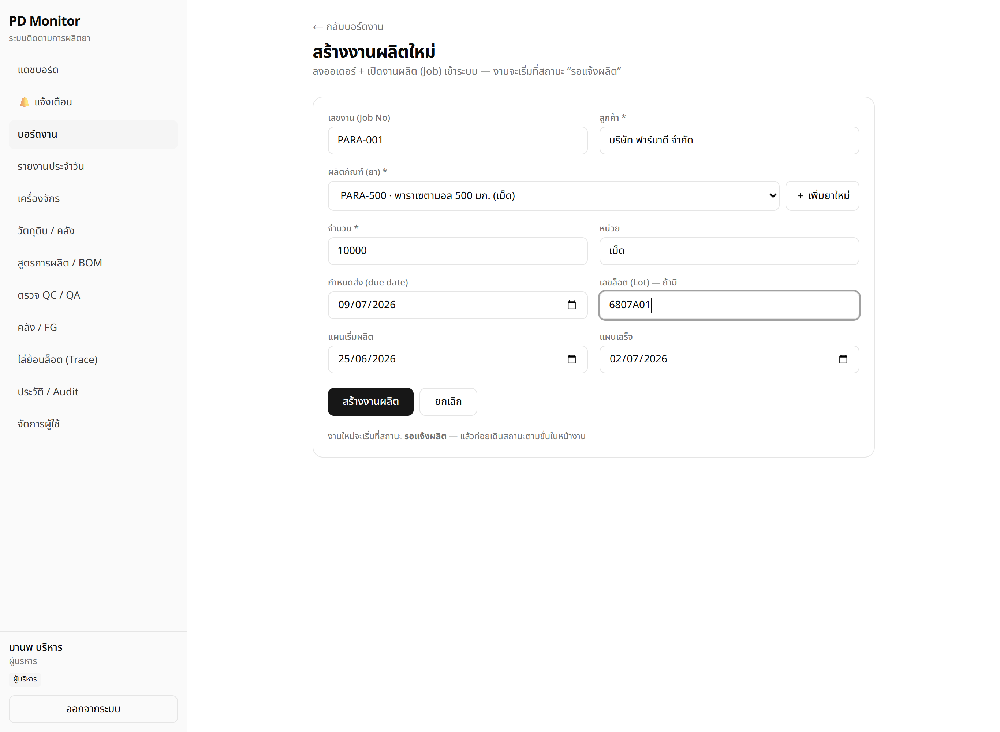

🖱️ กด **สร้างงานผลิต**

✅ ระบบพาเข้าหน้างาน **PARA-001** สถานะเริ่มต้น **"รอแจ้งผลิต"** พร้อมแถบสถานะ 6 ขั้นด้านบน

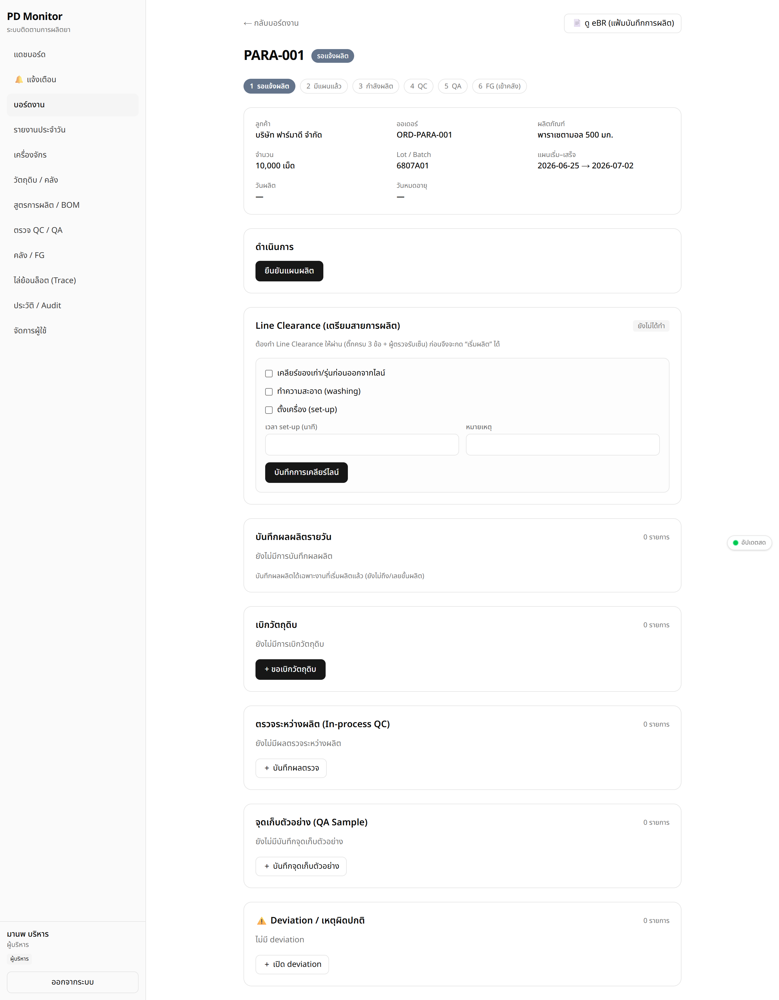

## B2 · สร้างสูตร / BOM / รูปแบบบรรจุ / ขั้นตอนการผลิต
📍 เมนูซ้าย → **สูตรการผลิต / BOM** → หาการ์ดยา **PARA-500**

**① หัวสูตร** — กด **＋ เพิ่มสูตร** กรอก: ชื่อ `สูตรมาตรฐาน v1` · ขนาดแบตช์ `10000` · หน่วย `เม็ด` → กด **เพิ่มสูตร**

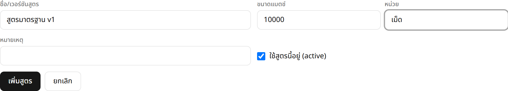

**② รายการวัตถุดิบ (BOM)** — กด **แก้รายการวัตถุดิบ** → เลือกวัตถุดิบ + จำนวน/แบตช์ (กด ＋ เพิ่มวัตถุดิบ เพื่อเพิ่มแถว):

| วัตถุดิบ | จำนวน/แบตช์ | หน่วย |
|---|---|---|
| RM-PARA · ผงพาราเซตามอล | 5 | kg |
| RM-CORN · แป้งข้าวโพด | 1 | kg |

🖱️ กด **บันทึกรายการวัตถุดิบ**

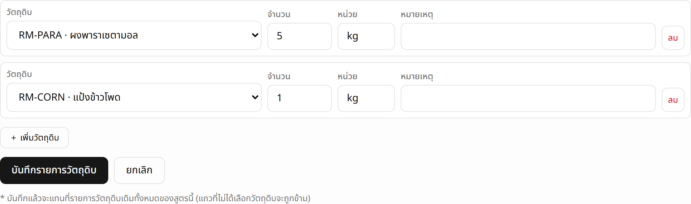

**③ รูปแบบบรรจุ** — กด **แก้บรรจุ** → เลือก `Blister` · รายละเอียด `แผง 10×10's (10 แผง × 10 เม็ด)` → **บันทึกรูปแบบบรรจุ**

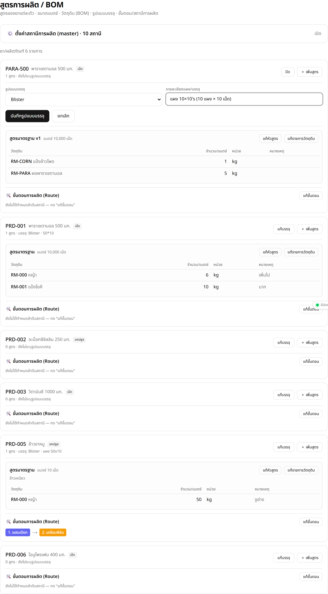

**④ ขั้นตอนการผลิต (Route)** — กด **แก้ขั้นตอน** → เลือกสถานีเรียงลำดับ (กด ＋ เพิ่มสถานี ให้ครบ 4 แถว · เลื่อนลำดับด้วย ▲▼):
ลำดับ 1 เตรียมวัตถุดิบ → 2 ผสม → 3 ตอกเม็ด → 4 บรรจุ → กด **บันทึกลำดับสถานี**

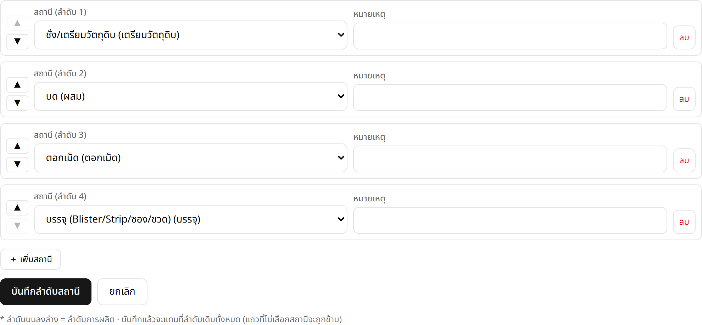

✅ การ์ดยา PARA-500 จะแสดง สูตร + BOM + รูปแบบบรรจุ + ผังขั้นตอนการผลิตครบถ้วน

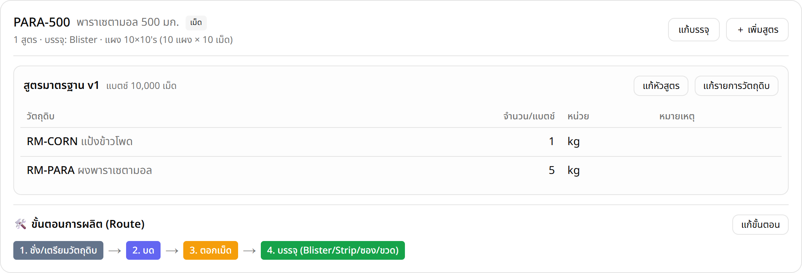

> 💡 สูตร/BOM/route ตั้งครั้งเดียว ใช้ซ้ำได้ทุกล็อตของยาตัวนี้

# Part C — เดินงานจริง 1 ล็อต (สร้าง → ปิด) 🏭
> ส่วนนี้คือหัวใจ — เราจะเดินงาน PARA-001 ผ่านครบทุกขั้น โดย **สลับบัญชีตามบทบาท**

## C1 · ยืนยันแผนผลิต
> 🔑 บัญชี **`manager@test.com`**

📍 เปิดงาน **PARA-001** → ในกล่อง **ดำเนินการ** กด **ยืนยันแผนผลิต**

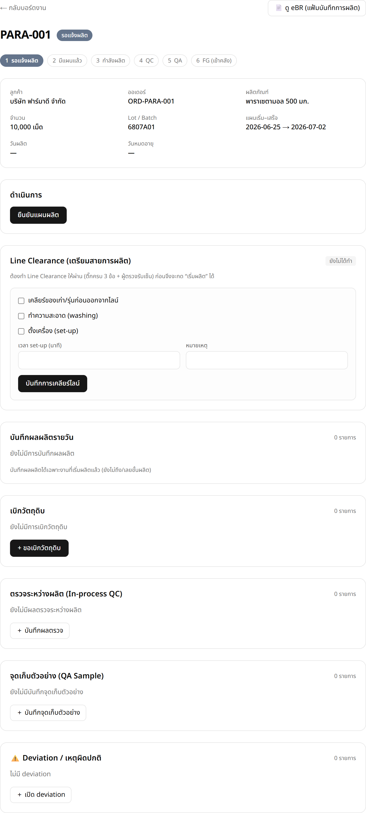

✅ สถานะเปลี่ยนเป็น **"มีแผนแล้ว"** — ฝ่ายผลิตเริ่มเตรียมงานต่อได้

## C2 · เบิกวัตถุดิบ
> 🔑 บัญชี **`production@test.com`** (ฝ่ายผลิตขอเบิก)

📍 ในหน้างาน เลื่อนไปส่วน **เบิกวัตถุดิบ** → กด **＋ ขอเบิกวัตถุดิบ** → เลือกล็อต + ใส่จำนวน:

| ล็อตที่เบิก | จำนวน |
|---|---|
| RMPARA-01 (ผงพาราเซตามอล) | 5 |
| RMCORN-01 (แป้งข้าวโพด) | 1 |

🖱️ กด **ขอเบิก** (ทำทีละรายการ)

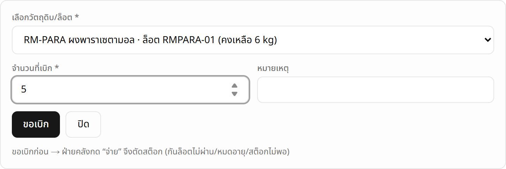

✅ รายการขึ้นสถานะ "ขอเบิก" รอฝ่ายคลังจ่าย

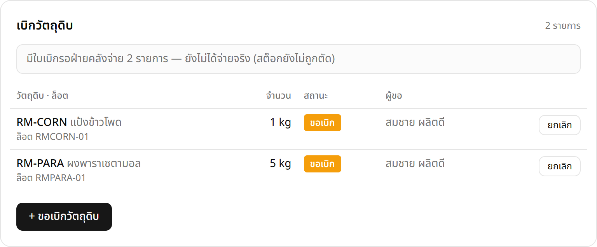

> 🔑 สลับเป็นบัญชี **`warehouse@test.com`** (ฝ่ายคลังจ่ายของ)

📍 เปิดงาน PARA-001 → ส่วนเบิกวัตถุดิบ จะเห็นปุ่ม **จ่าย** ในแต่ละรายการ → กด **จ่าย** ทุกรายการ

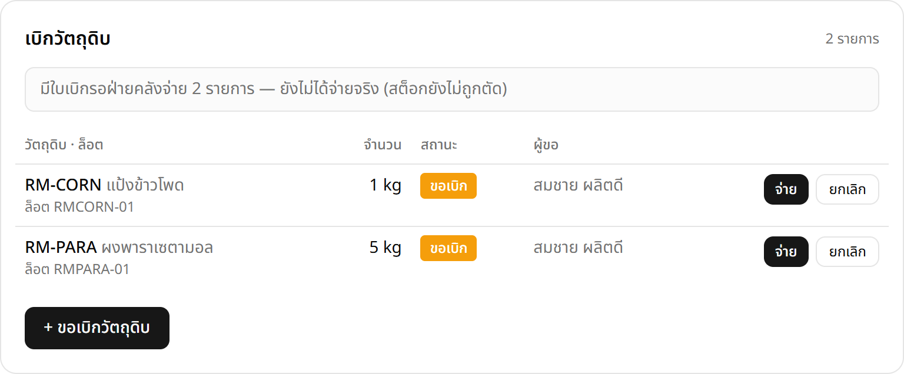

✅ สถานะเปลี่ยนเป็น **"จ่ายแล้ว"** และระบบ **ตัดสต็อกอัตโนมัติ**

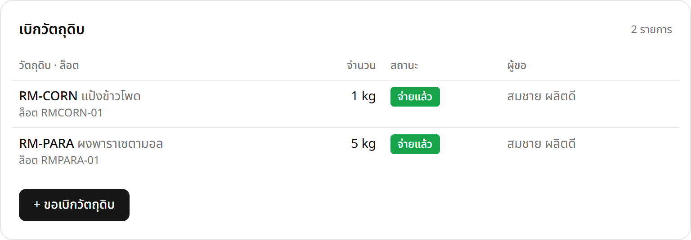

> 💡 ระบบกันจ่ายล็อตที่ไม่ผ่าน QC / หมดอายุ / สต็อกไม่พอ — ความปลอดภัยตามมาตรฐาน GMP

## C3 · Line Clearance (เคลียร์ไลน์) ⚠️
> 🔑 บัญชี **`production@test.com`** (ผู้เคลียร์)

📍 ในหน้างาน ส่วน **Line Clearance** → ติ๊กครบ 3 ข้อ + ใส่เวลา set-up:
☑ เคลียร์ของเก่า/รุ่นก่อน · ☑ ทำความสะอาด (washing) · ☑ ตั้งเครื่อง (set-up) · เวลา set-up `20` นาที
🖱️ กด **บันทึกการเคลียร์ไลน์**

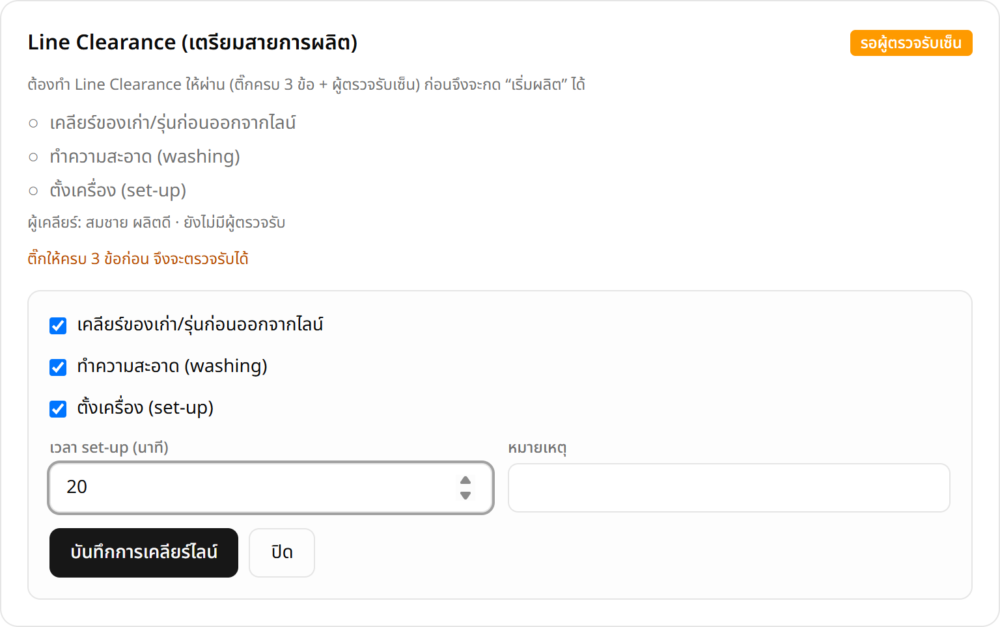

> 🔑 สลับเป็นบัญชี **`qc@test.com`** (ผู้ตรวจรับ — ต้องคนละคนกับผู้เคลียร์)

📍 เปิดงาน → ส่วน Line Clearance → กด **✍️ ตรวจรับ (เซ็นยืนยัน)**

✅ สถานะ Line Clearance = **"ผ่านแล้ว ✓"** (ครบ 2 ลายเซ็น)

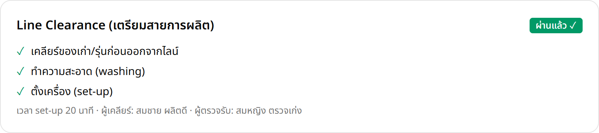

> ⚠️ **ถ้ายังไม่ผ่านขั้นนี้ จะกด "เริ่มผลิต" ไม่ได้** — ระบบบล็อกไว้ตามมาตรฐาน GMP

## C4 · เริ่มผลิต
> 🔑 บัญชี **`production@test.com`**

📍 ในกล่อง **ดำเนินการ** กด **เริ่มผลิต**

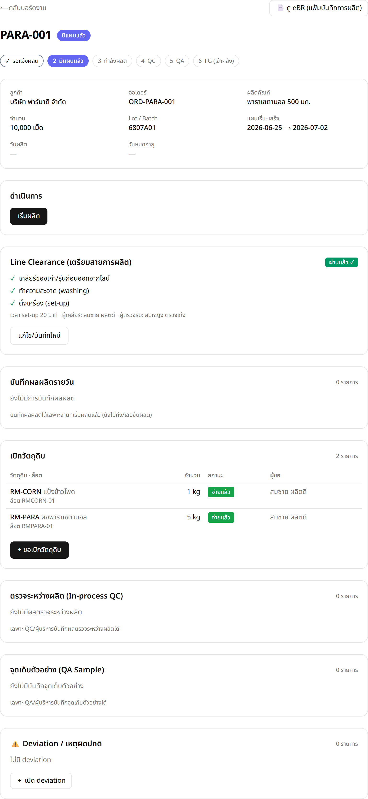

✅ สถานะเปลี่ยนเป็น **"กำลังผลิต"** — เริ่มบันทึกผลผลิตได้

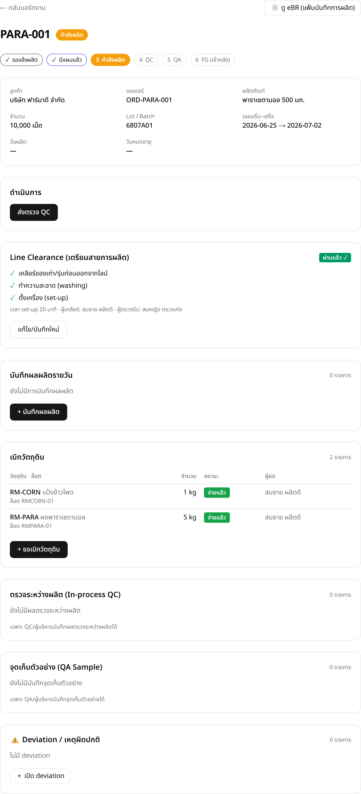

## C5 · บันทึกผลผลิตรายวัน
> 🔑 บัญชี **`production@test.com`**

📍 ส่วน **บันทึกผลผลิต** → กด **＋ บันทึกผลผลิต** → กรอกทีละสถานี (เลือกสถานีก่อน เครื่องจักรจะกรองให้):

| สถานี | เครื่อง | ตั้งต้น | ผลิตได้ | ของเสีย | ชม. | คน |
|---|---|---|---|---|---|---|
| เตรียมวัตถุดิบ | — | 10100 | 10100 | 0 | 2 | 2 |
| ผสม | MIX-01 | 10100 | 10080 | 20 | 3 | 2 |
| ตอกเม็ด | TBL-01 | 10080 | 10050 | 30 | 4 | 3 |
| บรรจุ | PAC-01 | 10050 | 10000 | 50 | 3 | 2 |

🖱️ กด **บันทึก** หลังกรอกแต่ละสถานี

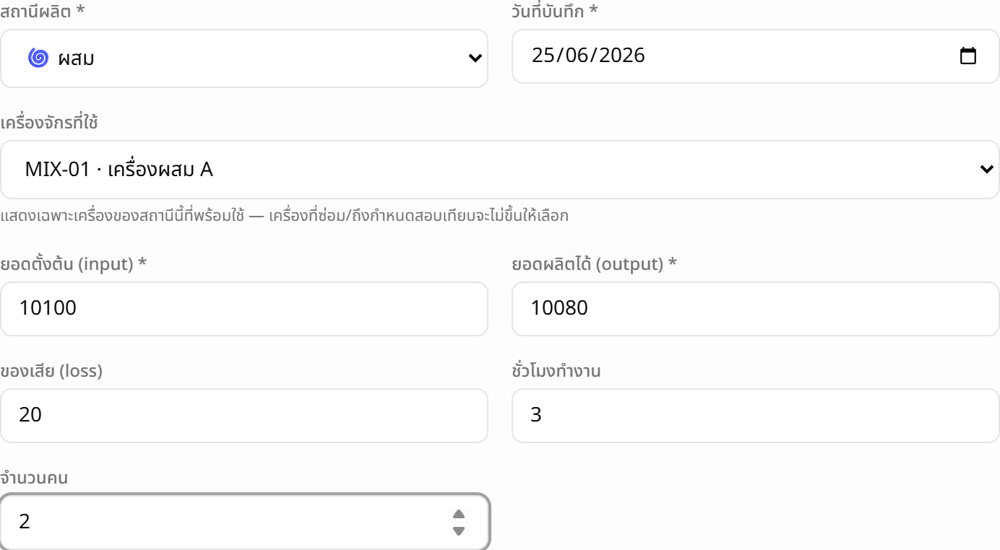

✅ ทุกรายการขึ้นในตาราง · ผลิตได้สุดท้าย 10,000 เม็ด ตรงตามออเดอร์

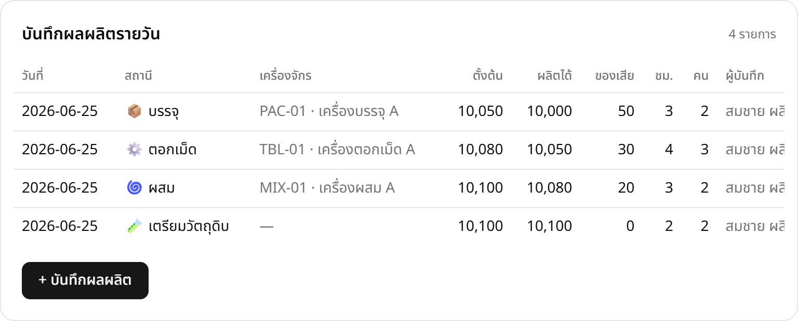

> 💡 ผลิตได้ห้ามเกินยอดตั้งต้น · เน็ตหลุดระหว่างกดบันทึก ระบบเก็บค้างไว้ส่งเองเมื่อเน็ตกลับมา (ข้อมูลไม่หาย ไม่ซ้ำ)

## C6 · ตรวจระหว่างผลิต (In-process QC)
> 🔑 บัญชี **`qc@test.com`**

📍 ในหน้างาน ส่วน **ตรวจระหว่างผลิต (In-process QC)** → กด **＋ บันทึกผลตรวจ**:
สถานี `ตอกเม็ด` · หัวข้อ `น้ำหนักเม็ด (เฉลี่ย)` · ค่า `500` · หน่วย `mg` · ผล **ผ่าน** → กด **บันทึกผลตรวจ**

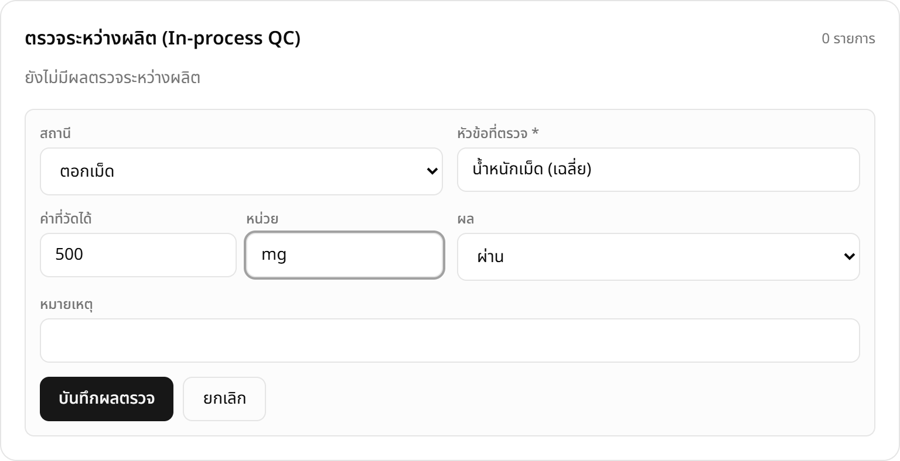

> 💡 ถ้าผล "ไม่ผ่าน" จะมีปุ่มลัดเปิด deviation ทันที (ดู C8)

## C7 · ส่งตรวจ QC แล้ว QC ลงนาม
> 🔑 บัญชี **`production@test.com`** — ผลิตเสร็จ กด **ส่งตรวจ QC**

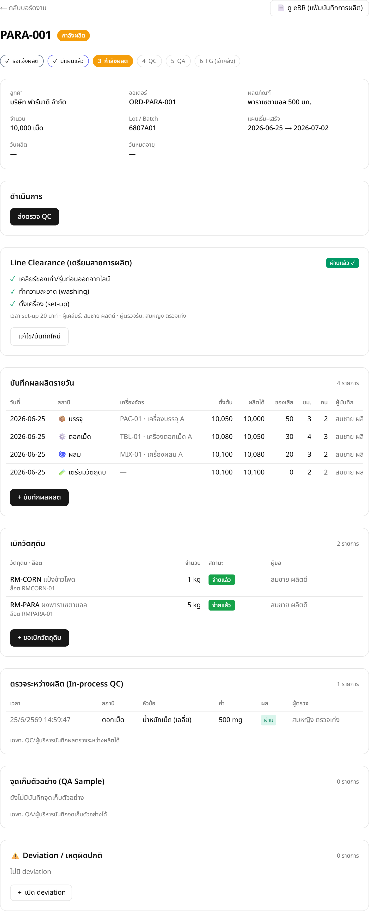

✅ สถานะเปลี่ยนเป็น **"QC"** (เข้าคิวให้ QC ตรวจ)

> 🔑 สลับเป็นบัญชี **`qc@test.com`** → เปิดงาน → กด **🖊️ QC ผ่าน → ส่ง QA**
> → ใส่ **รหัสผ่าน `123`** เพื่อลงนาม → กด **ยืนยันลงนาม**

✅ สถานะเปลี่ยนเป็น **"QA"** · ระบบบันทึกลายเซ็น (ใคร/เวลา/ผลตัดสิน) ไว้เป็นหลักฐาน

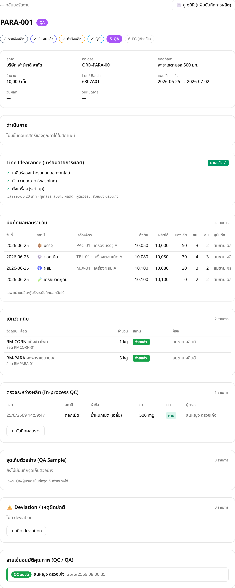

> 💡 การลงนาม = ยืนยันรหัสผ่านซ้ำ เพื่อยืนยันตัวตนจริงตามมาตรฐาน GMP (แก้ย้อนหลังไม่ได้)

## C8 · QA: เก็บตัวอย่าง + เหตุผิดปกติ (Deviation) + ปล่อยผ่าน
> 🔑 บัญชี **`qa@test.com`**

**① เก็บตัวอย่าง** — ส่วน **จุดเก็บตัวอย่าง (QA Sample)** → กด **＋ บันทึกจุดเก็บตัวอย่าง**:
จุด/รอบ `ปลายรอบบรรจุ` · จำนวน `30` · หน่วย `เม็ด` → **บันทึกจุดเก็บตัวอย่าง**

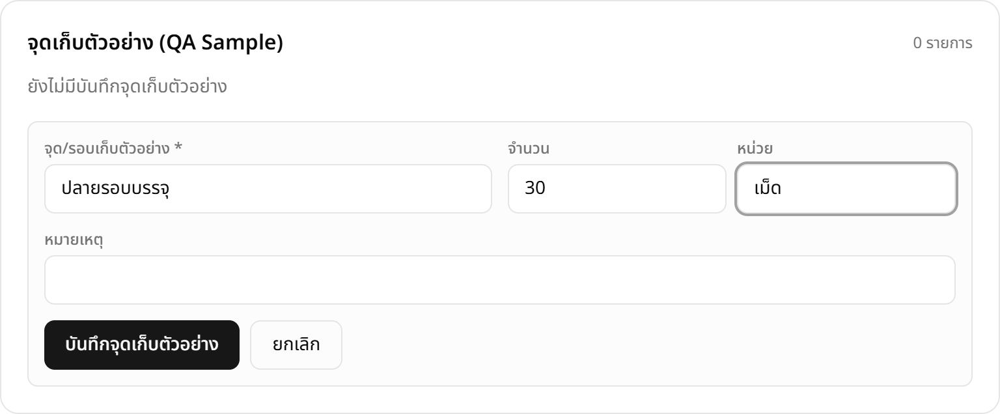

**② เปิด deviation (ฝึกเคสเจอปัญหา)** — ส่วน **⚠️ Deviation** → กด **＋ เปิด deviation**:
หัวข้อ `เม็ดบางแผงน้ำหนักเกินพิกัดเล็กน้อย` · ความรุนแรง **เล็กน้อย** · รายละเอียดตามจริง → **เปิด deviation**

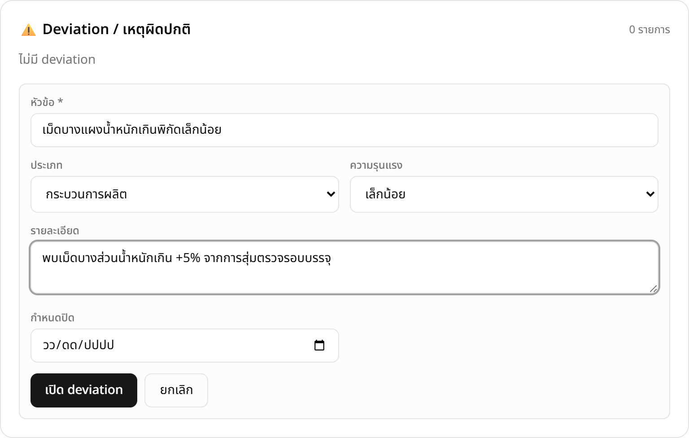

**③ ลองปล่อยผ่าน → จะถูกบล็อก** — กด **🖊️ QA ปล่อยผ่าน → FG** ใส่รหัส `123` กด **ยืนยันลงนาม**
ระบบจะแจ้งเตือนสีแดง: *"ปล่อยผ่าน FG ไม่ได้ — ยังมี deviation เปิดค้าง"*

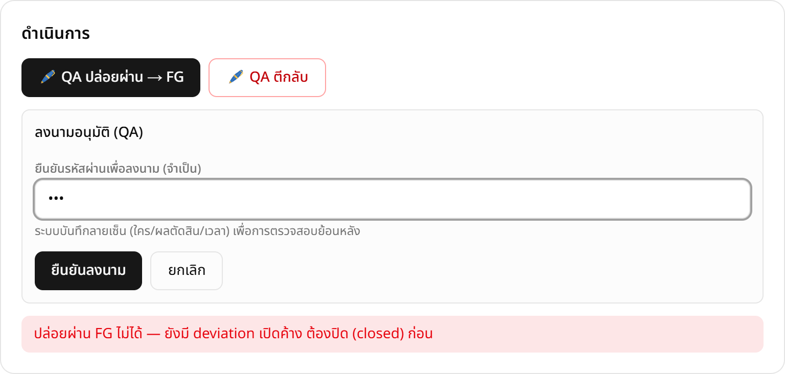

> ⚠️ นี่คือ "ด่านกั้น" สำคัญ — ตราบใดที่มี deviation เปิดค้าง ปล่อยสินค้าออกไม่ได้

**④ ปิด deviation** — ที่ deviation นั้นกด **อัปเดต / ปิด** → เปลี่ยนสถานะเป็น **ปิดแล้ว** + กรอกให้ครบ:
สาเหตุ (root cause): `ปรับตั้งน้ำหนักเครื่องตอกคลาดเคลื่อนช่วงต้นรอบ`
การแก้ไข/ป้องกัน (CAPA): `คัดแผงที่เกินพิกัดออก + เพิ่มความถี่สอบเทียบเครื่องตอกทุก 2 ชม.`
🖱️ กด **บันทึก**

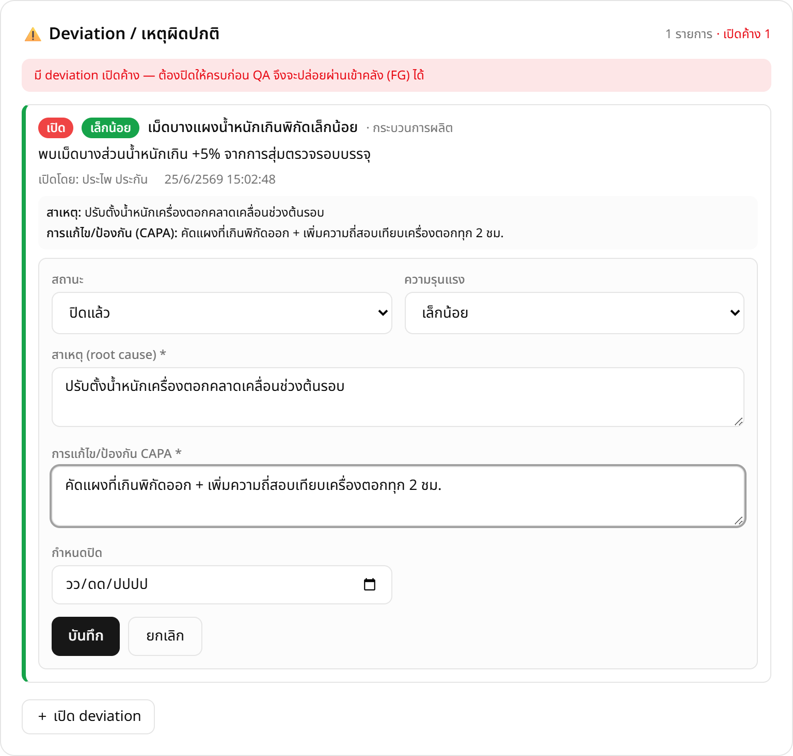

> ⚠️ ปิด deviation **ต้องกรอก root cause + CAPA** เสมอ (เฉพาะ QA/ผู้บริหารปิดได้)

**⑤ ปล่อยผ่าน → FG (สำเร็จ)** — กด **🖊️ QA ปล่อยผ่าน → FG** ใส่รหัส `123` กด **ยืนยันลงนาม**

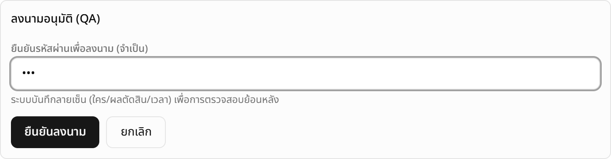

✅ สถานะเปลี่ยนเป็น **"FG (เข้าคลัง)"** — งานผ่านครบทุกด่านคุณภาพ

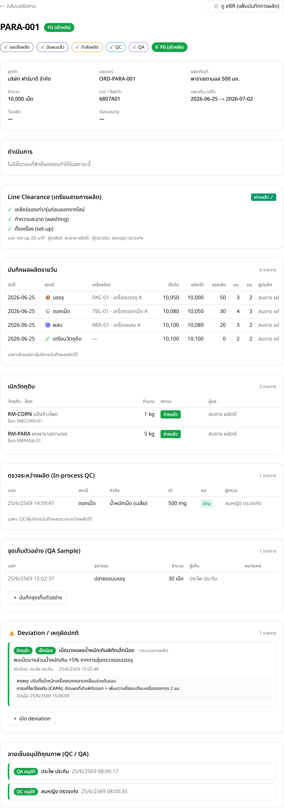

## C9 · รับสินค้าเข้าคลัง (ปิดงาน) 📦
> 🔑 บัญชี **`warehouse@test.com`**

📍 เมนูซ้าย → **คลัง / FG** → ที่การ์ด PARA-001 กด **รับเข้าคลัง** → กรอก:
จำนวนรับเข้า `10000` · ตำแหน่งจัดเก็บ `A-01` (ล็อต 6807A01 เติมให้อัตโนมัติ) → กด **รับเข้าคลัง**

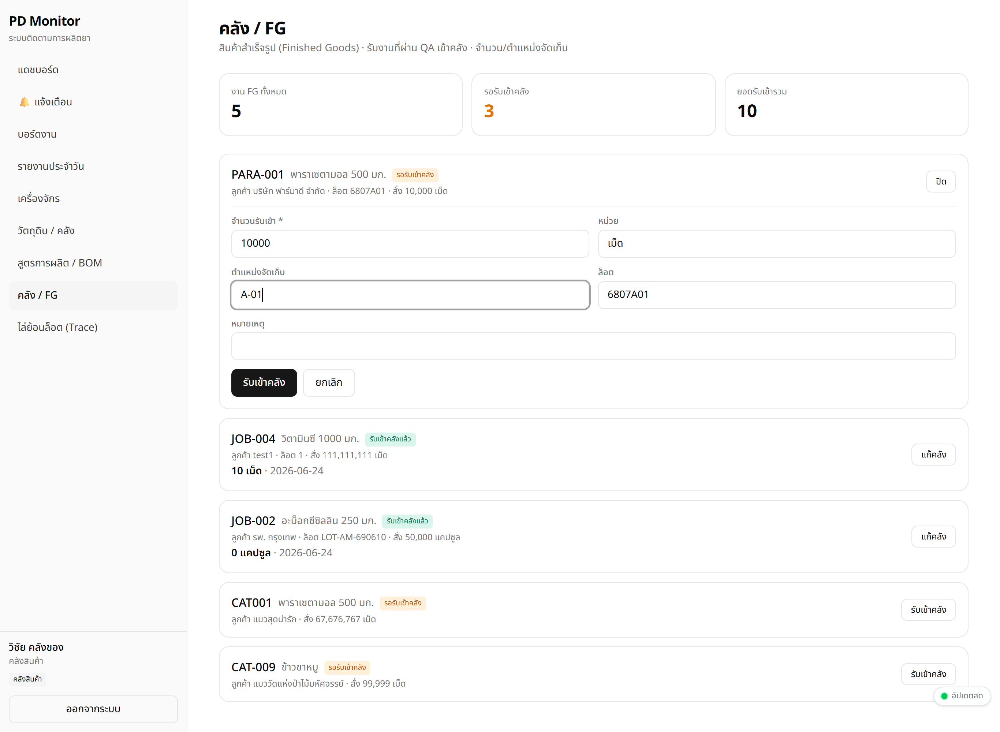

✅ การ์ดขึ้น **"รับเข้าคลังแล้ว"** · 10,000 เม็ด · ที่ A-01 — **งานจบสมบูรณ์** 🎉

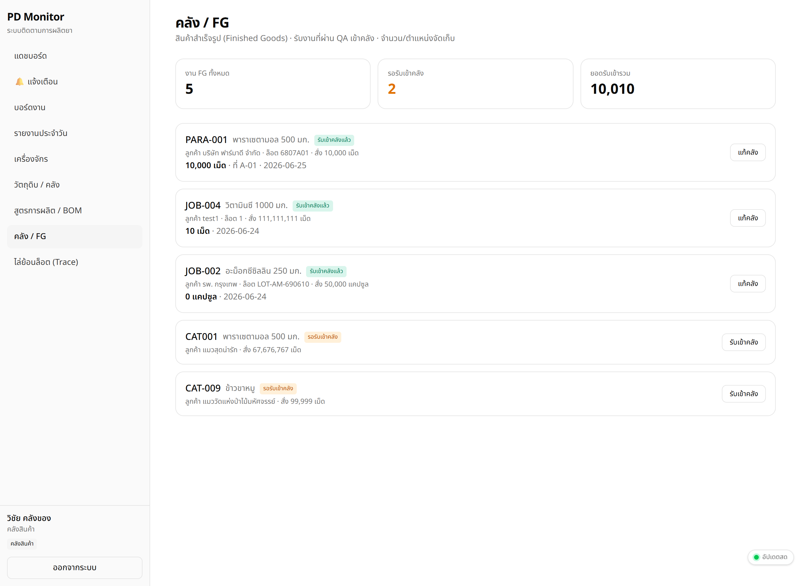

# Part D — ดูผลและเอกสาร 📊
> 🔑 เข้าด้วยบัญชี **`manager@test.com`** (เห็นได้ทุกหน้า)

## D1 · แดชบอร์ด
📍 เมนูซ้าย → **แดชบอร์ด** — เห็นจำนวนงานแต่ละสถานะ · สรุปผลผลิต/Yield · ต้นทุนค่าแรง (เฉพาะผู้บริหาร)

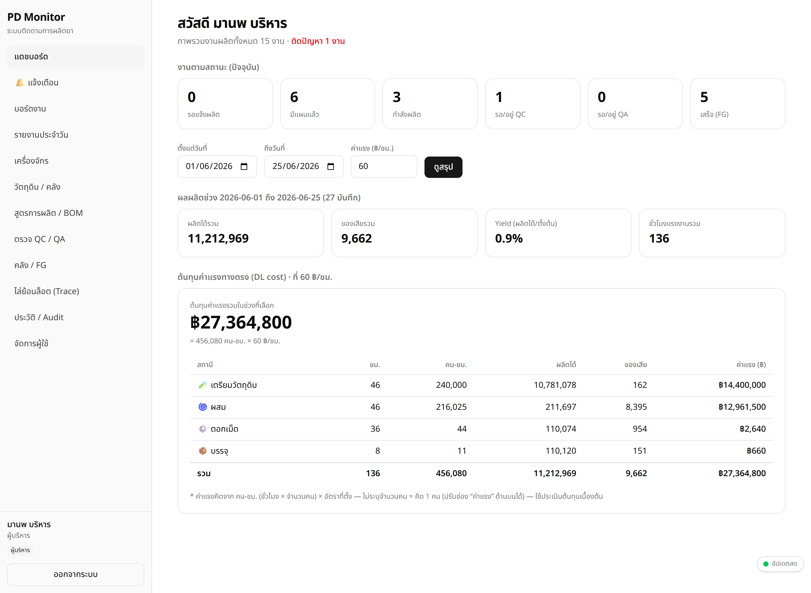

## D2 · รายงานประจำวัน
📍 เมนูซ้าย → **รายงานประจำวัน** → เลือกวันที่ที่บันทึกผล — เห็นผลผลิตแยกตามสถานี

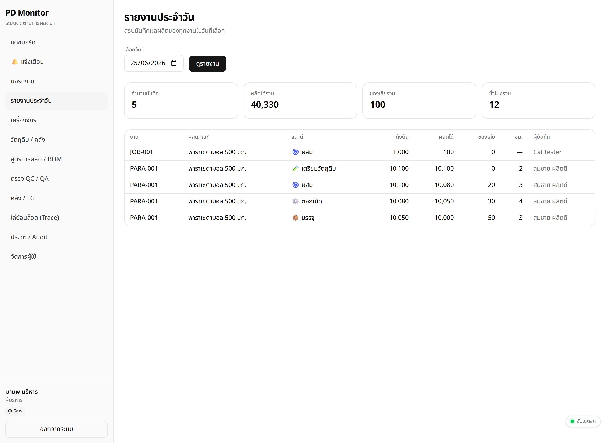

## D3 · เครื่องจักร (+ รายงานการใช้)
📍 เมนูซ้าย → **เครื่องจักร** — สถานะเครื่อง + เตือนซ่อม/สอบเทียบ + รายงานชั่วโมงการใช้

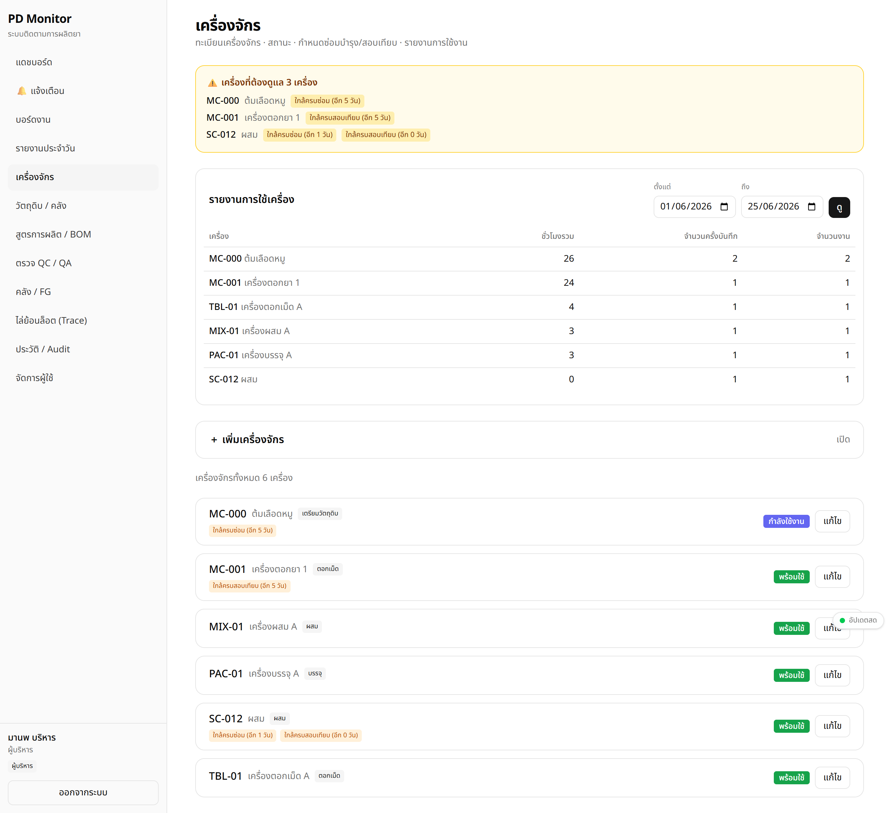

## D4 · ไล่ย้อนล็อต (Trace / Recall)
📍 เมนูซ้าย → **ไล่ย้อนล็อต (Trace)** → ค้นด้วยเลขล็อต `6807A01`
เห็นสายโซ่ **วัตถุดิบ → JOB → FG** (ตามกลับได้ว่าล็อตนี้ใช้วัตถุดิบล็อตไหน — สำคัญตอน recall)

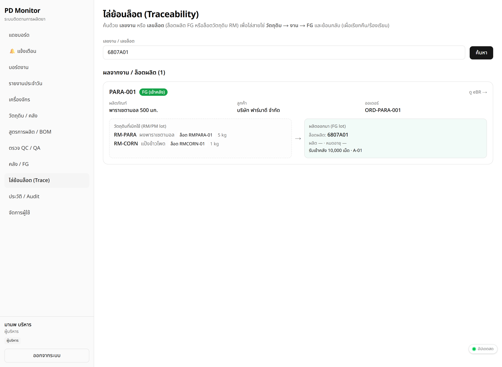

## D5 · eBR — แฟ้มบันทึกการผลิต (พิมพ์ได้)
📍 ในหน้างาน PARA-001 → กด **📄 ดู eBR** — เอกสารแฟ้มเดียวรวมทุกอย่างของล็อต เรียงตามลำดับ GMP
กดปุ่ม **พิมพ์** เพื่อบันทึกเป็น PDF / พิมพ์เก็บ

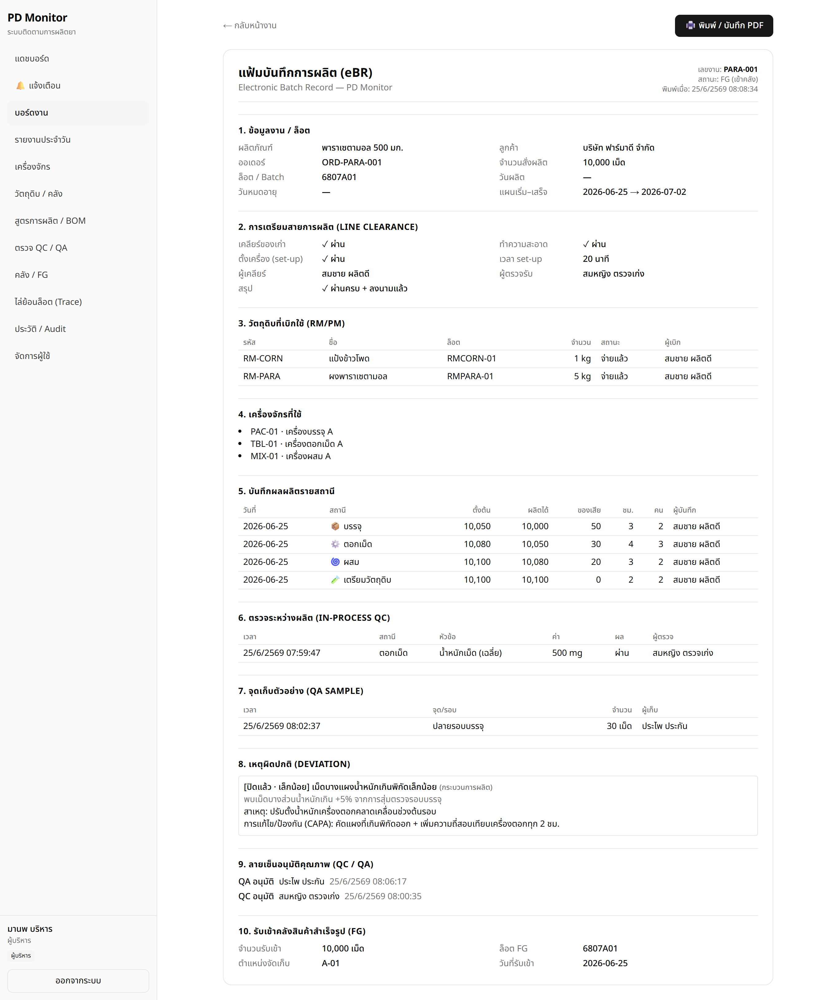

## D6 · ประวัติ / Audit
📍 เมนูซ้าย → **ประวัติ / Audit** — บันทึกทุกการเปลี่ยนแปลง (ใคร/ทำอะไร/เมื่อไหร่) แก้/ลบไม่ได้

## D7 · กล่องแจ้งเตือน
📍 เมนูซ้าย → **🔔 แจ้งเตือน** — รวมเรื่องที่เกี่ยวกับฝ่ายคุณ (งานถูกตีกลับ / deviation สำคัญ / งานเกินกำหนด)

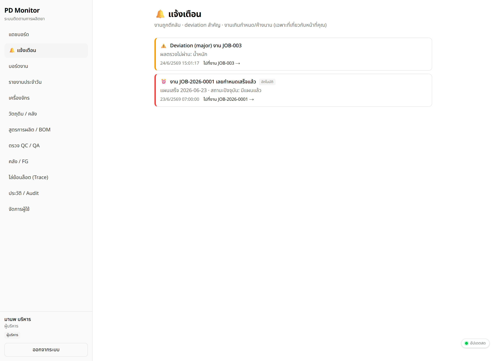

# ✅ จบแล้ว! คุณได้ใช้ครบทุกฟังก์ชัน

เช็กลิสต์สิ่งที่คุณเพิ่งทำ:
- [x] จัดการผู้ใช้ · เพิ่มเครื่องจักร · เพิ่มวัตถุดิบ + ล็อต
- [x] สร้างยา + งานผลิต · ตั้งสูตร/BOM/บรรจุ/ขั้นตอนการผลิต
- [x] ยืนยันแผน · เบิก–จ่ายวัตถุดิบ · Line Clearance (2 ลายเซ็น)
- [x] เริ่มผลิต · บันทึกผลผลิต 4 สถานี · ตรวจระหว่างผลิต (In-process QC)
- [x] ส่งตรวจ QC · ลงนาม QC · เก็บตัวอย่าง QA
- [x] เปิด/ปิด deviation (เห็นด่านกั้นก่อนปล่อย FG) · ปล่อยผ่าน FG · รับเข้าคลัง
- [x] ดูแดชบอร์ด · รายงานประจำวัน · เครื่องจักร · ไล่ย้อนล็อต · eBR · Audit · แจ้งเตือน

## อยากลองรอบใหม่ / ล้างข้อมูลทดลอง?
- จะ **ลองทำซ้ำ** ให้สร้างงานใหม่ด้วยเลขงาน/เลขล็อตใหม่ (เช่น `PARA-002` / `6807A02`) ใช้ยา PARA-500 และวัตถุดิบเดิมได้เลย
- ข้อมูลทดลองเหล่านี้อยู่ในระบบเดโม — ผู้ดูแลลบ/แก้ได้ตามต้องการ (ดูวิธีในคู่มือ Admin)

> 📌 คู่มือเล่มนี้เน้น "ลงมือทำ" · อยากเข้าใจภาพรวมแต่ละเมนูเพิ่ม ดูคู่มืออ้างอิง **user-guide.pdf**
