# คู่มือฝึกปฏิบัติ — เดินงานจริง 1 ล็อต ตั้งแต่เปิดจนปิดงาน

ภาคนี้พาคุณเดินงานผลิต **1 ล็อต ครบทั้งวงจร** ตั้งแต่ตั้งค่าระบบ เปิดงาน ผลิต ตรวจคุณภาพ ไปจนรับเข้าคลัง
อ่านเรียงจากต้นจนจบ แล้วลงมือทำตามในระบบจริงไปด้วย — ทำครบรอบเดียวก็ใช้งานเป็นทั้งระบบ

> 💡 **ทำเฉพาะขั้นที่เป็นหน้าที่ฝ่ายคุณก็ได้** — แต่ลองอ่านผ่านทุกขั้น จะเข้าใจว่าทำไมต้องรอฝ่ายอื่น
> และงานที่คุณส่งต่อไปนั้นฝ่ายถัดไปเอาไปทำอะไร

---

## เตรียมตัวก่อนเริ่ม

### บัญชีและบทบาทของคุณ

ทุกคนใช้ **บัญชีของตัวเอง** (อีเมล + รหัสผ่านส่วนตัว) ไม่มีบัญชีกลาง เพราะระบบต้องบันทึกได้ว่า
**ใครเป็นคนทำ** ทุกการกระทำ ตามหลัก GMP

ระบบมี **สิทธิ์ (role) 15 แบบ** — คนหนึ่งถือได้หลายสิทธิ์ · สิทธิ์ของคุณเห็นได้ที่ **ท้ายแถบเมนูซ้าย**

| สิทธิ์ | ตัวย่อ | ทำอะไรในภาคนี้ |
|---|---|---|
| ฝ่ายวางแผน | PLN | Part B ทั้งหมด · C1 |
| ฝ่ายผลิต | PROD | C2–C7 · C10 (ส่งตรวจ QC) |
| หัวหน้าฝ่ายผลิต | PROD-L | C5 (ยืนยัน) · C8 (อนุมัติ) |
| QC | QC | C9 · C10 |
| หัวหน้า QC | QC-L | C9 (อนุมัติผลตรวจ) |
| QA | QA | C11 · C12 · C13 |
| คลังสินค้า | WH | C2 (กดพร้อม) · C14 |
| วิศวกรรม | ENG | A4 (วันซ่อม/สอบเทียบ) |
| บัญชีต้นทุน | COST | D7 (ต้นทุนค่าแรง) |
| ผู้บริหาร | MGR | ทำแทนได้เกือบทุกขั้น ยกเว้นลงนาม QC/QA |
| ผู้ดูแลระบบ | ADM | Part A ทั้งหมด |

> 🔑 **หัวหน้าฝ่ายมีสิทธิ์ของลูกน้องเสมอ** — เช่น "หัวหน้าฝ่ายผลิต" ทำทุกอย่างที่ "ฝ่ายผลิต" ทำได้
> แต่ **ไม่ย้อนกลับ** — ฝ่ายผลิตไม่ได้สิทธิ์ของหัวหน้า นี่คือสิ่งที่ทำให้กฎ 2 ลายเซ็นทำงานได้จริง

---

### กฎ 2 ลายเซ็น — ทำไมบางขั้นต้องรออีกคน

หัวใจของระบบนี้คือ **คนทำกับคนรับรองต้องเป็นคนละคน** ระบบบังคับเองในฐานข้อมูล กดข้ามไม่ได้
มีทั้งหมด **5 ชุด** เจอครบในภาคนี้

| ชุด | ผู้ทำ | ผู้รับรอง | เจอที่ขั้น |
|---|---|---|---|
| Line Clearance | ฝ่ายผลิต | **หัวหน้าฝ่ายผลิต** | C5 |
| บันทึกผลผลิตรายวัน | ฝ่ายผลิต | **หัวหน้าฝ่ายผลิต** | C8 |
| ผลตรวจ In-process | QC | **หัวหน้า QC** | C9 |
| ลงนาม QC / QA | — | **QC / QA ตัวจริง** (ยืนยันรหัสผ่านซ้ำ) | C10 · C13 |
| คำขอแก้ไขย้อนหลัง | ใครก็ได้ | ผู้บริหาร / หัวหน้าฝ่ายที่เกี่ยว | E2 |

> 🔒 **ผู้บริหารลงนามขั้น QC/QA แทนไม่ได้** — ระบบบังคับว่าคนลงนามปล่อยผ่านต้องถือสิทธิ์ QC หรือ QA จริง
> ตามหลัก GMP ที่ว่าผู้ปล่อยผ่านต้องเป็นผู้มีคุณสมบัติของฝ่ายนั้น

---

### เส้นทางที่เราจะเดิน

งาน 1 ใบเดินผ่าน **6 สถานะหลัก** เรียงตายตัว ถอยหลังได้ทางเดียวคือ "ตีกลับ"

```
รอแจ้งผลิต ──► มีแผนแล้ว ──► กำลังผลิต ──► QC ──► QA ──► FG (เข้าคลัง)
   (PLN)         (PROD)        (PROD)      (QC)   (QA)      (WH)
                                  ▲          │      │
                                  └──────────┴──────┘
                                      ตีกลับ (ต้องลงนาม)
```

| สถานะ | ใครเป็นคนเลื่อนไปขั้นถัดไป | ปุ่มที่กด |
|---|---|---|
| รอแจ้งผลิต | ฝ่ายวางแผน / ผู้บริหาร | **"ยืนยันแผนผลิต"** |
| มีแผนแล้ว | ฝ่ายผลิต / ผู้บริหาร | **"เริ่มผลิต"** |
| กำลังผลิต | **ฝ่ายผลิตเท่านั้น** | **"ส่งตรวจ QC"** |
| QC | **QC เท่านั้น** | **"QC ผ่าน → ส่ง QA"** / **"QC ตีกลับ"** |
| QA | **QA เท่านั้น** | **"QA ปล่อยผ่าน → FG"** / **"QA ตีกลับ"** |
| FG (เข้าคลัง) | — จบงาน | (งานหายจากบอร์ด) |

> ⚠️ **"Status" กับ "สถานะ" ไม่ใช่เรื่องเดียวกัน** — ช่อง **Status** ในการ์ดข้อมูลงาน (เช่น `ไม่มีแผน` `มีแผน08/26`)
> เป็นข้อความอิสระที่ทีมใช้สื่อสารกันเอง **ไม่มีผลต่อด่าน GMP** ส่วน "สถานะ" 6 ขั้นข้างบนคือตัวที่ระบบบังคับจริง

---

# Part A — ตั้งค่าระบบ (ทำครั้งเดียว) 🔧

Part นี้ทำครั้งเดียวตอนเปิดใช้ระบบ หรือตอนมีของใหม่เข้ามา (ยาตัวใหม่ เครื่องใหม่ พนักงานใหม่)
ถ้าโรงงานคุณตั้งค่าไว้ครบแล้ว **ข้ามไป Part B ได้เลย**

> 🔑 ขั้นส่วนใหญ่ใน Part A เป็นสิทธิ์ของ **ผู้บริหาร** หรือ **ผู้ดูแลระบบ**

---

## A1 · สถานีการผลิต (master) 👔 *(ผู้บริหาร)*

"สถานี" คือขั้นตอนการผลิตของโรงงาน เช่น เตรียมวัตถุดิบ · ผสมแห้ง · ตอกเม็ด · เคลือบฟิล์ม · บรรจุ
เป็นรายการกลางที่ทุกผลิตภัณฑ์หยิบไปใช้

📍 **เมนูซ้าย → ผลิตภัณฑ์ / ขั้นตอนการผลิต** แล้วกางแผง **"⚙️ ตั้งค่าสถานีการผลิต"**

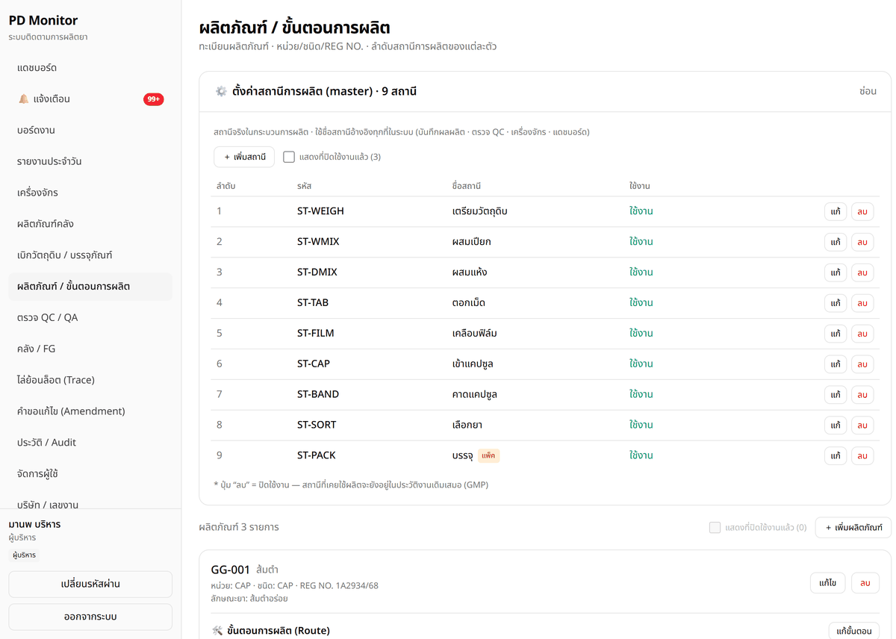

🖱️ กด **"เพิ่มสถานี"** แล้วกรอก

| ช่อง | ตัวอย่าง | อธิบาย |
|---|---|---|
| รหัส (code) * | `ST-BAND` | ห้ามซ้ำ |
| ชื่อสถานี * | `คาดแคปซูล` | ชื่อที่ทุกคนจะเห็น |
| ลำดับ | `7` | ใช้เรียงในรายการ |
| ใช้งาน | ✓ | ติ๊กออก = ซ่อนจากรายการเลือก แต่ของเก่ายังอ้างถึงได้ |
| **แพ็ค** | ☐ | ติ๊กเฉพาะ **สถานีบรรจุ** |

> ⚠️ **ธง "แพ็ค" มีผลกับแดชบอร์ด** — งานที่บันทึกผลผลิตล่าสุดอยู่ที่สถานีที่ติ๊ก "แพ็ค"
> จะถูกนับเข้าช่อง **"แพ็ค"** ของบล็อก Pending Order · ถ้าไม่ติ๊กเลย ช่องนั้นจะเป็น 0 ตลอด

---

## A2 · ทะเบียนผลิตภัณฑ์ 👔📦 *(ผู้บริหาร / วางแผน / คลัง)*

📍 **เมนูซ้าย → ผลิตภัณฑ์ / ขั้นตอนการผลิต** → 🖱️ **"＋ เพิ่มผลิตภัณฑ์"**

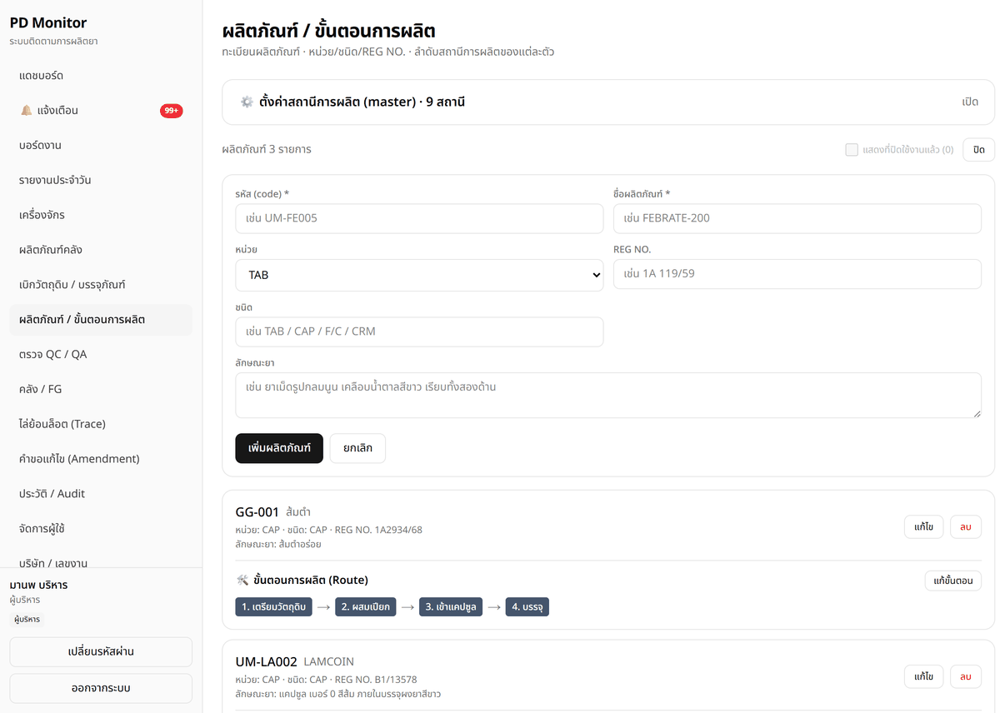

✍️ ช่องที่ต้องกรอก

| ช่อง | บังคับ | ตัวอย่าง | ไปโผล่ที่ไหน |
|---|:---:|---|---|
| รหัส (code) | ✓ | `UM-FE005` | คอลัมน์ CODE บนตารางบอร์ดงาน |
| ชื่อผลิตภัณฑ์ | ✓ | `FEBRATE-200` | ทุกที่ที่พูดถึงงานนี้ |
| หน่วย | | `TAB` · `CAP` | ล็อกให้งานที่ใช้ยาตัวนี้ |
| REG NO. | | `1A 119/59` | ช่อง REG. NO. บนใบแจ้งผลิต |
| ชนิด | | `TAB / CAP / F/C / CRM` | คอลัมน์ "ชนิด" |
| **ลักษณะยา** | | `ยาเม็ดกลมนูน เคลือบน้ำตาลสีขาว เรียบทั้งสองด้าน` | ช่อง **"รูปร่างลักษณะยา"** บนใบแจ้งผลิต |

> ⚠️ **รหัสยา · REG NO. · ลักษณะยา แก้ได้ที่หน้านี้ที่เดียว** — ในหน้ารายละเอียดงานจะเป็นแบบอ่านอย่างเดียว
> เพราะถ้าปล่อยให้แก้รายงาน ข้อมูลของยาตัวเดียวกันจะไม่ตรงกันระหว่างงาน

> 💡 **ลบผลิตภัณฑ์มี 2 ระดับ** — ปุ่ม **"ลบ"** ธรรมดาจะเปลี่ยนเป็น "ปิดใช้งาน" ให้อัตโนมัติถ้ายังมีงานอ้างถึงอยู่ ·
> ส่วน **"🗑️ ลบถาวร"** (ผู้บริหารเท่านั้น) จะบอกก่อนว่าลบไม่ได้เพราะมีอะไรผูกอยู่ และต้องยืนยันด้วยรหัสผ่าน

---

## A3 · ขั้นตอนการผลิต (Route) ของผลิตภัณฑ์ 👔 *(ผู้บริหารเท่านั้น)*

Route คือ **ลำดับสถานีที่ยาตัวนี้ต้องเดินผ่าน** — ระบบใช้ Route ตัดสินว่า
บันทึกผลผลิตได้ที่สถานีไหนบ้าง · ต้องตรวจ in-process กี่สถานีถึงจะครบ · และงานอยู่สถานีอะไร

📍 ในการ์ดของผลิตภัณฑ์ → 🖱️ **"แก้ขั้นตอน"**

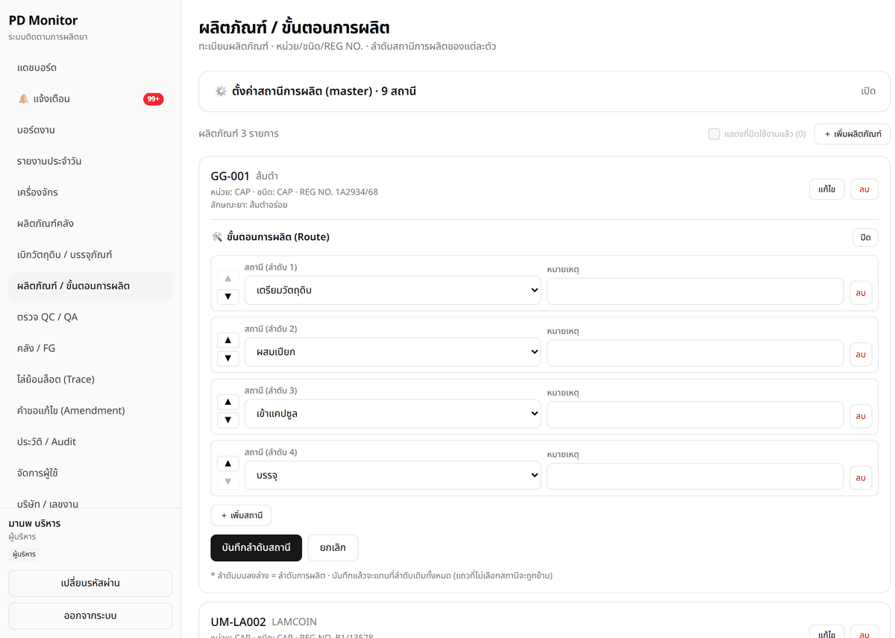

🖱️ เลือกสถานีทีละตัว จัดลำดับด้วย **"เลื่อนขึ้น" / "เลื่อนลง"** ใส่หมายเหตุได้ แล้วกด **"บันทึกลำดับสถานี"**

> ⚠️ **ยาที่ยังไม่มี Route จะขึ้นแถบเตือนสีแดงในหน้ารายละเอียดงาน** และบันทึกผลผลิตไม่ได้
> ถ้าเจอแถบนี้ให้กลับมาตั้ง Route ก่อน

---

## A4 · เครื่องจักร 🏭🔧 *(ฝ่ายผลิต / วิศวกรรม / ผู้บริหาร)*

📍 **เมนูซ้าย → เครื่องจักร** → 🖱️ **"＋ เพิ่มเครื่องจักร"**

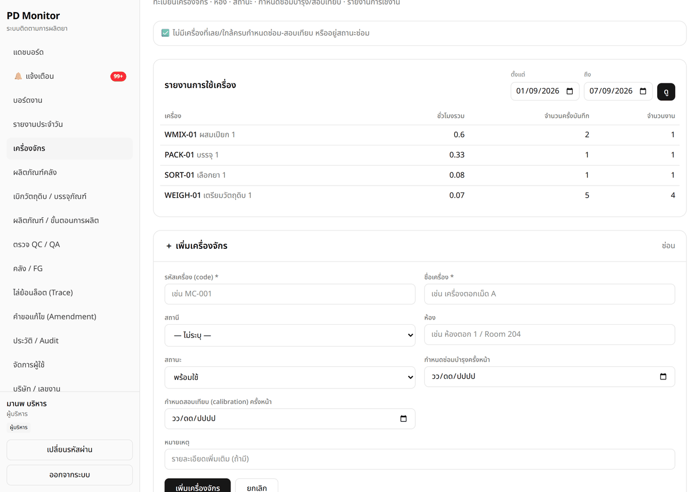

| ช่อง | ตัวอย่าง | หมายเหตุ |
|---|---|---|
| รหัสเครื่อง (code) * | `MC-001` | ห้ามซ้ำ |
| ชื่อเครื่อง * | `เครื่องตอกเม็ด A` | |
| สถานี | `ตอกเม็ด` | **ผูกเครื่องกับสถานี** — ตอนเลือกเครื่องให้ขั้นตอนของงาน ระบบจะโชว์เฉพาะเครื่องของสถานีนั้น |
| ห้อง | `ห้องตอก 1` | ไปโผล่ในบันทึก Line Clearance |
| สถานะ | พร้อมใช้ | 5 ค่า ดูด้านล่าง |

**สถานะเครื่องจักร 5 ค่า:** พร้อมใช้ · กำลังใช้งาน · ทำความสะอาด · ซ่อมบำรุง · ถึงกำหนดสอบเทียบ

> ⚠️ **เครื่องที่อยู่สถานะ "ซ่อมบำรุง" หรือ "ถึงกำหนดสอบเทียบ" จะไม่ขึ้นให้เลือกในฟอร์มบันทึกผลผลิต**
> — ตั้งใจกันไม่ให้เผลอบันทึกว่าใช้เครื่องที่ยังใช้ไม่ได้

> 🔑 **กำหนดวันซ่อมบำรุง / วันสอบเทียบครั้งหน้า** เป็นสิทธิ์ของ **ฝ่ายวิศวกรรม** และผู้บริหารเท่านั้น
> ฝ่ายผลิตเพิ่ม/แก้ทะเบียนเครื่องได้ แต่ตั้ง 2 วันนี้ไม่ได้

---

## A5 · บริษัท / เลขงาน 👔 *(ผู้บริหารเท่านั้น)*

ระบบออกเลขงาน (Job No.) ให้อัตโนมัติ **แยกชุดตามบริษัท** — หน้านี้คือที่ตั้งว่าเลขจะเริ่มที่เท่าไร

📍 **เมนูซ้าย → บริษัท / เลขงาน**


| ช่อง | ความหมาย |
|---|---|
| อักษรนำหน้าเลขงาน | เช่น POND ใช้ `P` นำหน้า · UMEDA ไม่มี |
| เลขตั้งต้นเมื่อขึ้นปีใหม่ | พอเปลี่ยน พ.ศ. ระบบจะเริ่มนับใหม่จากเลขนี้ |

> ⚠️ **บริษัทของงานเปลี่ยนทีหลังไม่ได้** — เพราะเลขงานถูกออกไปแล้วตามชุดของบริษัทนั้น
> เลือกบริษัทให้ถูกตั้งแต่ตอนสร้างงาน

---

## A6 · เปิดบัญชีให้ทีม 👔 *(ผู้บริหาร / หัวหน้าแผนก)*

📍 **เมนูซ้าย → จัดการผู้ใช้**


🖱️ กด **"＋ สร้างบัญชีผู้ใช้ใหม่"**

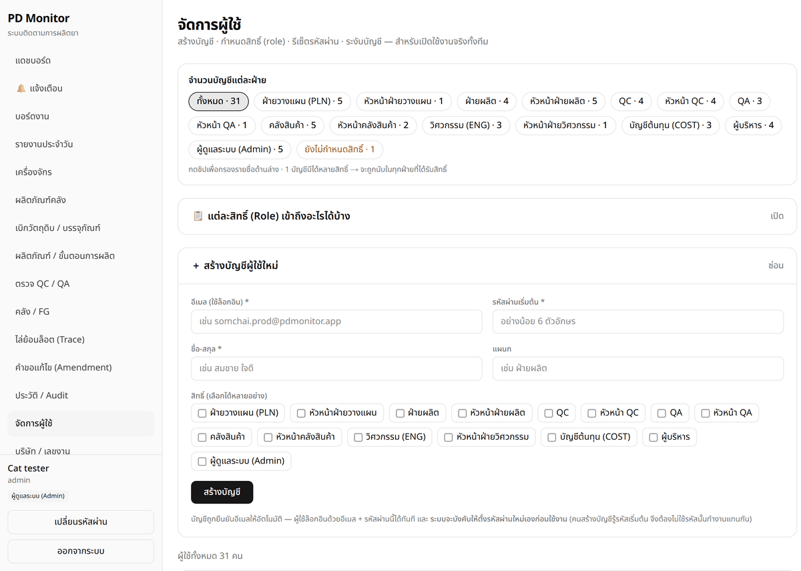

✍️ กรอก **อีเมล** · **รหัสผ่านเริ่มต้น** (อย่างน้อย 6 ตัว) · **ชื่อ-สกุล** · **แผนก** · ติ๊ก **สิทธิ์ (role)**

> 💡 **เจ้าตัวจะถูกบังคับตั้งรหัสผ่านใหม่เองตอนล็อกอินครั้งแรก** — รหัสที่คุณตั้งให้เป็นแค่รหัสชั่วคราว
> คุณจึงไม่จำเป็นต้องรู้รหัสจริงของใคร

> 🔑 **หัวหน้าแผนกเห็นเฉพาะลูกน้องในฝ่ายตัวเอง** และตั้งได้เฉพาะสิทธิ์ของฝ่ายตัวเอง ·
> **ผู้บริหารกับผู้ดูแลระบบเห็นทุกคน**

ในแผงของแต่ละคนยังทำได้อีก 4 อย่าง — **แก้ชื่อ/แผนก** · **แก้สิทธิ์** · **รีเซ็ตรหัสผ่าน** ·
**ระงับบัญชี (บล็อกล็อกอิน)** และ **ลบบัญชี**

> ⚠️ **ลบบัญชีที่เคยทำงานแล้ว ระบบจะไม่ลบประวัติทิ้ง** — จะปิดการล็อกอิน ล้างสิทธิ์ ปลดอีเมล
> แล้วซ่อนชื่อออกจากรายชื่อแทน เพราะลายเซ็นและประวัติในระบบต้องอยู่ครบตาม GMP
> · ระงับ/ลบ **บัญชีตัวเอง** ไม่ได้

หน้านี้ยังมีตารางอ้างอิง **"📋 แต่ละสิทธิ์ (Role) เข้าถึงอะไรได้บ้าง"** พับอยู่ กดกางดูได้ทุกเมื่อ

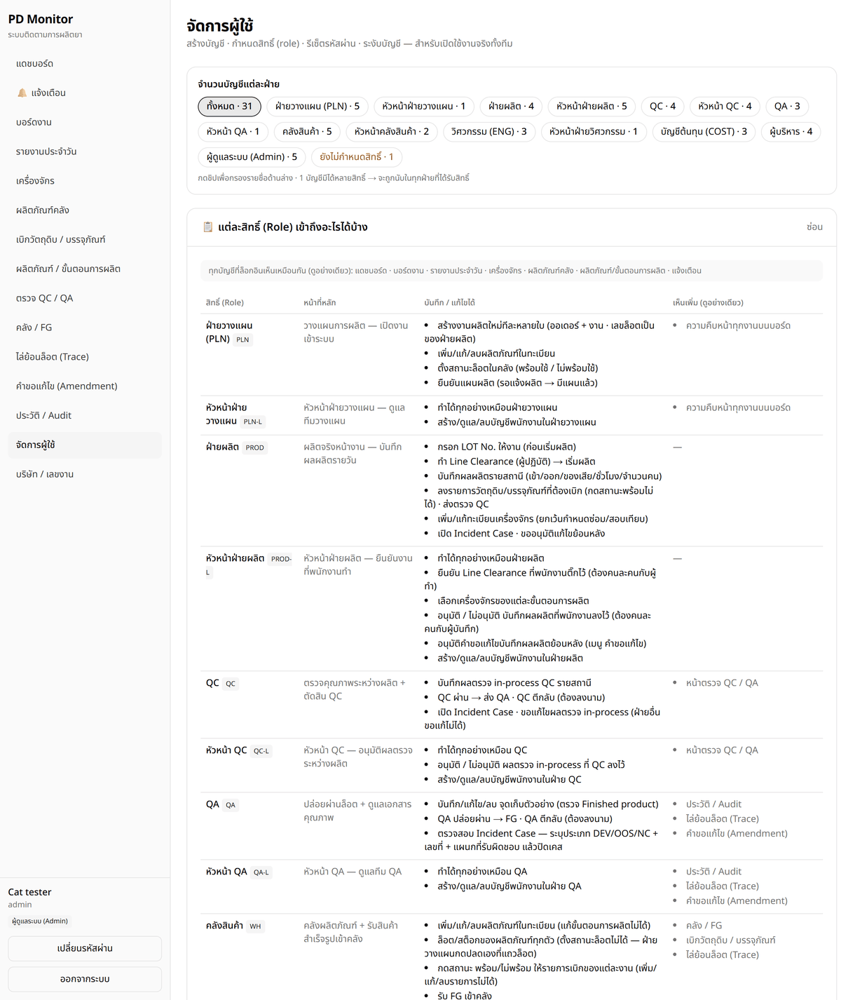

---

# Part B — เปิดงานผลิต 📝

## B1 · สร้างงานผลิตใหม่ 📋 *(ฝ่ายวางแผน / ผู้บริหาร)*

📍 **เมนูซ้าย → บอร์ดงาน** → 🖱️ ปุ่ม **"＋ สร้างงานใหม่"** มุมขวาบน

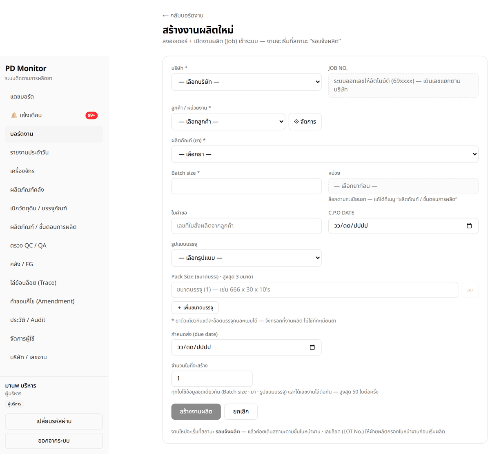

✍️ กรอกตามนี้

| ช่อง | บังคับ | อธิบาย |
|---|:---:|---|
| **บริษัท** | ✓ | ตัวกำหนดชุดเลขงาน — **เลือกผิดแก้ทีหลังไม่ได้** |
| **ลูกค้า / หน่วยงาน** | ✓ | เลือกจากทะเบียนลูกค้า (พิมพ์เองอิสระไม่ได้) |
| **ผลิตภัณฑ์ (ยา)** | ✓ | เลือกจากทะเบียน · **หน่วยจะถูกล็อกตามยาที่เลือกทันที** |
| จำนวนผลิต | | Batch Size |
| ใบคำขอ | | เลขที่ใบสั่งผลิตจากลูกค้า — ใบที่สร้างพร้อมกันใช้เลขนี้ร่วมกัน |
| C.P.O DATE | | วันที่ลูกค้าสั่งผลิต |
| กำหนดส่ง (due date) | | |
| รูปแบบบรรจุ + ขนาดบรรจุ 1–3 | | ตรงกับช่องบนใบแจ้งผลิต F.PLN.01 |
| หมายเหตุ | | ข้อความที่จะไปอยู่บนใบแจ้งผลิต (บริษัท POND ใช้ช่องนี้เป็นหลัก) |
| **จำนวนใบที่จะสร้าง** | | สร้างทีเดียวได้สูงสุด **50 ใบ** เลขงานไล่ต่อกันอัตโนมัติ |

🖱️ กด **"สร้างงานผลิต"**

✅ **ผลที่ควรเห็น** — กลับมาที่บอร์ดงาน มีงานใหม่อยู่คอลัมน์ **"รอแจ้งผลิต"** พร้อมเลขงานที่ระบบออกให้

> ⚠️ **ไม่มีช่อง LOT No. ในหน้านี้ — ถูกต้องแล้ว** เลขล็อตเป็นของฝ่ายผลิตที่รู้หน้างานจริง
> จะไปกรอกที่ขั้น C3

> 💡 **สร้างทีละหลายใบใช้ตอนไหน** — ลูกค้าสั่งยาตัวเดียวกันหลายล็อตในใบคำขอเดียว
> ใส่ "จำนวนใบที่จะสร้าง" เป็น 5 ระบบจะออกเลขงาน 5 เลขให้ในครั้งเดียว

---

## B2 · ดูงานบนบอร์ด 👀 *(ทุกฝ่าย)*

📍 **เมนูซ้าย → บอร์ดงาน**


- **การ์ดแบ่งตามสถานะ 6 ขั้น** — สีของป้ายบอกสถานะ
- **🔍 ค้นหา** ได้ด้วย เลขงาน / Lot / ลูกค้า / ชื่อยา
- **ตัวกรอง** — สถานะ · บริษัท · **"🔴 เฉพาะงานมีปัญหา"**
- ป้ายปัญหา 3 แบบ: 🔴 ติดปัญหา · 🟡 รอแก้ไข · 🟠 ล่าช้า

> 💡 **งานที่รับเข้าคลัง (FG) แล้วจะหายไปจากบอร์ด** — ไม่ได้ถูกลบ ยังค้นหาเจอและเปิด eBR ได้
> แค่ไม่รกบอร์ดของงานที่ยังเดินอยู่

🖱️ **กดที่การ์ด** เพื่อเข้าหน้ารายละเอียดงาน — ที่ที่งานทั้งหมดเกิดขึ้น

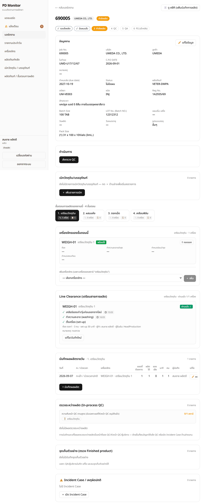

---

## B3 · การ์ดข้อมูลงาน 📇 *(แก้ได้ตามฝ่าย)*

การ์ดบนสุดของหน้ารายละเอียดงาน — รวมข้อมูลทั้งหมดของงานใบนี้

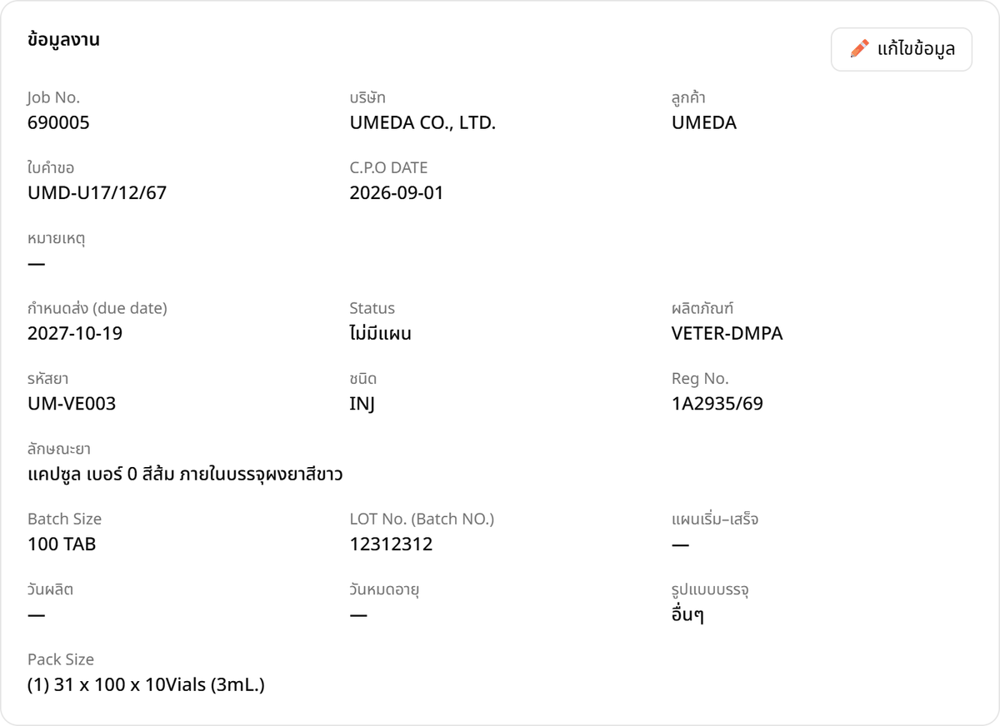

🖱️ กด **"✏️ แก้ไขข้อมูล"** เพื่อเข้าโหมดแก้ไข แก้หลายช่องแล้วกด **"บันทึก"** ทีเดียว

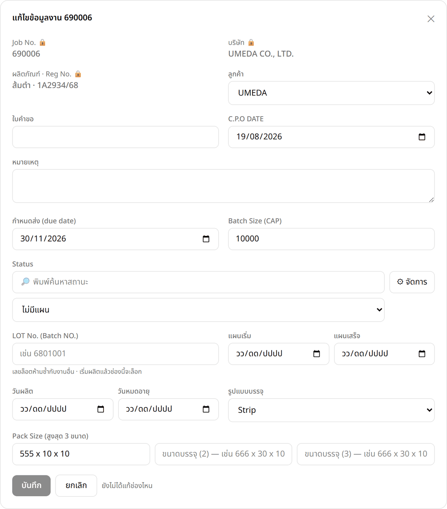

**ใครแก้ช่องไหนได้ และช่องไหนล็อกเมื่อไร**

| ช่อง | ฝ่ายที่แก้ได้ | ล็อกเมื่อสถานะถึง |
|---|---|---|
| Status · เดือนแผน · หมายเหตุ | วางแผน + ผลิต | ไม่ล็อก |
| กำหนดส่ง | วางแผน | ไม่ล็อก |
| ลูกค้า · C.P.O DATE · ใบคำขอ | วางแผน (ใบคำขอ = ทั้งสองฝ่าย) | **FG** |
| แผนเริ่ม · แผนเสร็จ | ผลิต | **FG** |
| Batch Size · รูปแบบบรรจุ · Pack Size 1–3 | วางแผน | **กำลังผลิต** |
| LOT No. (Batch NO.) | ผลิต | ไม่ล็อก |
| วันผลิต · วันหมดอายุ | ทั้งสองฝ่าย (ต้องมีเลขล็อตก่อน) | ไม่ล็อก |

> 🔒 **ช่องที่ล็อกแล้วยังแก้ได้ แต่ต้องระบุเหตุผล** — ระบบจะขอเหตุผลก่อนบันทึก แล้วเก็บลงประวัติ (Audit)
> ตัวอย่างเหตุผลที่ใช้จริง: *"ฝ่ายขายแจ้งแก้จำนวนสั่งผลิตหลังเปิดงาน"*

> ⚠️ **Job No. · รหัสยา · REG NO. · ลักษณะยา แก้ที่นี่ไม่ได้เลย** — เลขงานระบบออกให้
> ส่วนข้อมูลยาต้องไปแก้ที่หน้าทะเบียนผลิตภัณฑ์ (A2)

---

## B4 · ปริ้นใบแจ้งผลิต F.PLN.01 🖨️ *(ฝ่ายวางแผน / ผู้บริหาร)*

ใบแจ้งผลิตคือกระดาษที่ส่งลงหน้างาน — ระบบพิมพ์ให้เหมือนฟอร์มกระดาษเดิมทุกช่อง

📍 **บอร์ดงาน → ปุ่ม "🖨️ ปริ้นใบแจ้งผลิต"** (เห็นเฉพาะฝ่ายวางแผนกับผู้บริหาร)

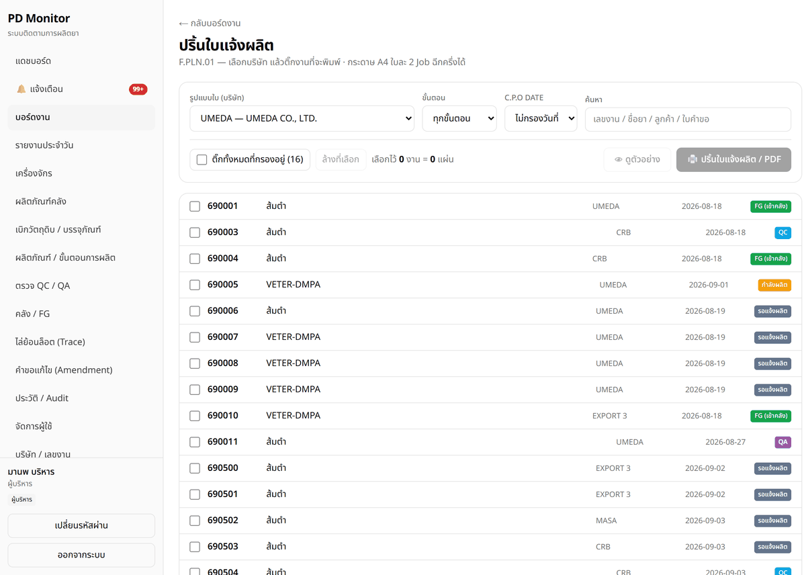

**ขั้นตอน**

1. 🖱️ เลือก **รูปแบบใบ (บริษัท)** — UMEDA และ POND ใช้ฟอร์มคนละแบบ
2. 🖱️ กรองงานด้วย **ขั้นตอน** · **C.P.O DATE** (ปี / เดือน+ปี / วัน) หรือช่อง **ค้นหา**
3. 🖱️ **ติ๊กงาน** ที่จะพิมพ์ (หรือกด "ติ๊กทั้งหมดที่กรองอยู่")
4. 🖱️ กด **"👁 ดูตัวอย่าง"** เพื่อตรวจก่อนเปลืองกระดาษ
5. 🖱️ กด **"🖨️ ปริ้นใบแจ้งผลิต / PDF"**

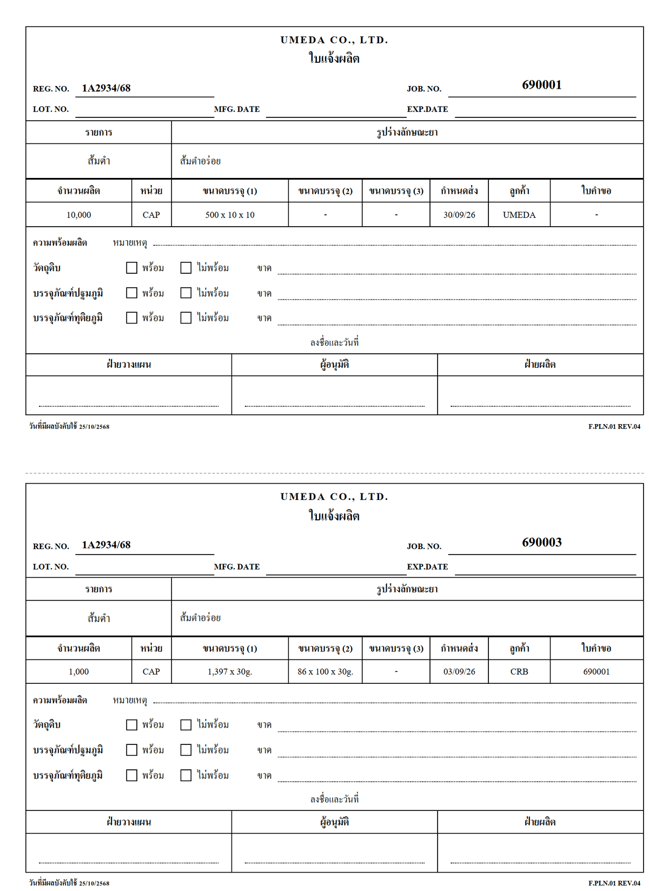

> 💡 **A4 หนึ่งแผ่น = 2 Job** มีเส้นประกลางไว้ฉีกครึ่ง · ช่อง LOT NO. / MFG. DATE / EXP.DATE
> เว้นว่างไว้ให้เขียนมือหน้างานตามฟอร์มเดิม

> ⚠️ **ตอนกด Ctrl+P ให้ตั้ง 3 อย่างนี้** ไม่งั้นใบจะไม่ตรงฟอร์มกระดาษ
> · **Margins = ค่าเริ่มต้น (Default)** · **Scale = 100%** · **เอาติ๊ก "Headers and footers" ออก**

> 💡 ปรับ **ขนาดขอบกระดาษ 4 ด้าน** ได้ที่ท้ายหน้า (ค่าเริ่มต้น 0.32 นิ้ว) —
> เครื่องพิมพ์ส่วนใหญ่พิมพ์ชิดขอบเกิน ~4 มม. ไม่ได้ ตั้งต่ำกว่านั้นเบราว์เซอร์อาจย่อทั้งหน้าให้เอง

---

# Part C — เดินงานจริง 1 ล็อต 🏭

Part นี้คือหัวใจ — ทุกขั้นทำที่ **หน้ารายละเอียดงาน** (กดการ์ดงานจากบอร์ด)
การ์ดในหน้านั้นเรียงจากบนลงล่างตามลำดับที่ใช้จริง จึงทำตามลงมาได้เลย

---

## C1 · ยืนยันแผนผลิต 📋 *(ฝ่ายวางแผน / ผู้บริหาร)*

🔑 เข้าด้วยบัญชี **ฝ่ายวางแผน** · 📍 เปิดงานที่สถานะ **"รอแจ้งผลิต"**

หาการ์ด **"ดำเนินการ"** แล้ว 🖱️ กด **"ยืนยันแผนผลิต"**

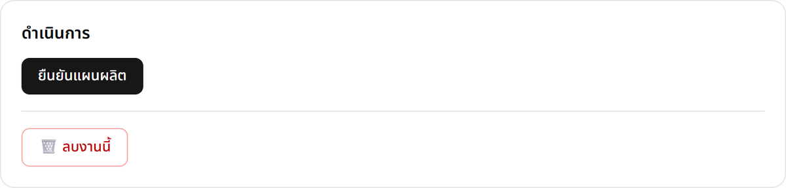

✅ สถานะเปลี่ยนเป็น **"มีแผนแล้ว"** · แถบขั้นตอนด้านบนขยับไปช่องที่ 2


> 💡 **อยากบอกทีมว่างานลงแผนเดือนไหน** ให้ตั้งช่อง **Status** ในการ์ดข้อมูลงานเป็น `มีแผน`
> แล้วเลือก **เดือนแผน** — บนบอร์ดจะแสดงเป็น `มีแผน08/26`

---

## C2 · ลงรายการเบิกวัตถุดิบ/บรรจุภัณฑ์ 🏭📦 *(ผลิตลงรายการ · คลังกดพร้อม)*

**แบ่งหน้าที่ชัดเจน:** ฝ่ายผลิตรู้ว่างานนี้ต้องใช้อะไร → ลงรายการ ·
ฝ่ายคลังเห็นของจริง → กดว่าพร้อมหรือไม่พร้อม

### ① ฝ่ายผลิตลงรายการ

🔑 บัญชี **ฝ่ายผลิต** · หาการ์ด **"เบิกวัตถุดิบ/บรรจุภัณฑ์"** → 🖱️ **"＋ เพิ่มรายการเบิก"**


✍️ กรอก **ชื่อวัตถุดิบ/บรรจุภัณฑ์** (เช่น `แป้งข้าวโพด` · `ขวด HDPE 100 ml`) ·
**ประเภท** · **จำนวนที่เบิก** · **หน่วย** (`kg` · `ม้วน` · `ใบ`) · หมายเหตุ

> 💡 พอบันทึกแล้วจะขึ้น **"✓ เพิ่มแล้ว — พิมพ์รายการถัดไปได้เลย"** ฟอร์มเคลียร์ให้เอง
> ลงรายการยาว ๆ ได้ต่อเนื่องไม่ต้องกดเปิดใหม่ทุกครั้ง

### ② ฝ่ายคลังกดสถานะความพร้อม

🔑 บัญชี **คลังสินค้า** — 🖱️ กดที่ป้ายสถานะของแต่ละรายการ แล้วเลือก **พร้อม / ไม่พร้อม**

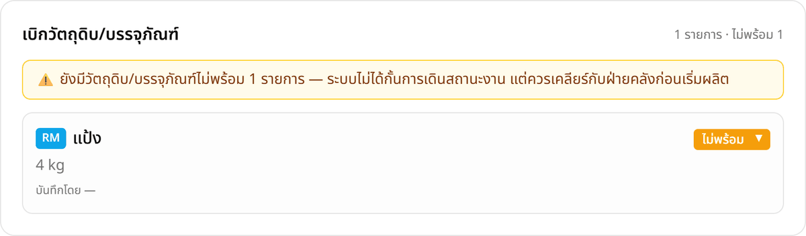

> 🔑 **ฝ่ายผลิตเห็นสถานะแต่กดไม่ได้ · ฝ่ายคลังกดได้แต่เพิ่ม/ลบรายการไม่ได้** — ตั้งใจให้เป็นแบบนี้
> เพื่อไม่ให้ฝ่ายเดียวทั้งขอทั้งยืนยันเอง

> 💡 **ฝ่ายคลังมีหน้ารวมให้กดทีเดียวหลายงาน** ที่ 📍 **เมนูซ้าย → เบิกวัตถุดิบ / บรรจุภัณฑ์**
> ไม่ต้องเปิดทีละงาน


---

## C3 · กรอก LOT No. 🏭 *(ฝ่ายผลิต)* ⚠️ ห้ามข้าม

🔑 บัญชี **ฝ่ายผลิต** · การ์ดข้อมูลงาน → 🖱️ **"✏️ แก้ไขข้อมูล"** → ✍️ ใส่ **LOT No. (Batch NO.)**
จากนั้นใส่ **วันผลิต** และ **วันหมดอายุ** ได้ (2 ช่องนี้จะเปิดให้กรอกก็ต่อเมื่อมีเลขล็อตแล้ว)

> ⚠️ **ไม่มีเลขล็อต = กด "เริ่มผลิต" ไม่ได้** — หน้างานจะขึ้นแถบเตือนสีเหลือง
> นี่เป็นด่าน GMP: ทุกอย่างที่บันทึกต่อจากนี้ต้องผูกกับเลขล็อตที่ตามย้อนได้

---

## C4 · เลือกเครื่องจักรของแต่ละขั้นตอน 🏭 *(ฝ่ายผลิต)*

งานหนึ่งเดินผ่านหลายสถานีตาม Route — แต่ละสถานีใช้เครื่องอะไรบ้าง กรอกที่นี่

🖱️ เลือก **แท็บขั้นตอน** ที่ต้องการก่อน (แถบแท็บจะบอกจำนวนเครื่องและจำนวนบันทึกของแต่ละขั้น)

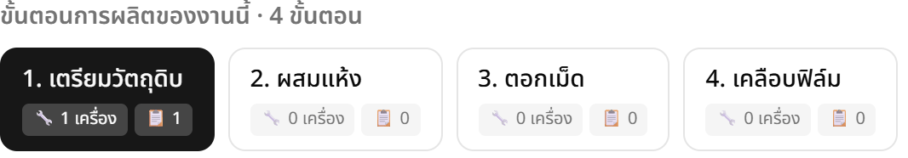

แล้วในการ์ด **"เครื่องจักรของขั้นตอนนี้"** 🖱️ กด **"＋ เพิ่ม"**

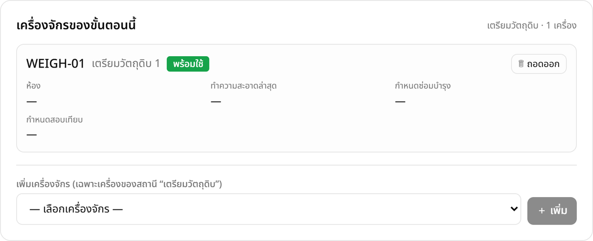

> 💡 **ระบบโชว์เฉพาะเครื่องของสถานีนั้น** — เพราะตอนตั้งทะเบียนเครื่อง (A4) เราผูกเครื่องกับสถานีไว้แล้ว
> ถ้าไม่เห็นเครื่องที่ต้องการ แปลว่าเครื่องนั้นยังไม่ได้ผูกกับสถานีนี้

---

## C5 · Line Clearance (เตรียมสายการผลิต) 🏭 *(ผลิตทำ · หัวหน้ายืนยัน)* ⚠️ สำคัญ

**ทำแยกทีละขั้นตอน × ทีละเครื่อง** — ไม่ใช่ครั้งเดียวจบทั้งงาน

### ① ฝ่ายผลิตติ๊กและบันทึก

🔑 บัญชี **ฝ่ายผลิต** · การ์ด **"Line Clearance (เตรียมสายการผลิต)"** →
🖱️ **"+ บันทึกการเคลียร์ไลน์"**

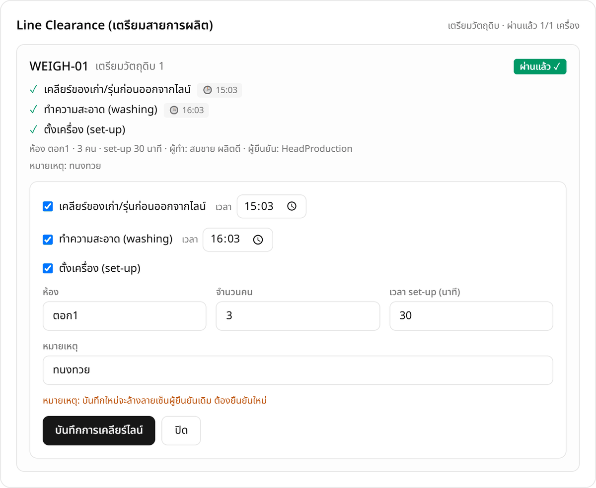

✍️ ติ๊กและกรอก

| รายการ | หมายเหตุ |
|---|---|
| ☐ เคลียร์ของเก่า/รุ่นก่อนออกจากไลน์ | ใส่ **เวลา** ได้ |
| ☐ ทำความสะอาด (washing) | ใส่ **เวลา** ได้ |
| ☐ ตั้งเครื่อง (set-up) | |
| ห้อง | เช่น `ห้องตอก 1` |
| จำนวนคน · เวลา set-up (นาที) | |
| หมายเหตุ | เช่น ชื่อพนักงานที่ทำจริง |

> ⚠️ **ต้องติ๊กอย่างน้อย 1 ข้อ** ถึงจะยืนยันได้

### ② หัวหน้าฝ่ายผลิตยืนยัน

🔑 บัญชี **หัวหน้าฝ่ายผลิต** (หรือผู้บริหาร) → 🖱️ กดยืนยัน

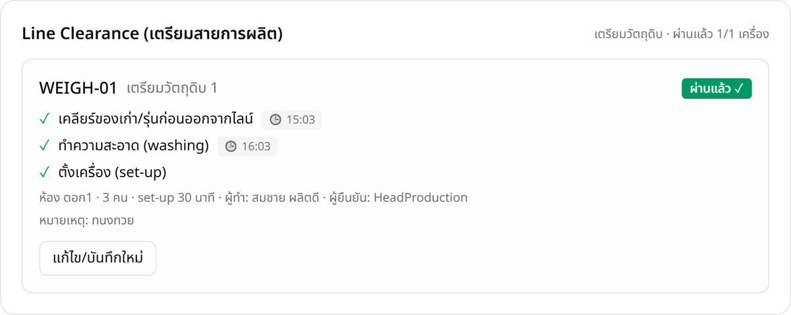

✅ ป้ายเปลี่ยนเป็น **"ผ่านแล้ว ✓"** พร้อมชื่อ **ผู้ทำ** และ **ผู้ยืนยัน**

> 🔒 **ผู้ยืนยันต้องเป็นคนละคนกับผู้ทำ** — ถ้าเป็นคนเดียวกันระบบจะขึ้นว่า
> *"ผู้ยืนยันต้องเป็นคนละคนกับผู้ทำ (รอหัวหน้าฝ่ายผลิตมายืนยัน)"* และกดไม่ผ่าน

---

## C6 · เริ่มผลิต 🏭 *(ฝ่ายผลิต / ผู้บริหาร)*

การ์ด **"ดำเนินการ"** → 🖱️ **"เริ่มผลิต"**

✅ สถานะเปลี่ยนเป็น **"กำลังผลิต"** — ตั้งแต่นี้ไปถึงบันทึกผลผลิตได้

> ⚠️ **ต้องมี LOT No. ก่อน** (C3) ไม่งั้นปุ่มนี้จะกดไม่ผ่าน

---

## C7 · บันทึกผลผลิตรายวัน 🏭 *(ฝ่ายผลิต)*

บันทึกได้เฉพาะตอนสถานะ **"กำลังผลิต"** เท่านั้น · บันทึก **แยกตามขั้นตอน** — เลือกแท็บขั้นตอนก่อนเสมอ

🖱️ การ์ด **"บันทึกผลผลิตรายวัน"** → **"+ บันทึกผลผลิต"**

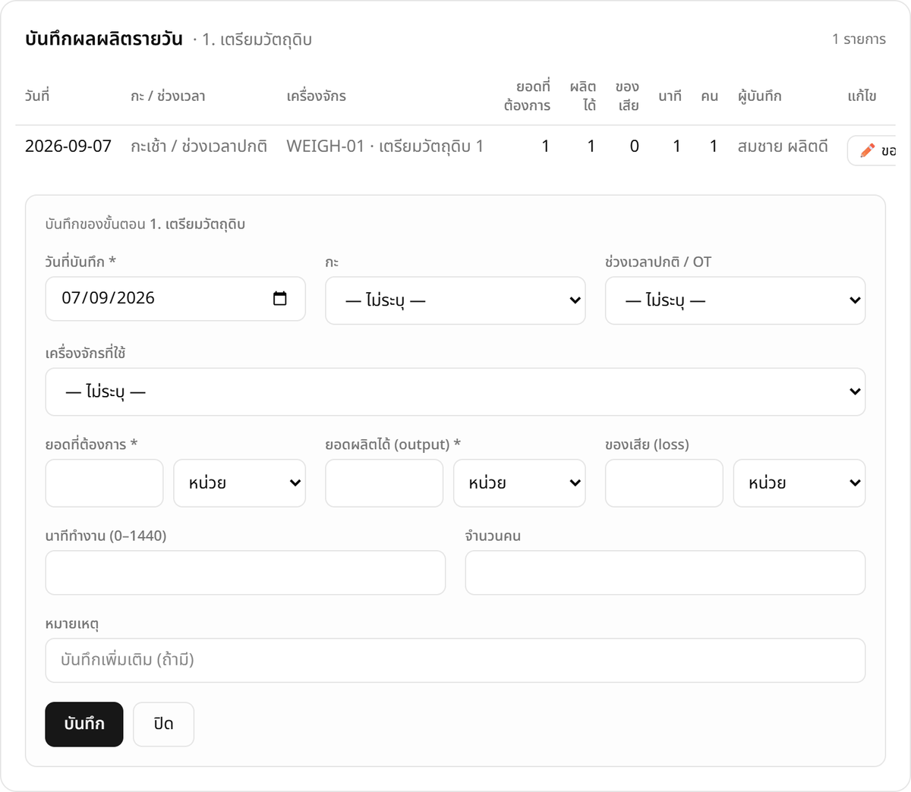

| ช่อง | บังคับ | หมายเหตุ |
|---|:---:|---|
| วันที่บันทึก | ✓ | |
| กะ | | กะเช้า / กะดึก |
| ช่วงเวลาปกติ / OT | | |
| เครื่องจักรที่ใช้ | | โชว์เฉพาะเครื่องของขั้นตอนนี้ · **เครื่องที่ซ่อม/สอบเทียบจะไม่ขึ้น** |
| ยอดที่ต้องการ | ✓ | มีช่อง **หน่วยแยกของตัวเอง** |
| ยอดผลิตได้ (output) | ✓ | มีหน่วยแยก |
| ของเสีย (loss) | | มีหน่วยแยก |
| นาทีทำงาน | | 0–1440 |
| จำนวนคน | | |
| หมายเหตุ | | |

> 💡 **แต่ละช่องเลือกหน่วยเองได้** (กล่อง · แผง · kg. · ซอง) เพราะหน้างานจริงนับคนละหน่วยกัน
> เช่นตั้งต้นเป็น kg. แต่ผลิตได้เป็นแผง

> ⚠️ **กรอกไม่ครบจะได้แจ้งเตือน 📋 "ข้อมูลไม่ครบ"** — ระบบเช็ก กะ · ช่วงเวลา · นาที · จำนวนคน
> แล้วบอกว่าขาดช่องไหนบ้าง (ไม่ได้ห้ามบันทึก แต่เตือนให้กลับมาเติม)

> 💡 **เน็ตหลุดกลางทางไม่หาย** — ระบบเก็บบันทึกที่ยังส่งไม่สำเร็จไว้ในเครื่อง แล้วส่งซ้ำให้เอง
> และกันไม่ให้เกิดแถวซ้ำถ้าส่งไปแล้วจริง

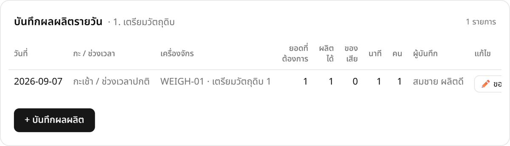

---

## C8 · หัวหน้าอนุมัติบันทึกผลผลิต 🏭 *(หัวหน้าฝ่ายผลิต)*

ทุกแถวที่พนักงานบันทึกจะขึ้นสถานะ **"รอหัวหน้าฝ่ายผลิตพิจารณา"**

🔑 บัญชี **หัวหน้าฝ่ายผลิต** (หรือผู้บริหาร) → 🖱️ กด **"อนุมัติ"** หรือ **"ไม่อนุมัติ"** ในคอลัมน์ "การอนุมัติ"

> 💡 **อนุมัติทีเดียวหลายแถวได้** — ติ๊กหลายแถวแล้วกดครั้งเดียว ระบบจะ **ข้ามบันทึกของตัวเองให้อัตโนมัติ**
> แล้วรายงานว่าข้ามไปกี่รายการ

> ⚠️ **ไม่อนุมัติต้องระบุเหตุผล** และ **บันทึกที่ถูกตีกลับจะไม่ถูกนับใน KPI บนแดชบอร์ด**

> ⚠️ **แก้บันทึกที่อนุมัติไปแล้ว = แถวเด้งกลับเป็น "รออนุมัติ" ใหม่** และหัวหน้าจะได้แจ้งเตือนอีกครั้ง

---

## C9 · ตรวจระหว่างผลิต (In-process QC) 🔬 *(QC ลงผล · หัวหน้า QC อนุมัติ)*

### ① QC ลงผลตรวจ

🔑 บัญชี **QC** · การ์ด **"ตรวจระหว่างผลิต (In-process QC)"** → 🖱️ **"＋ บันทึกผลตรวจ"**

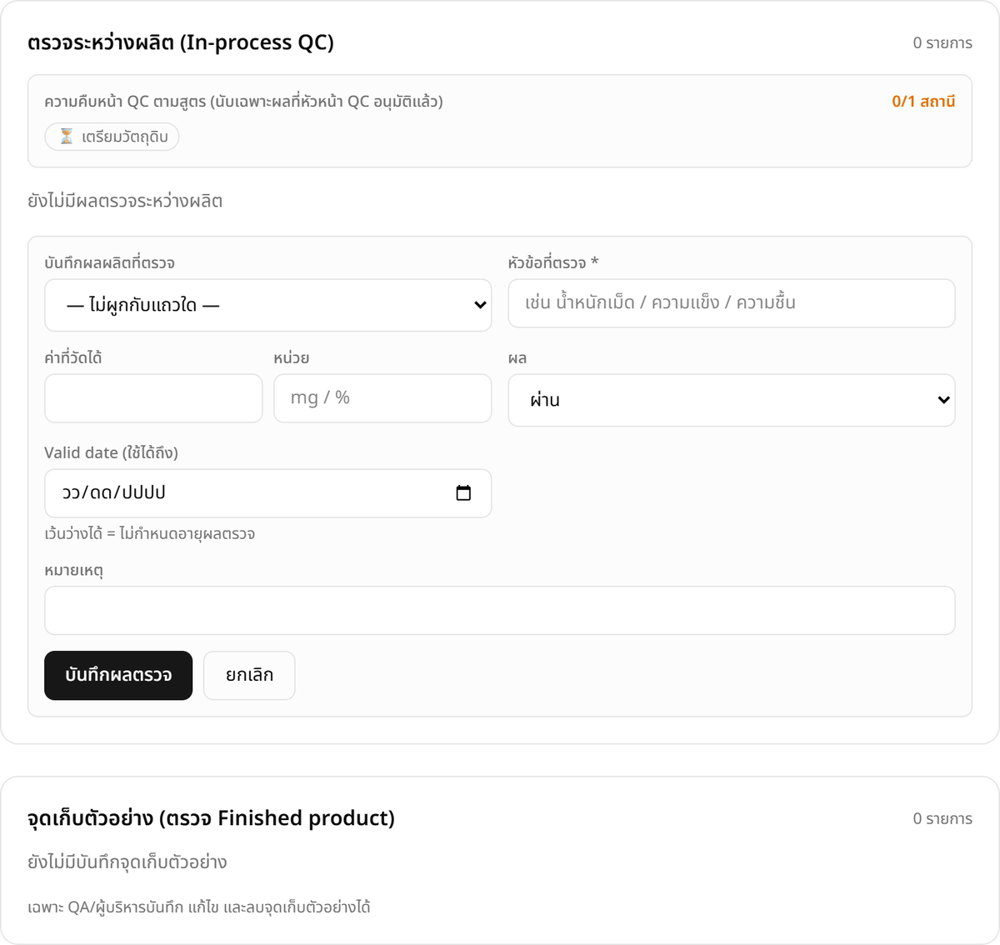

✍️ กรอก **หัวข้อที่ตรวจ** (เช่น น้ำหนักเม็ด / ความแข็ง / ความชื้น) · **ค่าที่วัดได้** + หน่วย ·
**ผล** (ผ่าน / ไม่ผ่าน) · **Valid date (ใช้ได้ถึง)** · หมายเหตุ

> 💡 **ผูกผลตรวจกับแถวบันทึกผลผลิตได้** — เลือกจากรายการด้านบนของฟอร์ม (หรือเลือก "— ไม่ผูกกับแถวใด —")
> ผูกไว้แล้วจะตามได้ว่าผลนี้มาจากการผลิตรอบไหน

### ② หัวหน้า QC อนุมัติ

🔑 บัญชี **หัวหน้า QC** → 🖱️ **"อนุมัติ"** / **"ไม่อนุมัติ"** (ไม่อนุมัติต้องระบุเหตุผล)

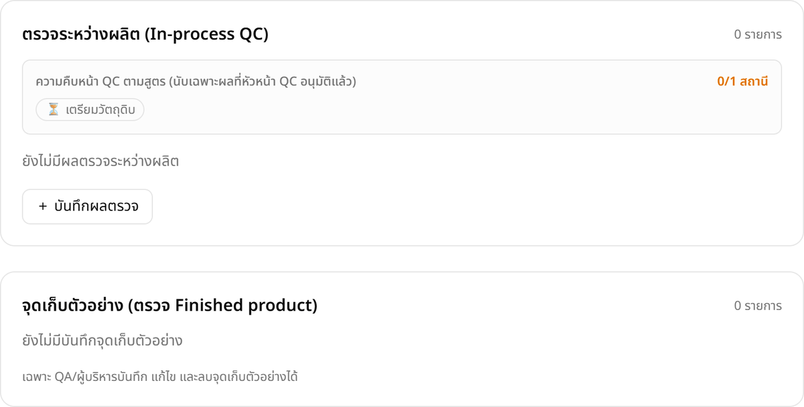

> 🔒 **ด่าน GMP: ต้องตรวจครบทุกสถานีใน Route ก่อนถึงจะส่ง QC ได้**
> แถบ **"ความคืบหน้า QC ตามสูตร"** ด้านบนบอกว่าครบกี่สถานีแล้ว — และ **นับเฉพาะผลที่หัวหน้า QC อนุมัติแล้ว**

> ⚠️ **ผลตรวจ "ไม่ผ่าน" จะเปิด Incident Case ให้อัตโนมัติ** (ดู C12)

> 🔑 **ฝ่ายอื่นบันทึก/แก้ผลตรวจ in-process ไม่ได้** — ถ้าเจอปัญหาให้แจ้ง QC หรือเปิด Incident Case แทน

---

## C10 · ส่งตรวจ QC แล้ว QC ตัดสิน 🏭🔬

### ① ฝ่ายผลิตส่งตรวจ

🔑 บัญชี **ฝ่ายผลิต** → การ์ด **"ดำเนินการ"** → 🖱️ **"ส่งตรวจ QC"**

> ⚠️ **ขั้นนี้ฝ่ายผลิตเท่านั้นที่กดได้** — ผู้บริหารกดแทนไม่ได้

✅ สถานะเปลี่ยนเป็น **"QC"** · ฝ่าย QC ได้แจ้งเตือน 📥 "งานมาถึงคุณ"

### ② QC ตัดสิน + ลงนาม

🔑 บัญชี **QC** → เปิดงาน จะเห็น 2 ปุ่ม

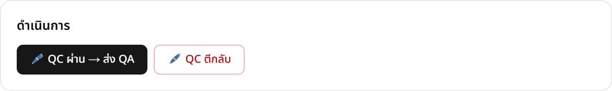

| ปุ่ม | ผลลัพธ์ |
|---|---|
| **"QC ผ่าน → ส่ง QA"** | สถานะไป **QA** |
| **"QC ตีกลับ"** | กลับไป **กำลังผลิต** · ต้องระบุเหตุผลให้ฝ่ายผลิตแก้ |

🖱️ กดปุ่ม → ระบบเปิด **แผงลงนาม** ✍️ พิมพ์ **รหัสผ่านบัญชีของคุณ** → 🖱️ **"ยืนยันลงนาม"**

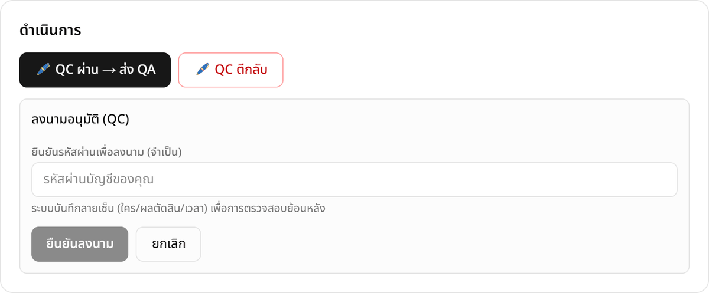

> 🔒 **นี่คือลายเซ็นอิเล็กทรอนิกส์ตาม GMP** — ระบบเก็บว่าใครลงนาม เมื่อไร ตัดสินว่าอะไร ลบไม่ได้
> **ผู้บริหารลงนามขั้นนี้แทนไม่ได้** ต้องเป็น QC ตัวจริง

---

## C11 · QA เก็บตัวอย่าง (ตรวจ Finished product) ✅ *(QA)*

🔑 บัญชี **QA** · การ์ด **"จุดเก็บตัวอย่าง (ตรวจ Finished product)"** → 🖱️ **"＋ บันทึกจุดเก็บตัวอย่าง"**

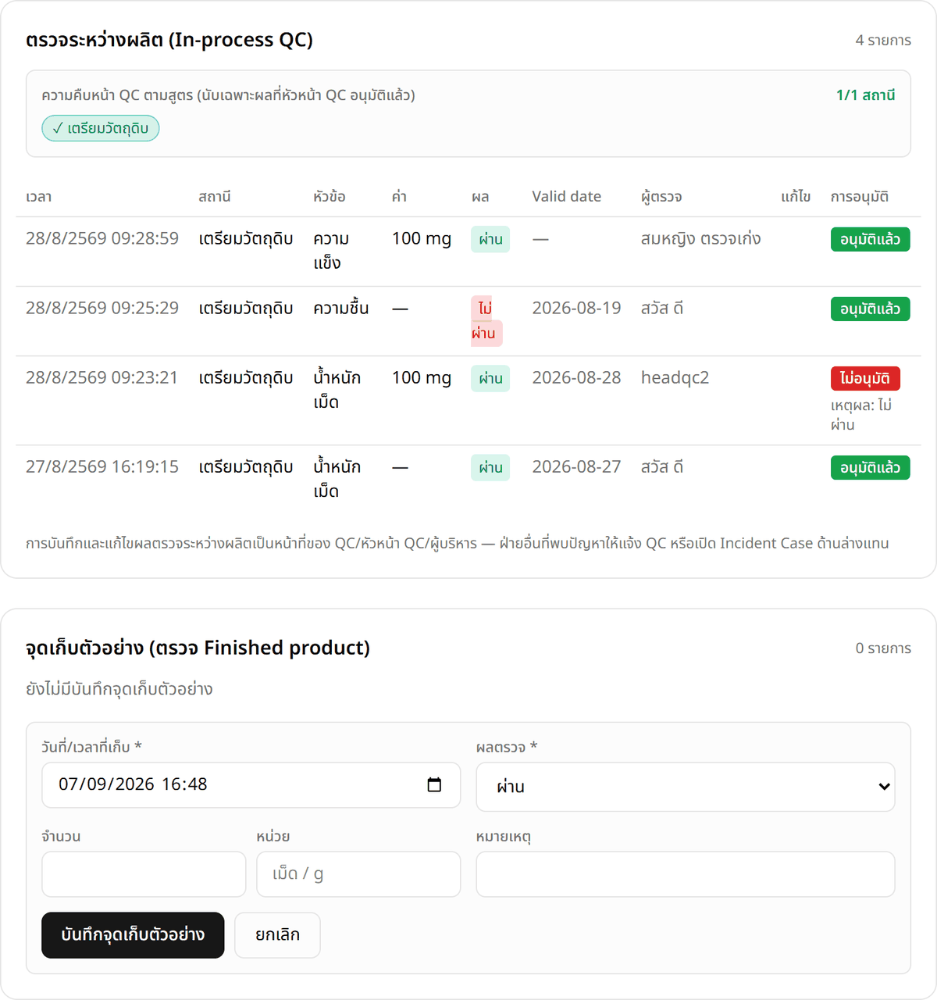

✍️ **วันที่/เวลาที่เก็บ** (มีปุ่ม **"ตอนนี้"** ให้กดใส่เวลาปัจจุบัน) · **ผลตรวจ** (ผ่าน / ไม่ผ่าน) ·
**จำนวน** + หน่วย (เม็ด / g) · หมายเหตุ

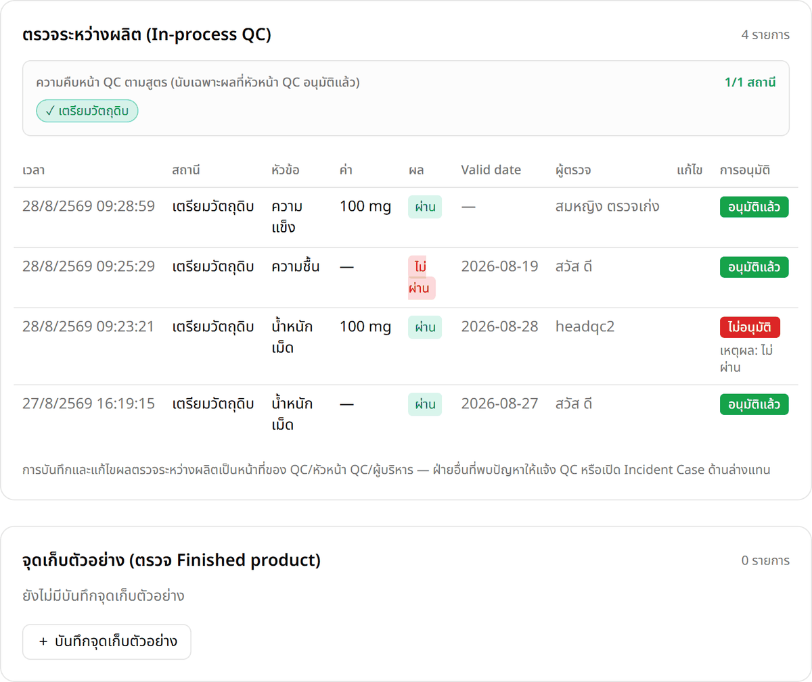

> ⚠️ **ผลตรวจ "ไม่ผ่าน" จะเปิด Incident Case ให้อัตโนมัติ** เหมือนกับ in-process
> · QA แก้/ลบรายการของตัวเองได้ แต่ **ลบต้องระบุเหตุผล** และเหตุผลถูกเก็บลงประวัติ

---

## C12 · Incident Case (เหตุผิดปกติ) ⚠️ *(ทุกฝ่ายเปิดได้ · QA ตัดสิน)*

### เปิดเคส — ใครก็ได้ที่ล็อกอิน

🖱️ การ์ด **"⚠️ Incident Case / เหตุผิดปกติ"** → **"＋ เปิด Incident Case"**

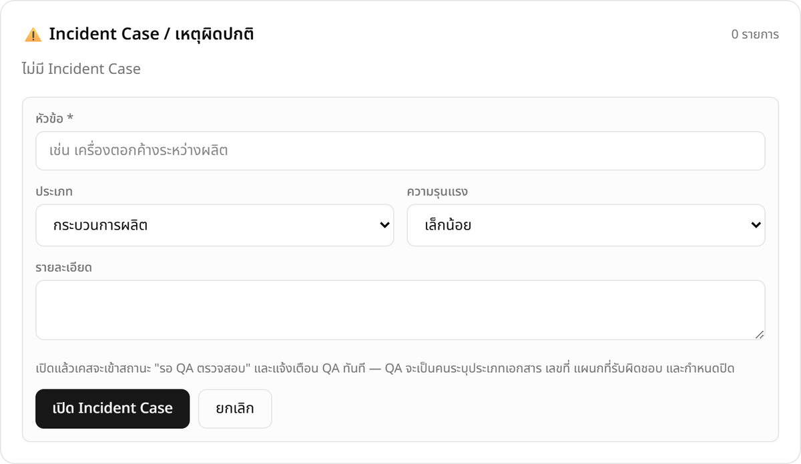

✍️ **หัวข้อ** (เช่น `เครื่องตอกค้างระหว่างผลิต`) · **ประเภท** · **ความรุนแรง** · **รายละเอียด**

**ประเภทเหตุผิดปกติ 6 แบบ:** ผลตรวจระหว่างผลิตไม่ผ่าน · ตรวจ Finished product ไม่ผ่าน ·
เครื่องจักร/อุปกรณ์ · วัตถุดิบ/บรรจุภัณฑ์ · กระบวนการผลิต · อื่นๆ

**ความรุนแรง 3 ระดับ:** เล็กน้อย · ปานกลาง · ร้ายแรง

### เคสเดินผ่าน 5 สถานะ

```
เปิดเคส ──► รอ QA ตรวจสอบ ──► ส่งแผนกแก้ไข ──► รอ QA อนุมัติ ──► ปิดแล้ว
                  (QA)          (แผนกที่รับผิดชอบ)      (QA)
                                       ▲                  │
                                       └──────────────────┘
                                         QA ไม่ผ่าน — ส่งกลับให้แก้ใหม่
```

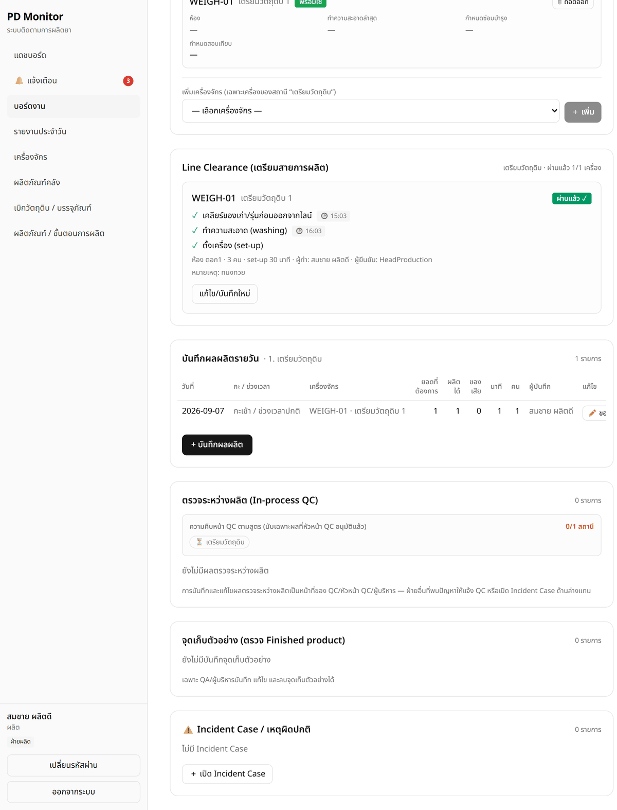

| ขั้น | ใครทำ | ทำอะไร |
|---|---|---|
| 1. เปิดเคส | ทุกคน | หรือระบบเปิดเองเมื่อผลตรวจไม่ผ่าน |
| 2. **QA ตรวจสอบ** | QA | 🖱️ **"🔎 QA ตรวจสอบเคสนี้"** → เลือก **ประเภทเอกสาร DEV / OOS / NC** · ใส่ **เลขที่เอกสาร** · เลือก **แผนกที่รับผิดชอบ (เลือกได้หลายแผนก)** |
| 3. **แผนกแก้ไข** | แผนกที่ถูกมอบหมาย | กรอก **"การแก้ไขเบื้องต้น"** (บังคับ) แล้ว 🖱️ **"ส่งผลแก้ไขให้ QA"** |
| 4. **QA อนุมัติ** | QA | ผ่าน → ปิดเคส · ไม่ผ่าน → 🖱️ **"↩️ ไม่ผ่าน — ส่งกลับให้แผนกแก้ไข"** |
| 5. ปิดแล้ว / ยกเลิก | QA | ยกเลิกต้องระบุเหตุผล |

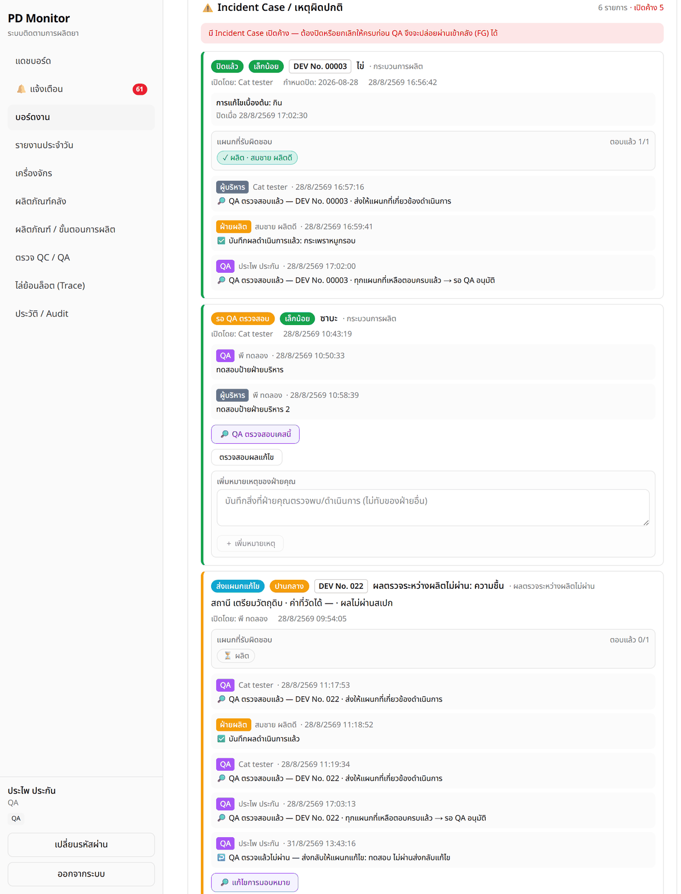

> 💡 **ทุกฝ่ายเพิ่มหมายเหตุของตัวเองได้** ผ่าน **"＋ เพิ่มหมายเหตุ"** — หมายเหตุมีป้ายสีบอกฝ่าย
> และ **ไม่ทับของฝ่ายอื่น**

> 🔒 **ด่านสำคัญ: มีเคสที่ยังไม่ปิด = QA ปล่อยผ่านไป FG ไม่ได้**
> ("ปิดแล้ว" และ "ยกเลิก" ถือว่าจบ · สถานะอื่นถือว่ายังค้าง)

---

## C13 · QA ปล่อยผ่าน ✅ *(QA)*

🔑 บัญชี **QA** → การ์ด **"ดำเนินการ"**

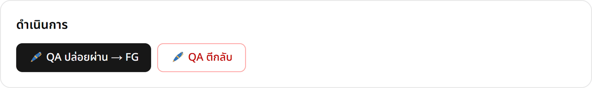

| ปุ่ม | ผลลัพธ์ |
|---|---|
| **"QA ปล่อยผ่าน → FG"** | สถานะไป **FG (เข้าคลัง)** |
| **"QA ตีกลับ"** | กลับไป **กำลังผลิต** |

🖱️ กด → ✍️ ใส่รหัสผ่าน → 🖱️ **"ยืนยันลงนาม"** (เหมือน C10)

> ⚠️ **กดไม่ผ่านถ้ายังมี Incident Case ค้าง** — ต้องกลับไปปิดเคสก่อน

---

## C14 · รับสินค้าเข้าคลัง (FG) = ปิดงาน 📦 *(คลังสินค้า)*

🔑 บัญชี **คลังสินค้า** · 📍 **เมนูซ้าย → คลัง / FG** → 🖱️ **"รับเข้าคลัง"** ที่งานนั้น

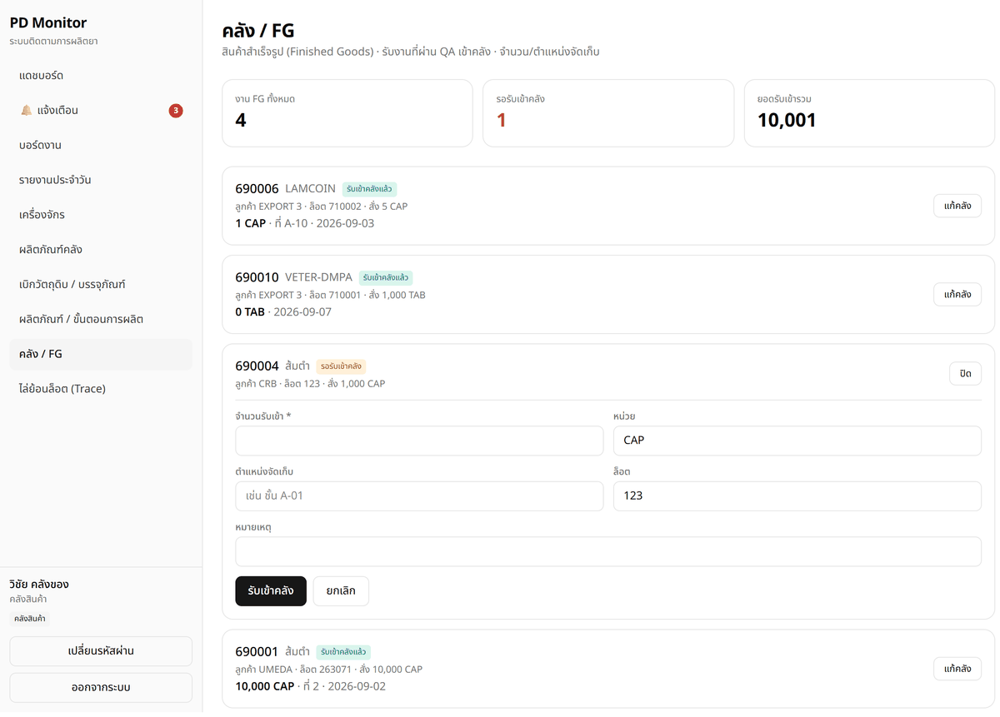

✍️ **จำนวนรับเข้า** · **หน่วย** (เม็ด / กล่อง / แผง) · **ตำแหน่งจัดเก็บ** (เช่น `ชั้น A-01`) ·
**ล็อต** · หมายเหตุ

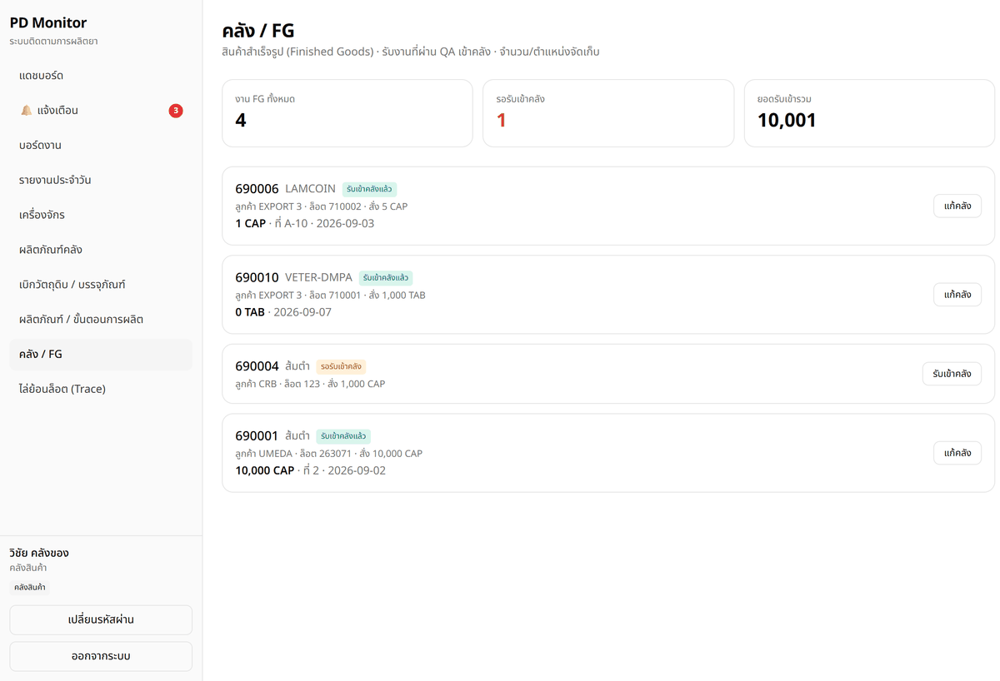

✅ **จบวงจร** — งานหายจากบอร์ด (ยังค้นหาเจอและเปิด eBR ได้) · แดชบอร์ดนับเข้าช่อง **"เข้าคลังแล้ว"**

---

# Part D — เอกสารและรายงาน 📊

## D1 · eBR — แฟ้มบันทึกการผลิต 📄 *(ทุกฝ่าย)*

eBR คือ **เอกสารสรุปทั้งงานในแผ่นเดียว** ดึงจากทุกอย่างที่บันทึกไว้ — พิมพ์เก็บเข้าแฟ้มได้เลย

📍 หน้ารายละเอียดงาน → 🖱️ **"📄 ดู eBR (แฟ้มบันทึกการผลิต)"** มุมขวาบน

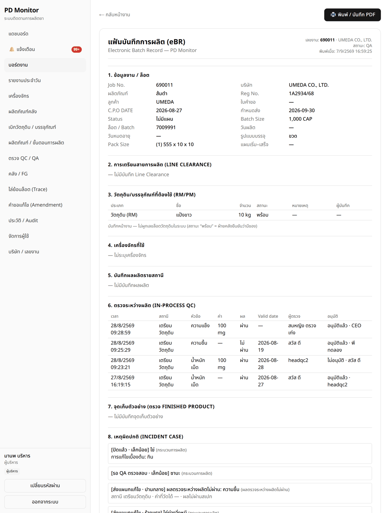

**เอกสารมี 10 ส่วน**

| # | ส่วน | มาจากไหน |
|:---:|---|---|
| 1 | ข้อมูลงาน / ล็อต | การ์ดข้อมูลงาน |
| 2 | การเตรียมสายการผลิต (Line Clearance) | C5 — ทุกใบ (ขั้นตอน × เครื่อง) พร้อมผู้ทำและผู้ยืนยัน |
| 3 | วัตถุดิบ/บรรจุภัณฑ์ที่ต้องใช้ (RM/PM) | C2 |
| 4 | เครื่องจักรที่ใช้ | C4 |
| 5 | บันทึกผลผลิตรายสถานี | C7 — พร้อมผู้บันทึกและผู้อนุมัติ |
| 6 | ตรวจระหว่างผลิต (In-process QC) | C9 |
| 7 | จุดเก็บตัวอย่าง (ตรวจ Finished product) | C11 |
| 8 | เหตุผิดปกติ (Incident Case) | C12 |
| 9 | ลายเซ็นอนุมัติคุณภาพ (QC / QA) | C10 · C13 |
| 10 | รับเข้าคลังสินค้าสำเร็จรูป (FG) | C14 |

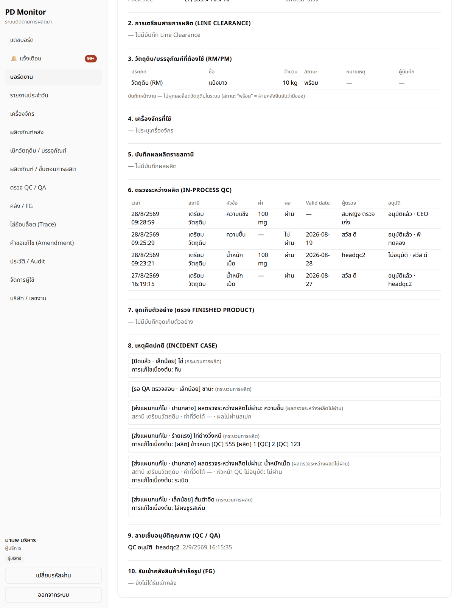

🖱️ ปุ่ม **พิมพ์** จะพิมพ์เฉพาะตัวเอกสาร ไม่ติดแถบเมนู

> 💡 **eBR เป็นแบบอ่านอย่างเดียว** — แก้อะไรไม่ได้ที่นี่ ต้องไปแก้ที่ต้นทาง
> ถ้าข้อมูลผิดและงานปิดไปแล้ว ให้ใช้ **คำขอแก้ไขย้อนหลัง** (E2)

---

## D2 · ปริ้นตารางบอร์ดงาน F.PLN.10 + ออก Excel 📋 *(ทุกฝ่าย)*

📍 **บอร์ดงาน → ปุ่ม "📋 ปริ้นตารางบอร์ดงาน"**

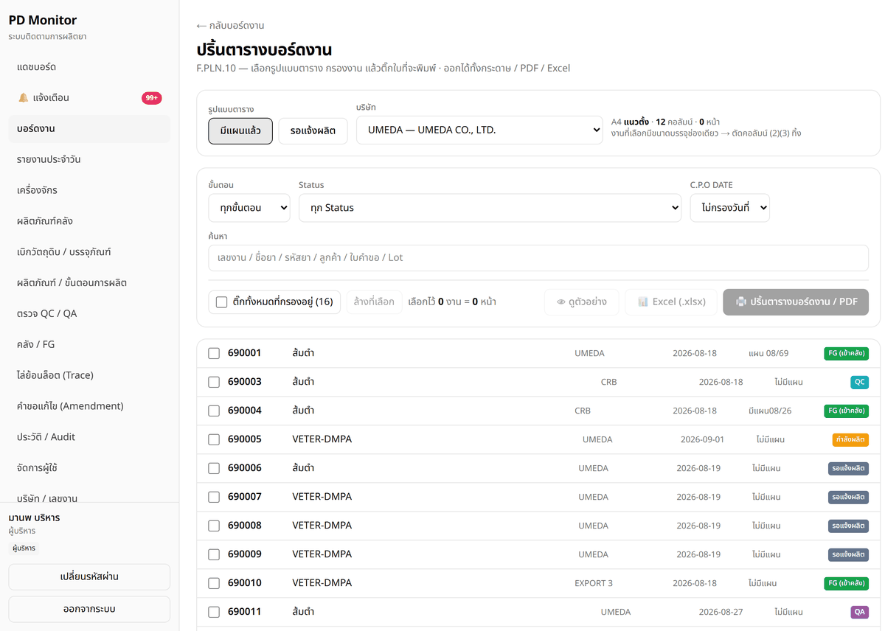

**ขั้นตอน**

1. 🖱️ เลือก **รูปแบบตาราง** — **"มีแผนแล้ว"** (ไม่มีคอลัมน์ LOT) หรือ **"รอแจ้งผลิต"** (มี LOT + ท้ายกระดาษ `F.PLN.10 REV.03`)
2. 🖱️ เลือก **บริษัท** — บังคับเลือก 1 บริษัทเสมอ (เลขงานตัดอักษรนำแล้วซ้ำกันได้)
3. 🖱️ กรองด้วย **ขั้นตอน** · **Status** · **เดือนแผน** · **C.P.O DATE** หรือช่องค้นหา
4. 🖱️ **ติ๊กงาน** — มีปุ่ม "ติ๊กทั้งหมดที่กรองอยู่ (N)" และ "ล้างที่เลือก"
5. 🖱️ เลือกทางออก: **"👁 ดูตัวอย่าง"** · **"📊 Excel (.xlsx)"** · **"🖨️ ปริ้นตารางบอร์ดงาน / PDF"**

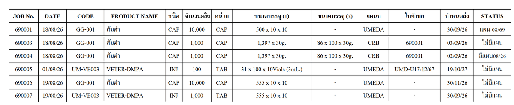

**คอลัมน์:** JOB No. · (LOT. No.) · DATE · CODE · PRODUCT NAME · ชนิด · จำนวนผลิต · หน่วย ·
ขนาดบรรจุ (1)(2)(3) · แผนก · ใบคำขอ · กำหนดส่ง · STATUS

> 💡 **ของที่ติ๊กไว้ไม่หายเมื่อเปลี่ยนตัวกรอง** — ถ้างานที่ติ๊กถูกซ่อนอยู่ จะมีชิปเตือนให้เห็น

> 💡 **ขนาดตัวอักษรปรับเอง** — ค่าเริ่มต้นคือ "อัตโนมัติ" (ตัวใหญ่ที่สุดเท่าที่ทุกช่องยังอยู่บรรทัดเดียว)
> กด **−** / **+** ปรับเองทีละ 0.5pt ได้ และกด **"↺ อัตโนมัติ"** กลับ

> 💡 **ไฟล์ Excel** ตั้งชื่อให้เอง `ตารางบอร์ดงาน-{บริษัท}-{วันที่}.xlsx` และคอลัมน์ตัวเลขเป็นตัวเลขจริง
> (เอาไปบวก/เรียงต่อได้)

> ⚠️ **ตอน Ctrl+P** ตั้ง **Margins = Default** · **Scale = 100%** · เอาติ๊ก **"Headers and footers"** ออก

---

## D3 · รายงานประจำวัน 📅 *(ทุกฝ่าย)*

📍 **เมนูซ้าย → รายงานประจำวัน** → เลือกวันที่

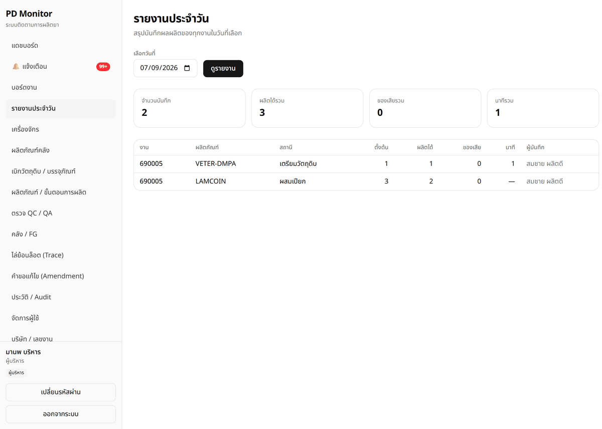

การ์ดสรุป 4 ใบ: **จำนวนบันทึก** · **ผลิตได้** · **ของเสีย** · **นาทีรวม** พร้อมตารางรายบันทึก

---

## D4 · เครื่องจักร + รายงานการใช้ 🔧 *(ทุกฝ่าย)*

📍 **เมนูซ้าย → เครื่องจักร**

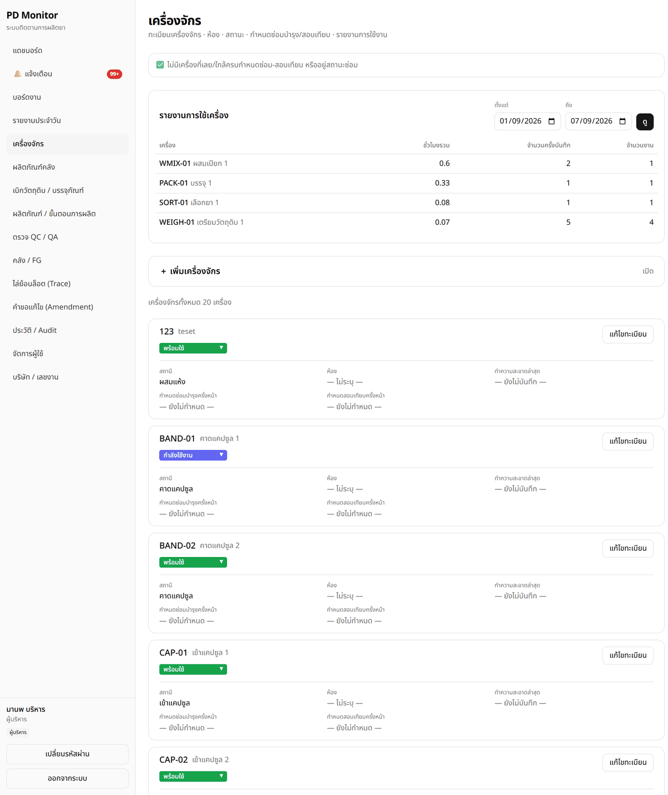

- **แถบเตือน "เครื่องที่ต้องดูแล"** — เครื่องที่ถึงกำหนดซ่อมบำรุงหรือสอบเทียบ
- **รายงานการใช้เครื่อง** ตามช่วงวันที่ (คำนวณจากบันทึกผลผลิต)
- **ทะเบียนเครื่อง** พร้อมสถานะ 5 ค่า

---

## D5 · ไล่ย้อนล็อต (Trace) 🔍 *(QA / คลัง / ผู้บริหาร)*

📍 **เมนูซ้าย → ไล่ย้อนล็อต (Trace)** → ✍️ ใส่ **เลขงาน** หรือ **เลขล็อตผลิต**

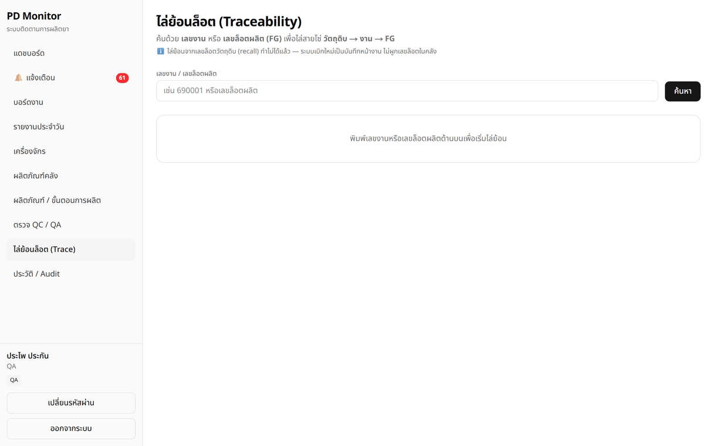

ระบบแสดงผัง **วัตถุดิบ → งาน → FG** ใช้ตอนต้องเรียกคืนสินค้าหรือสอบสวนปัญหา

> ⚠️ **ไล่ย้อนจาก "เลขล็อตวัตถุดิบ" ทำไม่ได้แล้ว** — ตั้งแต่ระบบเบิกเปลี่ยนเป็นแบบลงรายการหน้างาน
> รายการเบิกไม่ได้ผูกกับล็อตในคลังอีกต่อไป · ให้ค้นด้วยเลขงานหรือเลขล็อตผลิตแทน

---

## D6 · ประวัติ / Audit 🕓 *(ผู้บริหาร / QA)*

📍 **เมนูซ้าย → ประวัติ / Audit**

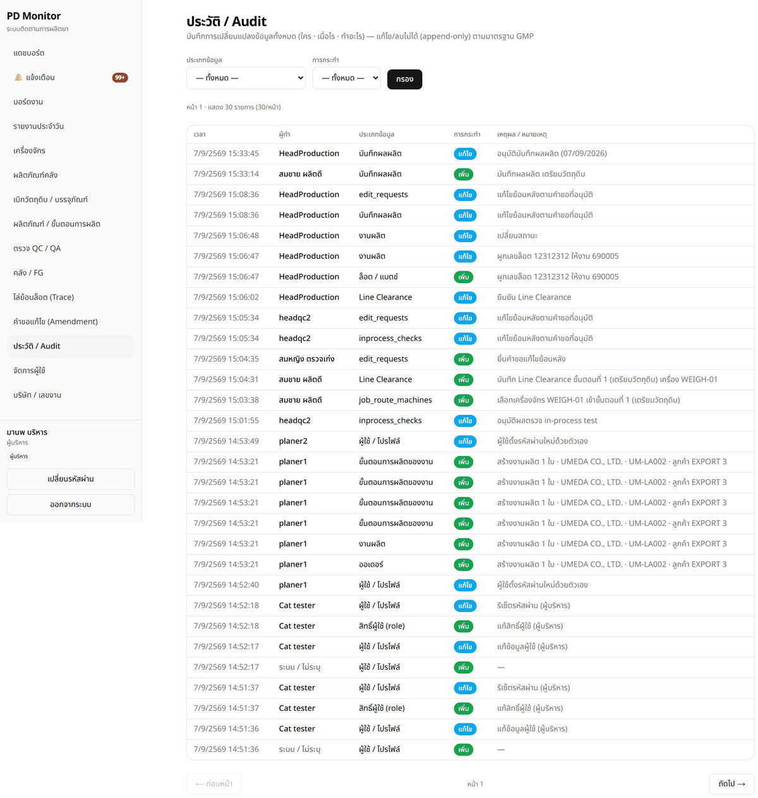

ทุกการเพิ่ม/แก้ไข/ลบในระบบถูกบันทึกไว้ **ลบไม่ได้ แก้ไม่ได้** ตามหลัก GMP
กรองได้ตาม **ประเภทข้อมูล** และ **การกระทำ** (เพิ่ม / แก้ไข / ลบ)

---

## D7 · แดชบอร์ด 📈 *(ทุกฝ่าย)*

📍 **เมนูซ้าย → แดชบอร์ด** (หน้าแรกหลังล็อกอิน)

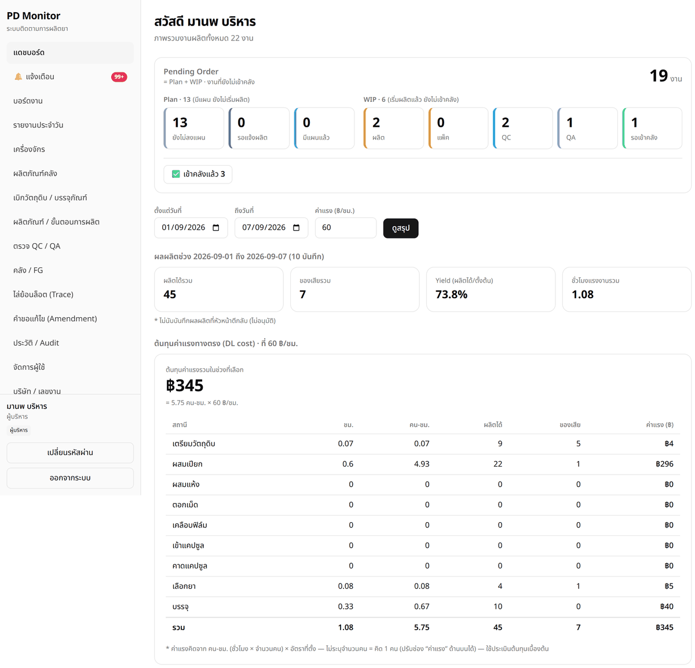

**บล็อก Pending Order = Plan + WIP** = งานที่ยังไม่เข้าคลัง แยกเป็น

- **Plan** (มีแผน ยังไม่เริ่มผลิต): ยังไม่ลงแผน · รอแจ้งผลิต · มีแผนแล้ว
- **WIP** (เริ่มผลิตแล้ว ยังไม่เข้าคลัง): ผลิต · แพ็ค · QC · QA · รอเข้าคลัง

🖱️ **กดที่การ์ดแต่ละใบ** เพื่อกระโดดไปบอร์ดงานที่กรองไว้ให้แล้ว

ด้านล่างเป็น **KPI ตามช่วงวันที่** — ผลิตได้รวม · ของเสียรวม · Yield · ชั่วโมงแรงงานรวม

> ⚠️ **KPI ไม่นับบันทึกที่หัวหน้าตีกลับ (ไม่อนุมัติ)** — ตัวเลขจึงเป็นของที่ผ่านการรับรองแล้วเท่านั้น

> 🔑 **บล็อกต้นทุนค่าแรง (DL cost)** เห็นเฉพาะ **บัญชีต้นทุน** และ **ผู้บริหาร** — ปรับอัตรา ฿/ชม. ได้ที่นั่น

---

# Part E — ของที่ใช้ทุกวัน 🔔

## E1 · กล่องแจ้งเตือน 🔔 *(ทุกฝ่าย)*

📍 **เมนูซ้าย → 🔔 แจ้งเตือน** — ตัวเลขวงกลมแดงคือจำนวนที่ยังไม่อ่าน

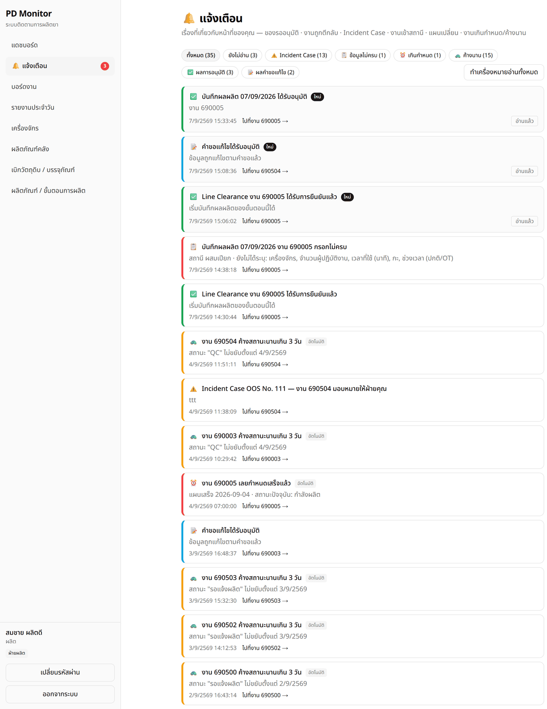

**แจ้งเตือนมี 13 ชนิด** เรียงจาก "ต้องลงมือทำ" ไป "รับทราบ"

| ไอคอน | ชนิด | เกิดเมื่อ | ส่งถึงใคร |
|:---:|---|---|---|
| ⏳ | **รออนุมัติ** | มีของรอหัวหน้าพิจารณา (Line Clearance · in-process · บันทึกผลผลิต) | หัวหน้าฝ่ายนั้น |
| ✏️ | **คำขอแก้ไข** | มีคนยื่นขอแก้ข้อมูลย้อนหลัง | ผู้อนุมัติตามชนิดคำขอ |
| ↩️ | **งานถูกตีกลับ** | QC หรือ QA ตีกลับ | ฝ่ายผลิต |
| ⚠️ | **Incident Case** | เปิด/อัปเดตเคส | ฝ่ายที่เกี่ยวข้อง |
| 📋 | **ข้อมูลไม่ครบ** | บันทึกผลผลิตขาดข้อมูล | ฝ่ายผลิต |
| ⏰ | **เกินกำหนด** | งานเลยแผนเสร็จแล้ว | ฝ่ายผลิต · ผู้บริหาร |
| 🐢 | **ค้างนาน** | งานไม่ขยับเกิน 3 วัน | ฝ่ายผลิต · ผู้บริหาร |
| 📥 | **งานมาถึงคุณ** | งานเดินมาถึงสถานะของฝ่ายคุณ | ฝ่ายปลายทาง |
| 🏭 | **งานเข้าสถานี** | บันทึกผลผลิตเข้าสถานีใหม่ / พร้อมเข้าสถานีแพ็ค | ฝ่ายที่เกี่ยวข้อง |
| 🆕 | **งานใหม่** | มีคนสร้างงานผลิต | ฝ่ายวางแผน (ไม่แจ้งคนสร้างเอง) |
| 📅 | **แผนเปลี่ยน** | เลื่อนแผน หรือ **ยกเลิกงาน** | ฝ่ายวางแผน |
| ✅ | **ผลการอนุมัติ** | หัวหน้าตัดสินแล้ว | **ผู้ยื่นคนเดียว** |
| 📝 | **ผลคำขอแก้ไข** | คำขอถูกอนุมัติ/ปฏิเสธ | **ผู้ยื่นคนเดียว** |

**สิ่งที่กดได้ในหน้านี้**

- 🖱️ **ชิปด้านบน** — กรอง ทั้งหมด / ยังไม่อ่าน / รายชนิด
- 🖱️ **"ทำเครื่องหมายอ่านทั้งหมด"** มุมขวาบน
- 🖱️ **"ไปที่งาน XXXXX →"** ในแต่ละใบ · **"อ่านแล้ว"** เพื่อเอาออกจากตัวนับ
- 🖱️ **"โหลดเพิ่ม"** ล่างสุด (ครั้งละ 30 · สูงสุด 200)

> 🔑 **แต่ละคนเห็นไม่เท่ากัน** — ใบส่วนใหญ่จ่าหน้าถึง "ฝ่าย" · บางใบจ่าหน้าถึง **ตัวบุคคล**
> (ผลการอนุมัติ · ผลคำขอแก้ไข) ซึ่ง **แม้แต่ผู้บริหารก็ไม่เห็น** — ตั้งใจให้เป็นความเป็นส่วนตัวของผู้ยื่น
> · **ผู้บริหารเห็นแจ้งเตือนของทุกฝ่าย** ยกเว้นใบรายบุคคล

> ⚠️ **⏰ เกินกำหนด และ 🐢 ค้างนาน เป็นใบที่ระบบคำนวณสด** — มีป้าย "อัตโนมัติ"
> **ไม่นับในตัวเลขสีแดง** และกด "อ่านแล้ว" ไม่ได้ · จะหายเองเมื่องานขยับ

> 💡 **แจ้งเตือนชุดใหม่ไม่หายเอง** — ต้องกด "อ่านแล้ว" เอง

---

## E2 · ขอแก้ไขย้อนหลัง (Amendment) ✏️

ข้อมูลที่บันทึกแล้วแก้เองไม่ได้ทั้งหมด — บางอย่างต้องขออนุมัติก่อน ตามหลัก GMP ที่ห้ามแก้บันทึกเงียบ ๆ

### ① ยื่นคำขอ

🔑 บัญชีคนที่บันทึกไว้ → 🖱️ ปุ่ม **"✏️ ขอแก้ไข"** ที่แถวนั้น (บันทึกผลผลิต หรือ ผลตรวจ in-process)

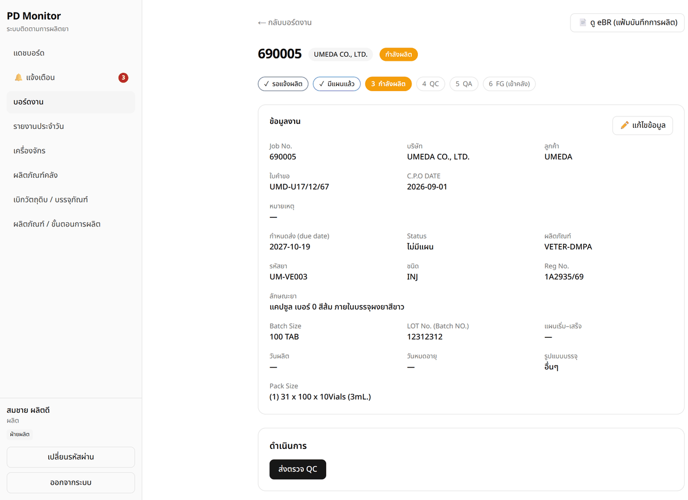

✍️ แก้ค่าที่ต้องการ + **ระบุเหตุผล** (บังคับ) → 🖱️ **"ส่งคำขอแก้ไข"**

> ⚠️ **ถ้าไม่ได้แก้ค่าอะไรเลย ระบบจะไม่ให้ส่ง** — ขึ้นว่า "ยังไม่มีการแก้ไข (ค่ายังเหมือนเดิม)"

### ② ผู้มีสิทธิ์อนุมัติ

📍 **เมนูซ้าย → คำขอแก้ไข (Amendment)** — มีตัวเลขสีเหลืองบอกจำนวนที่ค้าง

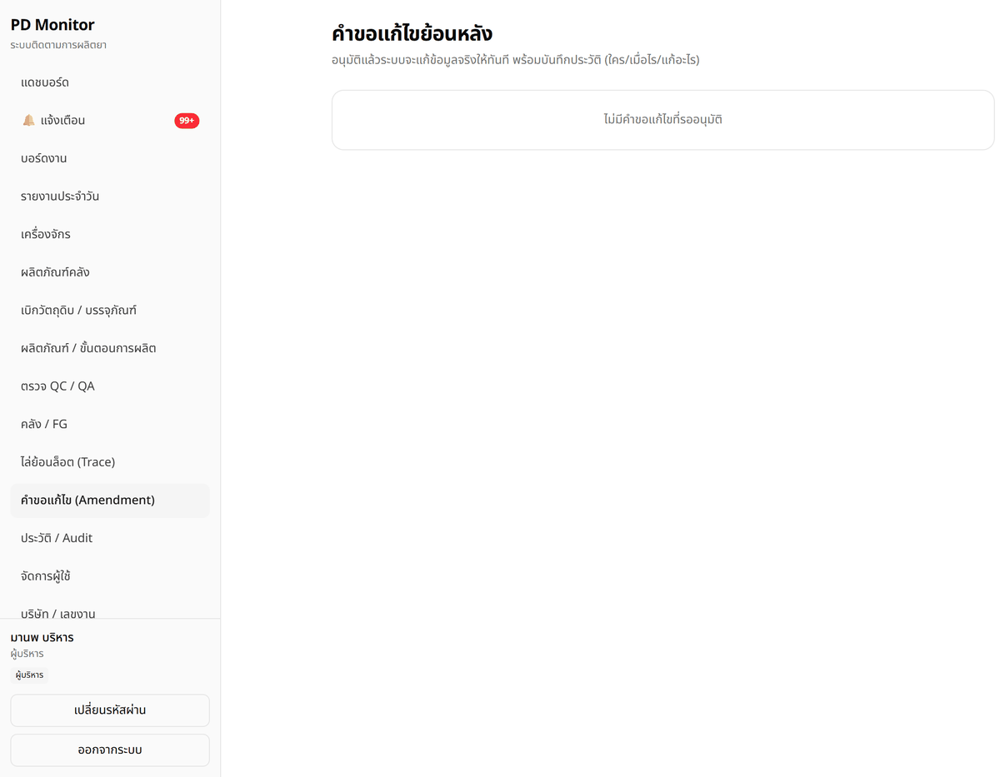

หน้านี้แสดง **ค่าเดิม → ค่าใหม่** ทีละช่อง พร้อมเหตุผลของผู้ยื่น
🖱️ **"✅ อนุมัติ + แก้ให้"** (ระบบแก้ข้อมูลให้เลย) หรือ **ปฏิเสธ** (ต้องใส่หมายเหตุ)

| ชนิดคำขอ | ใครอนุมัติได้ |
|---|---|
| **บันทึกผลผลิต** | ผู้บริหาร · **หัวหน้าฝ่ายผลิต** |
| **ผลตรวจ QC ระหว่างผลิต** | ผู้บริหาร · **หัวหน้า QC** |

> 🔑 **QA ไม่ได้อยู่ในสายอนุมัติคำขอแก้ไขแล้ว** — คำขอแก้ผลตรวจ in-process เป็นเรื่องภายในของฝ่าย QC

✅ ผลการพิจารณาถูกส่งกลับ **ถึงผู้ยื่นคนเดียว** และการแก้ไขทั้งหมดถูกบันทึกลง **ประวัติ / Audit**

---

# ✅ จบแล้ว — คุณเดินงานครบ 1 ล็อตแล้ว

ทวนสิ่งที่เพิ่งทำ

- [x] ตั้งค่าระบบ — สถานี · ผลิตภัณฑ์ + Route · เครื่องจักร · บริษัท/เลขงาน · บัญชีผู้ใช้
- [x] เปิดงานผลิต + ปริ้นใบแจ้งผลิต F.PLN.01
- [x] ยืนยันแผน → เบิกของ → เคลียร์ไลน์ → เริ่มผลิต
- [x] บันทึกผลผลิตรายวัน + หัวหน้าอนุมัติ
- [x] ตรวจ In-process QC + หัวหน้า QC อนุมัติ
- [x] ส่งตรวจ QC → QC ลงนาม → QA เก็บตัวอย่าง → QA ปล่อยผ่าน
- [x] เปิดและปิด Incident Case
- [x] รับเข้าคลัง FG = ปิดงาน
- [x] เปิด eBR · ปริ้นตารางบอร์ดงาน · ดูรายงานและ Audit
- [x] ใช้กล่องแจ้งเตือน + ยื่น/อนุมัติคำขอแก้ไขย้อนหลัง

**ต่อจากนี้** — เปิด **ภาค 2 (คู่มืออ้างอิง)** เวลาต้องการรายละเอียดของหน้าจอใดหน้าจอหนึ่ง
หรือสงสัยว่าใครมีสิทธิ์ทำอะไร

> 💡 **ติดตรงไหน ให้ดู 3 ที่นี้ก่อนถามใคร** — ① ข้อความสีแดงใต้ปุ่มที่กดไม่ผ่าน (ระบบบอกเหตุผลเสมอ)
> ② หัวข้อ **ถาม–ตอบ** ท้ายภาค 2 ③ **ประวัติ / Audit** ถ้าสงสัยว่าใครแก้อะไรไป
