# 📘 คู่มือการใช้งาน PD Monitor (ฉบับละเอียด)

> **ระบบติดตามการผลิตยา — Pending Order & PD Monitoring System**
> คู่มือสำหรับผู้ใช้งานจริง เดินตามได้ทีละขั้น ตั้งแต่ **สร้างงาน → ปิดงานเข้าคลัง**
> เปิดใช้งานที่เว็บไซต์: **https://pd-monitor.vercel.app**
> ใช้ได้ทั้งบนคอมพิวเตอร์และมือถือ · ไม่ต้องติดตั้งโปรแกรมเพิ่ม

---

## PD Monitor คืออะไร (อ่านก่อน 1 นาที)

PD Monitor คือเว็บแอปที่ใช้ **แทนการจดมือ** ในการติดตามงานผลิตยา ตั้งแต่รับออเดอร์ → ผลิต → ตรวจคุณภาพ → เข้าคลัง
จุดเด่นที่ต้องเข้าใจตั้งแต่ต้น:

- **ทุกฝ่ายเห็นข้อมูลชุดเดียวกัน** (ผลิต / QC / QA / คลัง / ผู้บริหาร) — ไม่มีสมุดของใครของมัน
- **เรียลไทม์** — เมื่อมีคนเปลี่ยนสถานะหรือบันทึกข้อมูล หน้าจอของทุกคนอัปเดตเองทันที **ไม่ต้องกดรีเฟรช**
- **บันทึกว่าใครทำอะไรเมื่อไหร่** ทุกขั้นตอน (ตามมาตรฐาน GMP) — แก้ย้อนหลังไม่ได้
- **กันข้ามขั้น** — ระบบบังคับลำดับงานให้ถูกต้อง (เช่น ยังไม่เคลียร์ไลน์ = เริ่มผลิตไม่ได้)

> 💡 ถ้าคุณเพิ่งเริ่มใช้ครั้งแรก ให้อ่าน **ส่วนที่ 1 (พื้นฐาน)** ให้จบก่อน แล้วค่อยข้ามไปอ่านขั้นที่ตรงกับหน้าที่ของคุณในส่วนที่ 2

---

## 📑 สารบัญ

**ส่วนที่ 1 — พื้นฐาน (ทุกคนต้องอ่าน)**
- 1.1 เข้าสู่ระบบ
- 1.2 ส่วนประกอบของหน้าจอ (เมนู · กระดิ่ง · ออกจากระบบ)
- 1.3 บทบาท (role) ของคุณ
- 1.4 สถานะงาน 6 ขั้น และใครเป็นคนเลื่อน
- 1.5 หน้าแดชบอร์ด
- 1.6 กล่องแจ้งเตือน 🔔

**ส่วนที่ 2 — เดินงานครบวงจร 1 งาน (สร้าง → ปิด) ทีละขั้น**
- ขั้นที่ 1 สร้างงานผลิตใหม่ — *ผู้บริหาร*
- ขั้นที่ 2 ยืนยันแผนผลิต — *ผู้บริหาร*
- ขั้นที่ 3 เบิกวัตถุดิบ — *ฝ่ายผลิต + คลัง*
- ขั้นที่ 4 Line Clearance (เคลียร์ไลน์) — *ฝ่ายผลิต + ผู้ตรวจ*
- ขั้นที่ 5 เริ่มผลิต — *ฝ่ายผลิต*
- ขั้นที่ 6 บันทึกผลผลิตรายวัน — *ฝ่ายผลิต*
- ขั้นที่ 7 ตรวจระหว่างผลิต (In-process QC) — *QC*
- ขั้นที่ 8 ส่งตรวจ QC แล้ว QC ตัดสิน (ผ่าน/ตีกลับ) — *ฝ่ายผลิต + QC*
- ขั้นที่ 9 QA เก็บตัวอย่าง + ปล่อยผ่าน/ตีกลับ — *QA*
- ขั้นที่ 10 เหตุผิดปกติ (Deviation) — *ทุกฝ่ายที่เกี่ยว*
- ขั้นที่ 11 รับสินค้าเข้าคลัง (FG) = ปิดงาน — *คลัง*
- ขั้นที่ 12 eBR — พิมพ์แฟ้มบันทึกการผลิต

**ส่วนที่ 3 — เมนู/ฟังก์ชันอื่นที่ใช้ประจำ**
- 3.1 รายงานประจำวัน
- 3.2 เครื่องจักร
- 3.3 วัตถุดิบ / คลัง (RM/PM)
- 3.4 สูตรการผลิต / BOM
- 3.5 ไล่ย้อนล็อต (Trace) / Recall
- 3.6 ประวัติ / Audit
- 3.7 จัดการผู้ใช้ (เปิดบัญชีให้ทีม)

**ส่วนที่ 4 — สรุปสั้น: แต่ละฝ่ายต้องทำอะไรบ้าง**

**ส่วนที่ 5 — ถาม–ตอบ & แก้ปัญหาที่พบบ่อย**

---
---

# ส่วนที่ 1 — พื้นฐาน (ทุกคนต้องอ่าน)

## 1.1 เข้าสู่ระบบ

1. เปิดเบราว์เซอร์ (แนะนำ **Chrome**, ใช้ Safari / Edge ได้) บนคอมหรือมือถือ
2. พิมพ์ที่อยู่ **https://pd-monitor.vercel.app** แล้วกด Enter
3. ที่หน้าเข้าสู่ระบบ ใส่ **อีเมล** และ **รหัสผ่าน** ที่ผู้บริหาร/แอดมินตั้งให้
4. กดปุ่ม **"เข้าสู่ระบบ"**
5. เมื่อเข้าสำเร็จ ระบบจะพาไปที่หน้า **แดชบอร์ด** โดยอัตโนมัติ

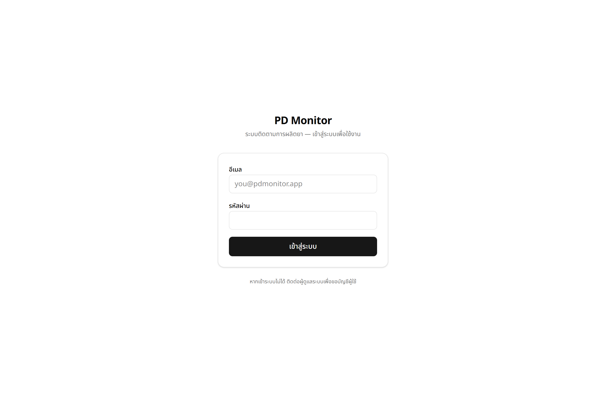

**เคล็ดลับ**
- 📱 **บนมือถือ:** หลังเปิดเว็บแล้ว กดเมนูเบราว์เซอร์ → "เพิ่มไปยังหน้าจอโฮม" (Add to Home Screen) จะได้ไอคอนเหมือนแอปจริง เปิดเร็วขึ้น
- 🔑 **ลืมรหัสผ่าน / เข้าไม่ได้** → แจ้งผู้บริหารหรือแอดมินให้รีเซ็ตรหัสให้ (วิธีในข้อ 3.7)
- 🙅 **ห้ามใช้บัญชีร่วมกัน** — แต่ละคนต้องมีบัญชีของตัวเอง เพราะระบบบันทึกว่า "ใครทำอะไร" ไว้เป็นหลักฐานทุกขั้น (มาตรฐาน GMP)

---

## 1.2 ส่วนประกอบของหน้าจอ

หลังเข้าระบบ หน้าจอมี 3 ส่วนหลักที่ต้องรู้จัก:

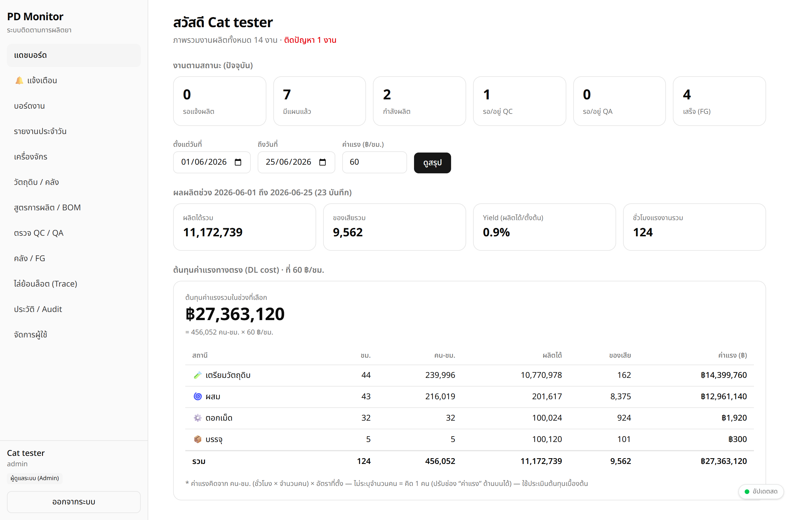

| ส่วน | อยู่ตรงไหน | ใช้ทำอะไร |
|---|---|---|
| **เมนูด้านซ้าย** | แถบซ้ายมือ (บนมือถือ กดปุ่ม ☰ เพื่อเปิด) | สลับไปยังหน้าต่าง ๆ ของระบบ |
| **กระดิ่งแจ้งเตือน 🔔** | เมนู "🔔 แจ้งเตือน" — มีตัวเลขสีแดงบอกจำนวนเรื่องที่ยังไม่อ่าน | ดูเรื่องที่คุณต้องรู้ (ข้อ 1.6) |
| **ปุ่มออกจากระบบ** | ล่างสุดของเมนู | ออกจากบัญชีเมื่อใช้งานเสร็จ |

**บนมือถือ** เมนูจะถูกซ่อนไว้ กดปุ่ม **☰** มุมบนเพื่อเปิด:

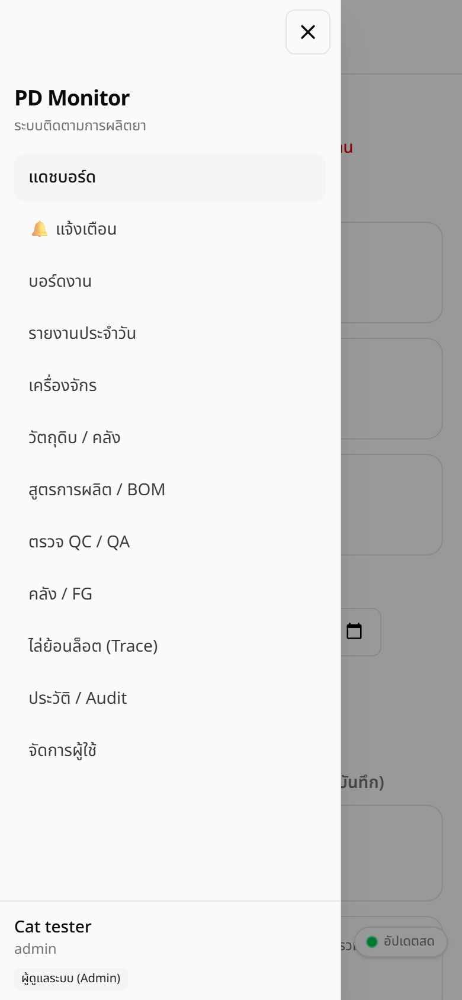

> ⚠️ **คุณจะเห็นเมนูไม่เท่ากับเพื่อนต่างฝ่าย** เป็นเรื่องปกติ — ระบบแสดงเฉพาะเมนูที่ตรงกับหน้าที่ของคุณ (ดูข้อ 1.3)

---

## 1.3 บทบาท (role) ของคุณ

ทุกบัญชีมี "บทบาท" กำหนดว่าเห็นเมนูอะไรและกดทำอะไรได้บ้าง:

| บทบาท | ชื่อในระบบ | ทำอะไรได้หลัก ๆ |
|---|---|---|
| **ฝ่ายผลิต** | production | เบิกวัตถุดิบ · Line Clearance · เริ่มผลิต · บันทึกผลผลิต · ส่งตรวจ QC |
| **QC** | qc | ตรวจระหว่างผลิต · ลงนามผ่าน/ตีกลับ (ขั้น QC) |
| **QA** | qa | เก็บตัวอย่าง · ปล่อยผ่านเข้าคลัง/ตีกลับ (ขั้น QA) · ปิด deviation · ไล่ย้อนล็อต |
| **คลังสินค้า** | warehouse | จ่ายวัตถุดิบให้ฝ่ายผลิต · รับสินค้าสำเร็จรูป (FG) เข้าคลัง |
| **ผู้บริหาร** | manager | **ทำได้แทบทุกอย่าง** + สร้างงาน · ดูต้นทุนค่าแรง · จัดการผู้ใช้ |
| **ผู้ดูแลระบบ** | admin | ทำได้ทุกอย่างในระบบ (รวมสิทธิ์ของทุกฝ่าย) |

> หนึ่งคนมีได้หลายบทบาท · ถ้ารู้สึกว่าบทบาทไม่ถูก (เห็นเมนูน้อยไป/ทำงานไม่ได้) → แจ้งผู้บริหารแก้ในหน้า "จัดการผู้ใช้" (ข้อ 3.7)

---

## 1.4 สถานะงาน 6 ขั้น และใครเป็นคนเลื่อน

นี่คือ **หัวใจของทั้งระบบ** — งานผลิตทุกงานจะไหลผ่าน 6 สถานะนี้ตามลำดับ:

| ลำดับ | สถานะ | สี | ความหมาย |
|:---:|---|---|---|
| 1 | **รอแจ้งผลิต** | ⚪ เทา | งานเพิ่งถูกสร้าง ยังไม่ยืนยันแผน |
| 2 | **มีแผนแล้ว** | 🔵 น้ำเงิน-ม่วง | ผู้บริหารยืนยันแผนผลิตแล้ว พร้อมเตรียมผลิต |
| 3 | **กำลังผลิต** | 🟠 ส้ม | กำลังผลิตอยู่ที่ไลน์ |
| 4 | **QC** | 🔵 ฟ้า | ส่งให้ QC ตรวจ |
| 5 | **QA** | 🟣 ม่วง | QC ผ่านแล้ว รอ QA ปล่อย |
| 6 | **FG (เข้าคลัง)** | 🟢 เขียว | ผ่านครบ เข้าคลังสินค้าสำเร็จรูป — **จบงาน** |

**ใครกดเลื่อนสถานะได้บ้าง** (ระบบจะแสดงปุ่มให้เฉพาะคนที่มีสิทธิ์):

| จากสถานะ → ไปสถานะ | ปุ่มที่กด | ใครกดได้ | เงื่อนไขพิเศษ |
|---|---|---|---|
| รอแจ้งผลิต → มีแผนแล้ว | **ยืนยันแผนผลิต** | ผู้บริหาร | — |
| มีแผนแล้ว → กำลังผลิต | **เริ่มผลิต** | ฝ่ายผลิต / ผู้บริหาร | ⚠️ ต้องผ่าน **Line Clearance** ก่อน |
| กำลังผลิต → QC | **ส่งตรวจ QC** | ฝ่ายผลิต | — |
| QC → QA | **QC ผ่าน → ส่ง QA** | QC | ✍️ ต้องลงนาม (ยืนยันรหัสผ่าน) |
| QC → กำลังผลิต (ตีกลับ) | **QC ตีกลับ** | QC | ✍️ ลงนาม + ใส่เหตุผล |
| QA → FG | **QA ปล่อยผ่าน → FG** | QA | ✍️ ลงนาม · 🚫 ติด deviation เปิดค้างไม่ได้ |
| QA → กำลังผลิต (ตีกลับ) | **QA ตีกลับ** | QA | ✍️ ลงนาม + ใส่เหตุผล |

**ป้ายปัญหา** (แปะเพิ่มได้ ไม่เกี่ยวกับ 6 ขั้นด้านบน): 🔴 ติดปัญหา · 🟡 รอแก้ไข · 🟠 ล่าช้า

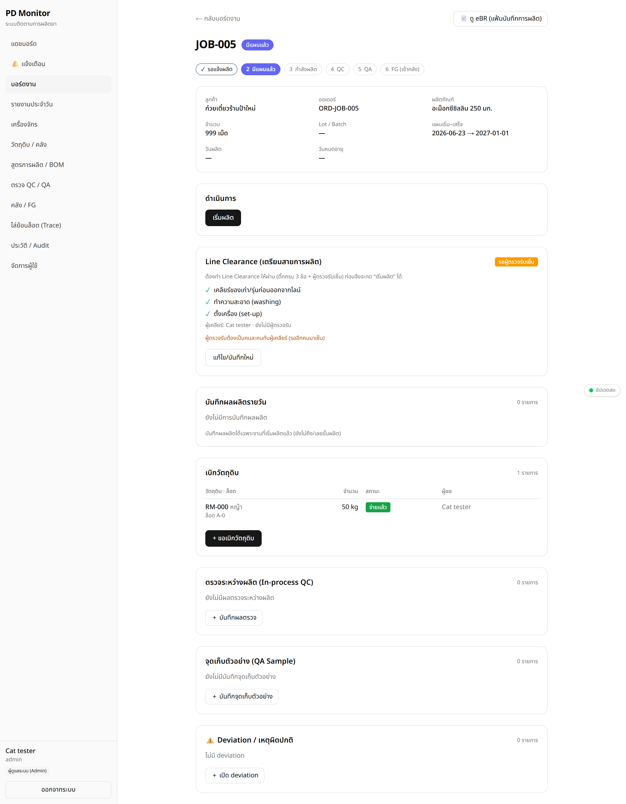

---

## 1.5 หน้าแดชบอร์ด

เมนูซ้าย → **แดชบอร์ด** (หน้าแรกหลังเข้าระบบ) — เห็นภาพรวมทั้งโรงงานในที่เดียว:

สิ่งที่เห็นบนหน้านี้:
- **งานตามสถานะ (ปัจจุบัน)** — นับว่ามีงานค้างอยู่ขั้นไหนกี่งาน (รอแจ้งผลิต / มีแผนแล้ว / กำลังผลิต / QC / QA / FG)
- **งานที่ติดปัญหา** — งานที่ถูกแปะป้าย 🔴🟡🟠
- **สรุปผลผลิตตามช่วงเวลา** — ผลิตได้รวม · ของเสียรวม · **% ของดี (Yield)** · ชั่วโมงแรงงานรวม
- **เลือกช่วงวันที่** (จากวันที่–ถึงวันที่) เพื่อดูสรุปเฉพาะช่วงที่ต้องการ

> 👔 **เฉพาะผู้บริหาร** จะเห็นเพิ่ม: **ต้นทุนค่าแรง (DL)** = จำนวนคน × ชั่วโมง × อัตราค่าแรง (ปรับอัตรา ฿/ชม. ได้) พร้อมตารางแยกตามสถานี

---

## 1.6 กล่องแจ้งเตือน 🔔

เมนูซ้าย → **🔔 แจ้งเตือน** — รวมเรื่องที่คุณต้องรู้ (ระบบส่งเฉพาะเรื่องที่เกี่ยวกับฝ่ายของคุณ ไม่รบกวนด้วยเรื่องคนอื่น):

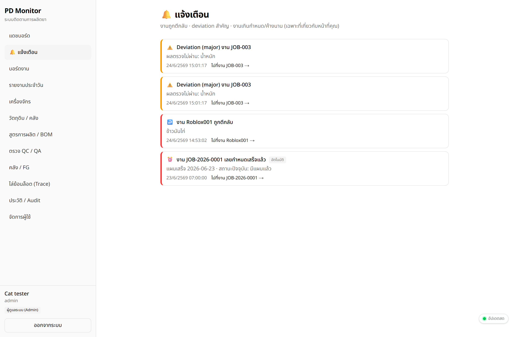

ระบบจะแจ้งเตือนเมื่อ:
- งานของคุณ **ถูกตีกลับ** (QC หรือ QA ตีกลับ)
- มี **เหตุผิดปกติ (deviation) สำคัญ** เกิดขึ้น
- งาน **เกินกำหนดส่ง** หรือ **ค้างนานผิดปกติ**

วิธีใช้:
1. ตัวเลขสีแดงบนเมนูกระดิ่ง = จำนวนเรื่องที่ยังไม่อ่าน
2. เปิดเข้าไปอ่าน → กด **"อ่านแล้ว"** ทีละเรื่อง หรือ **"อ่านทั้งหมด"** ทีเดียว
3. กดที่รายการเพื่อกระโดดไปยังหน้างานที่เกี่ยวข้องได้ทันที

---
---

# ส่วนที่ 2 — เดินงานครบวงจร 1 งาน (สร้าง → ปิด)

> ส่วนนี้คือ "การเดินทางของงาน 1 งาน" เรียงตามลำดับจริง ตั้งแต่สร้างจนปิดเข้าคลัง
> แต่ละขั้นบอกว่า **ใครทำ · กดปุ่มไหน · กรอกอะไร · จะเกิดอะไรขึ้น**
> อ่านเฉพาะขั้นที่เป็นหน้าที่ของคุณก็ได้ แต่ถ้าอ่านครบจะเข้าใจภาพรวมทั้งทีม

---

## ขั้นที่ 1 — สร้างงานผลิตใหม่ 👔 *(ผู้บริหาร)*

1. เมนูซ้าย → **บอร์ดงาน**
2. กดปุ่ม **"＋ สร้างงานใหม่"** (มุมบนขวา — เห็นเฉพาะผู้บริหาร)

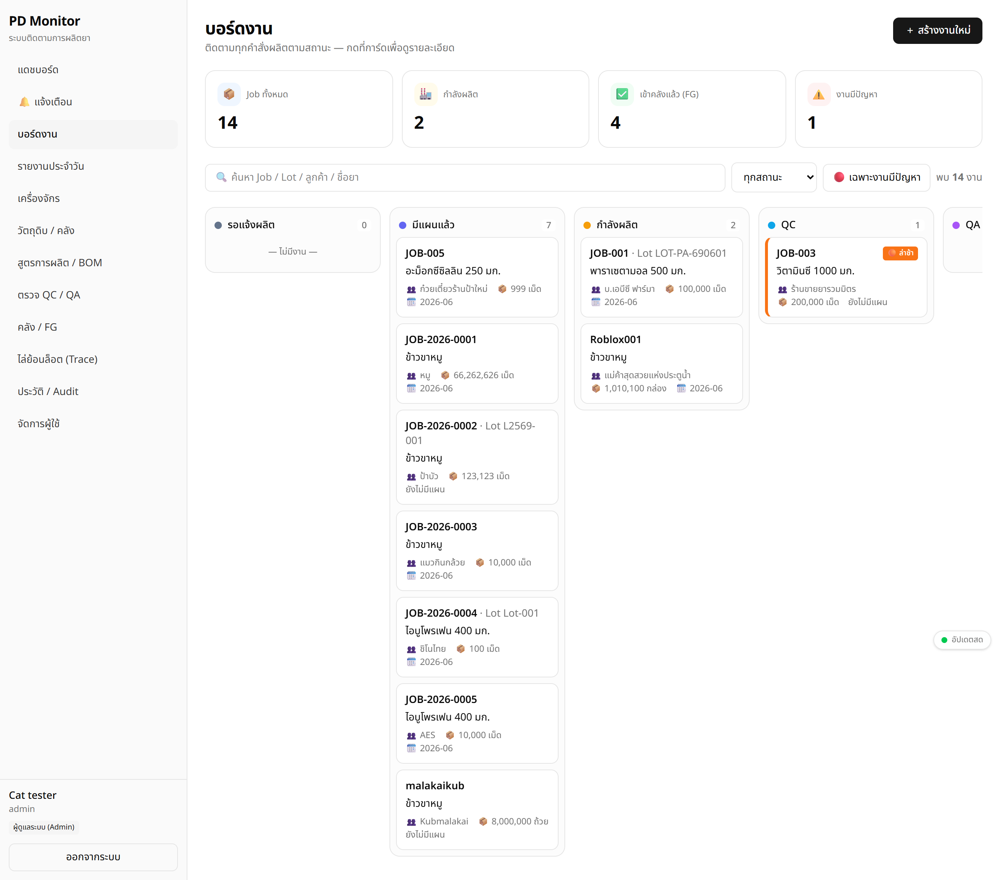

3. กรอกข้อมูลในฟอร์ม:

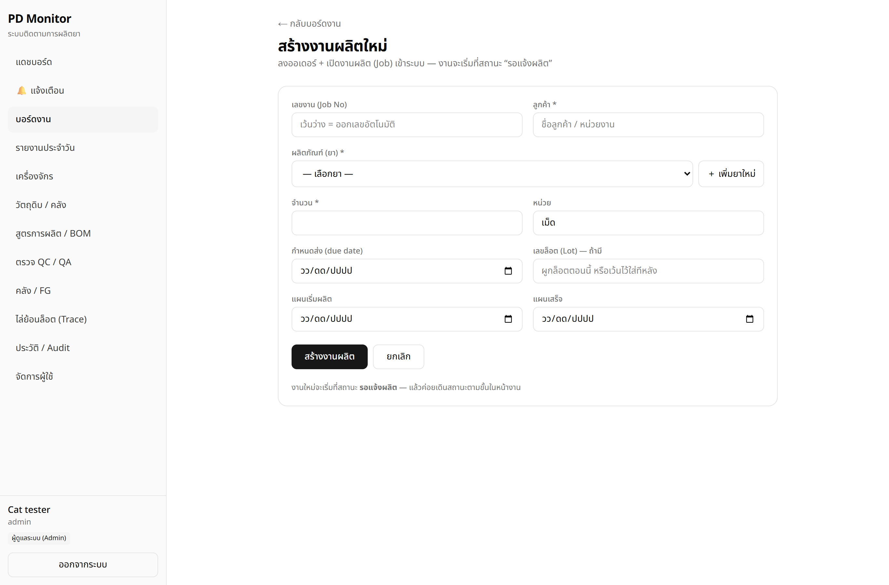

| ช่อง | บังคับ? | คำอธิบาย |
|---|:---:|---|
| **ลูกค้า** | ✅ | ชื่อลูกค้า/เจ้าของออเดอร์ |
| **ผลิตภัณฑ์ (ยา)** | ✅ | เลือกจากรายการ หรือกด **"เพิ่มยาใหม่"** เพื่อกรอกตรงนั้น (รหัสยา · ชื่อยา · รูปแบบยา · เวลามาตรฐาน ชม.) |
| **จำนวน + หน่วย** | ✅ | จำนวนที่จะผลิต + หน่วย (เม็ด / แคปซูล / ขวด ฯลฯ) |
| **กำหนดส่ง** | – | วันครบกำหนดส่งมอบ |
| **แผนเริ่ม – แผนเสร็จ** | – | ช่วงวันที่วางแผนผลิต |
| **เลขล็อต** | – | ใส่ตอนนี้ หรือเติมทีหลังก็ได้ |
| **เลขงาน** | – | **เว้นว่างได้** ระบบจะออกให้อัตโนมัติ เช่น `JOB-2569-0001` |

4. กด **บันทึก** → ระบบสร้างงานพร้อมออเดอร์ให้ในครั้งเดียว และพาเข้าหน้ารายละเอียดงาน
5. งานใหม่จะขึ้นบนบอร์ดทันที (ทุกคนเห็นแบบเรียลไทม์) เริ่มที่สถานะ **"รอแจ้งผลิต"**

---

## ขั้นที่ 2 — ยืนยันแผนผลิต 👔 *(ผู้บริหาร)*

1. เปิดงานที่สถานะ **"รอแจ้งผลิต"** (เมนู → บอร์ดงาน → กดที่การ์ดงาน)
2. กดปุ่ม **"ยืนยันแผนผลิต"**
3. งานเลื่อนเป็นสถานะ **"มีแผนแล้ว"** → ฝ่ายผลิตเริ่มเตรียมงานต่อได้

> 💡 ตั้งแต่ขั้นนี้เป็นต้นไป งานจะปรากฏให้ฝ่ายผลิตเห็นว่า "พร้อมเตรียมผลิต"

---

## ขั้นที่ 3 — เบิกวัตถุดิบ 🏭📦 *(ฝ่ายผลิต ขอ + คลัง จ่าย)*

> หน้าจอทั้งหมดของขั้นนี้อยู่ใน **หน้ารายละเอียดงาน** ส่วน **"ใบเบิกวัตถุดิบ"**

**ฝ่ายผลิต — ขอเบิก:**
1. เปิดหน้างาน → เลื่อนหาส่วน **"ใบเบิกวัตถุดิบ"**
2. เลือกวัตถุดิบ (ล็อตที่ต้องการ) + ใส่ **จำนวนที่ต้องใช้** → กด **ขอเบิก**

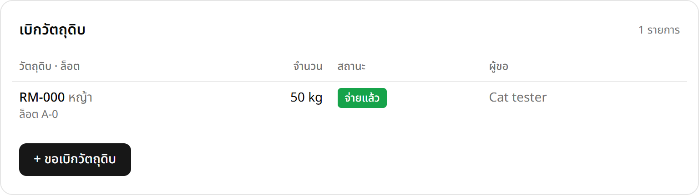

**ฝ่ายคลัง — จ่ายของ:**
3. ฝ่ายคลังเปิดหน้างานเดียวกัน → กด **จ่ายของ (issue)** ระบุ **เลขล็อต** + จำนวนที่จ่าย
4. ระบบ **ตัดสต็อกอัตโนมัติ** และ **กันจ่าย** ล็อตที่ QC ไม่ผ่าน / หมดอายุ / ของไม่พอ

> ℹ️ ถ้างานเข้าสู่ขั้นเตรียม/ผลิตแต่ยังไม่เบิก ระบบจะมีแถบเตือน "ควรเบิกวัตถุดิบก่อน"

---

## ขั้นที่ 4 — Line Clearance (เคลียร์ไลน์ก่อนผลิต) 🏭 *(ฝ่ายผลิต + ผู้ตรวจ)* ⚠️ สำคัญ

> นี่คือ "ด่านกั้น" ตามมาตรฐาน GMP — **ถ้าไม่ผ่าน จะกด "เริ่มผลิต" ไม่ได้**

1. ในหน้างาน เลื่อนหาส่วน **"Line Clearance"**
2. บันทึกการเคลียร์ไลน์: เคลียร์ของรุ่นก่อนออกจากไลน์ · ทำความสะอาด (washing) · ตั้งเครื่อง (set-up) · ใส่หมายเหตุ
3. ต้องมี **2 ลายเซ็น** — **คนทำ ≠ คนตรวจ** (ผู้ทำบันทึก แล้วให้ผู้ตรวจ เช่น QC/หัวหน้า/ผู้บริหาร มาเซ็นรับรอง)
4. เมื่อครบ 2 ลายเซ็น สถานะ Line Clearance = **ผ่าน ✓**

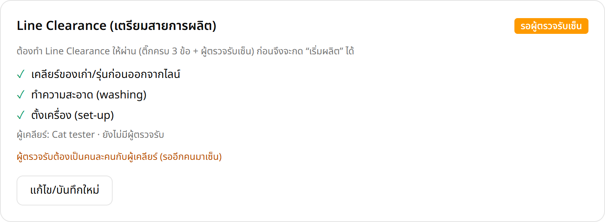

> ⚠️ ถ้าพยายามกด "เริ่มผลิต" โดยยังไม่เคลียร์ไลน์ ระบบจะบล็อกและแจ้งว่ายังไม่ผ่าน Line Clearance

---

## ขั้นที่ 5 — เริ่มผลิต 🏭 *(ฝ่ายผลิต)*

1. เปิดงานที่สถานะ **"มีแผนแล้ว"** และผ่าน Line Clearance แล้ว
2. กดปุ่ม **"เริ่มผลิต"**
3. งานเลื่อนเป็นสถานะ **"กำลังผลิต"** — พร้อมบันทึกผลผลิตได้

---

## ขั้นที่ 6 — บันทึกผลผลิตรายวัน 🏭 *(ฝ่ายผลิต)*

> บันทึกได้เฉพาะงานที่อยู่สถานะ **กำลังผลิต / QC / QA** (หลังจากนั้นงานล็อกแล้ว)

1. ในหน้างาน เลื่อนหาส่วน **"บันทึกผลผลิต"**
2. กรอกข้อมูล:

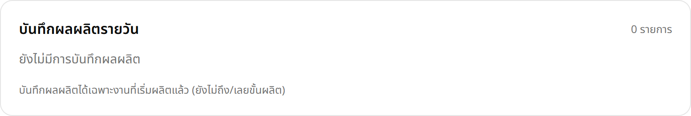

| ช่อง | บังคับ? | คำอธิบาย |
|---|:---:|---|
| **วันที่บันทึก** | ✅ | เป็นวันในอนาคตไม่ได้ |
| **สถานี** | ✅ | เตรียมวัตถุดิบ 🧪 / ผสม 🌀 / ตอกเม็ด ⚙️ / บรรจุ 📦 |
| **เครื่องจักร** | – | เลือกเครื่องที่ใช้ (ระบบ **กันเลือกเครื่องที่กำลังซ่อม**) |
| **ยอดตั้งต้น (input)** | ✅ | จำนวนวัตถุดิบ/ของที่รับเข้าสถานี |
| **ยอดผลิตได้ (output)** | ✅ | ต้องไม่เกินยอดตั้งต้น |
| **ของเสีย (loss)** | – | ผลิตได้ + ของเสีย ต้องไม่เกินยอดตั้งต้น |
| **ชั่วโมงทำงาน** | – | 0–24 |
| **จำนวนคน** | – | จำนวนเต็มตั้งแต่ 1 (ใช้คำนวณต้นทุนค่าแรง) |
| **หมายเหตุ** | – | บันทึกเพิ่มเติม |

3. กด **บันทึก** → รายการขึ้นในตารางทันที

> 📶 **เน็ตโรงงานกระตุกไม่ต้องห่วง:** ถ้ากดบันทึกแล้วเน็ตหลุด ระบบจะ **เก็บค้างไว้และลองส่งเองอัตโนมัติเมื่อเน็ตกลับมา** — ปิดจอ/รีโหลดข้อมูลก็ไม่หาย และจะไม่บันทึกซ้ำ
> สถานะที่เห็นใต้ปุ่ม: "กำลังบันทึก" / "เน็ตมีปัญหา–ลองใหม่ (n/4)" / "ค้างไว้" / "บันทึกแล้ว ✓"

---

## ขั้นที่ 7 — ตรวจระหว่างผลิต (In-process QC) 🔬 *(QC)*

> ทำคู่ขนานระหว่างที่งานกำลังผลิต — ไม่ต้องรอผลิตเสร็จ

1. QC เปิดหน้างาน → ส่วน **"ตรวจระหว่างผลิต (In-process QC)"** (เห็น/เพิ่มได้เฉพาะ QC)
2. บันทึกผล: สถานี · หัวข้อที่ตรวจ (param) · ค่าที่วัด · หน่วย · **ผ่าน / ไม่ผ่าน**

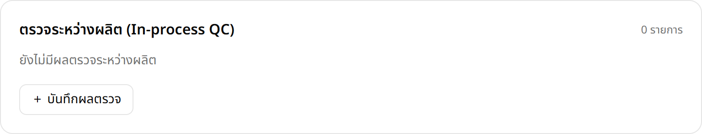

3. ❌ ถ้าผล **"ไม่ผ่าน"** จะมีปุ่มลัด **"เปิด deviation"** เพื่อบันทึกเหตุผิดปกติทันที (ดูขั้นที่ 10)

---

## ขั้นที่ 8 — ส่งตรวจ QC แล้ว QC ตัดสิน 🏭🔬 *(ฝ่ายผลิต ส่ง + QC ตัดสิน)*

**ฝ่ายผลิต — ส่งตรวจ:**
1. ผลิตเสร็จแล้ว → ในหน้างานกด **"ส่งตรวจ QC"**
2. งานเลื่อนเป็นสถานะ **"QC"** (ไปอยู่ในคิวของ QC)

**QC — ดูคิวและตัดสิน:**
3. QC เข้าเมนูซ้าย → **ตรวจ QC / QA** → เห็นงานที่สถานะ "QC" รอตรวจ → กดเข้างาน
4. ตัดสินงาน (ต้องลงนาม ✍️):
   - **ผ่าน:** กด **"QC ผ่าน → ส่ง QA"** → ยืนยันรหัสผ่าน → งานไปขั้น **QA**
   - **ไม่ผ่าน:** กด **"QC ตีกลับ"** → ใส่เหตุผล + ยืนยันรหัสผ่าน → งานกลับไป **"กำลังผลิต"** (ฝ่ายผลิตได้รับแจ้งเตือน)

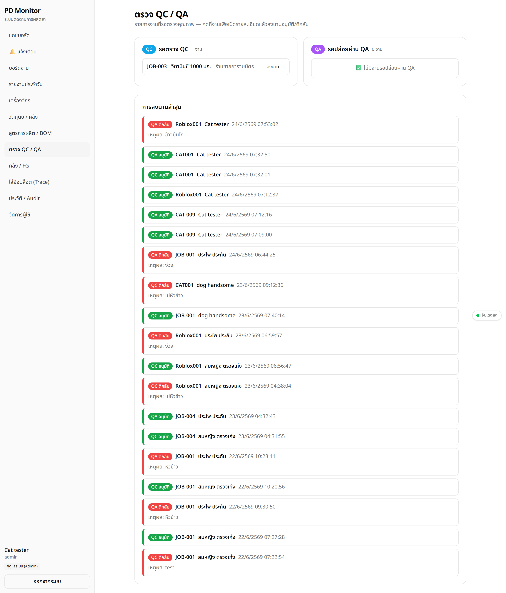

> ✍️ **การลงนาม** คือการ **ยืนยันรหัสผ่านซ้ำ** เพื่อยืนยันว่าเป็นตัวคุณจริง — ระบบเก็บชื่อผู้ลงนาม + เวลา + ผลตัดสิน + เหตุผล ไว้เป็นหลักฐาน (แก้ไม่ได้)

---

## ขั้นที่ 9 — QA เก็บตัวอย่าง + ปล่อยผ่าน/ตีกลับ ✅ *(QA)*

1. QA เข้าเมนูซ้าย → **ตรวจ QC / QA** → เห็นงานที่สถานะ **"QA"** รอปล่อย → กดเข้างาน
2. ในหน้างาน ส่วน **"จุดเก็บตัวอย่าง (QA Sample)"** → บันทึกจุด/รอบที่เก็บตัวอย่าง (เห็น/เพิ่มได้เฉพาะ QA)

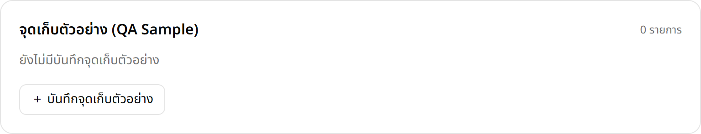

3. ตัดสินงาน (ต้องลงนาม ✍️):
   - **ปล่อยผ่าน:** กด **"QA ปล่อยผ่าน → FG"** → ยืนยันรหัสผ่าน → งานเข้าคลังสินค้าสำเร็จรูป (ขั้นต่อไปเป็นของฝ่ายคลัง)
   - **ตีกลับ:** กด **"QA ตีกลับ"** → ใส่เหตุผล → งานกลับไป **"กำลังผลิต"**

> 🚫 **ปล่อยผ่าน FG ไม่ได้ถ้ายังมี deviation เปิดค้างอยู่** — ระบบบล็อก ต้องปิด deviation ให้เรียบร้อยก่อน (ดูขั้นที่ 10)

---

## ขั้นที่ 10 — เหตุผิดปกติ (Deviation) ⚠️ *(เปิดได้หลายฝ่าย / ปิดเฉพาะ QA-ผู้บริหาร)*

> เปิดเมื่อเจอความผิดปกติระหว่างงาน (ผลตรวจไม่ผ่าน เครื่องเสีย วัตถุดิบมีปัญหา ฯลฯ) — อยู่ในหน้างาน ส่วน **"⚠️ Deviation"**

**การเปิด deviation** (ทำได้: ฝ่ายผลิต / QC / QA / ผู้บริหาร):
1. กด **เปิด deviation** → เลือก **ประเภท** (ผลตรวจไม่ผ่าน / เครื่องจักร / วัตถุดิบ / กระบวนการ / อื่น ๆ)
2. เลือก **ระดับความรุนแรง:** 🟢 เล็กน้อย (minor) · 🟠 ปานกลาง (major) · 🔴 ร้ายแรง (critical)
3. กรอกหัวข้อ + รายละเอียด → บันทึก (deviation ระดับสำคัญจะแจ้งเตือน QA + ผู้บริหารอัตโนมัติ)

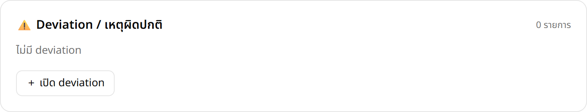

**การปิด deviation** (ทำได้เฉพาะ **QA / ผู้บริหาร**):
4. กด **อัปเดต/ปิด** → ต้องกรอก **สาเหตุราก (root cause)** + **แนวทางแก้ไข/ป้องกัน (CAPA)** ให้ครบ
5. เลือกสถานะ **ปิด (closed)** → บันทึก

> 🚫 ตราบใดที่ยังมี deviation เปิดค้าง **QA จะปล่อยผ่าน FG ไม่ได้** (ขั้นที่ 9)

---

## ขั้นที่ 11 — รับสินค้าเข้าคลัง (FG) = ปิดงาน 📦 *(คลัง)*

1. ฝ่ายคลังเข้าเมนูซ้าย → **คลัง / FG** → เห็นงานที่ผ่าน QA แล้ว (สถานะ FG) รอรับเข้า
2. กดปุ่ม **"รับเข้าคลัง"** → ใส่ **จำนวน / หน่วย / ตำแหน่งจัดเก็บ / เลขล็อต / หมายเหตุ**
3. การ์ดงานจะขึ้นว่า **"รับเข้าคลังแล้ว"** — **งานจบสมบูรณ์** 🎉

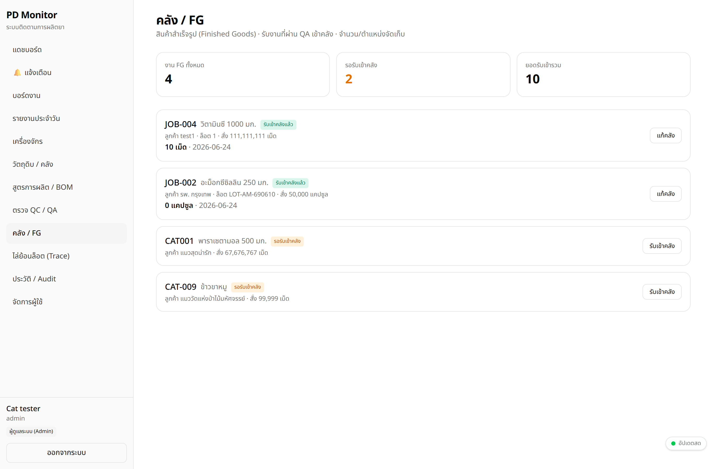

> การ์ดสรุปด้านบนบอก: งาน FG ทั้งหมด · รอรับเข้าคลัง · ยอดรับเข้ารวม

---

## ขั้นที่ 12 — eBR: พิมพ์แฟ้มบันทึกการผลิต 📄🖨️ *(ทุกฝ่ายที่เกี่ยวข้อง)*

> eBR (Electronic Batch Record) = แฟ้มเดียวที่รวมทุกอย่างของล็อตนั้น เอาไว้พิมพ์เก็บ/ส่งตรวจ

1. ในหน้ารายละเอียดงาน → กดปุ่ม **"📄 ดู eBR"**
2. จะเห็นเอกสารแฟ้มเดียวที่รวมทุกข้อมูลของล็อต เรียงตามลำดับ GMP:
   ข้อมูลงาน · Line Clearance · วัตถุดิบที่เบิก · เครื่องที่ใช้ · ผลผลิต · In-process QC · QA sample · deviation · ลายเซ็น QC/QA · FG ที่รับเข้า
3. กดปุ่ม **"พิมพ์"** เพื่อพิมพ์เป็นเอกสาร หรือบันทึกเป็น **PDF** (ระบบซ่อนเมนูออกให้อัตโนมัติตอนพิมพ์)

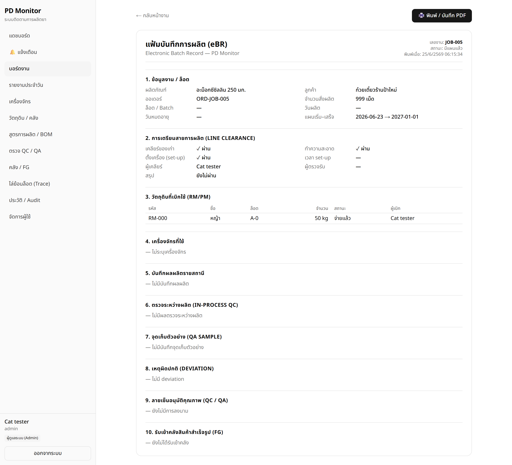

---
---

# ส่วนที่ 3 — เมนู/ฟังก์ชันอื่นที่ใช้ประจำ

## 3.1 รายงานประจำวัน

เมนูซ้าย → **รายงานประจำวัน** → เลือกวันที่ → เห็นสรุปบันทึกผลผลิตของวันนั้น แยกตามสถานี
(จำนวนบันทึก · ผลิตได้รวม · ของเสียรวม · ชั่วโมงรวม + ตารางรายการ: งาน · ผลิตภัณฑ์ · สถานี · ตั้งต้น · ผลิตได้ · ของเสีย · ชม. · ผู้บันทึก)

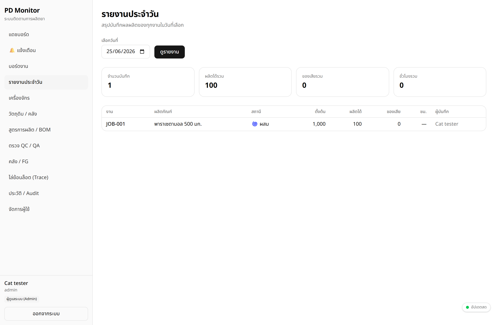

## 3.2 เครื่องจักร

เมนูซ้าย → **เครื่องจักร** — ทะเบียนเครื่อง + สถานะ + เตือนซ่อม/สอบเทียบ:
- 🔴 เครื่องอยู่สถานะซ่อม/สอบเทียบ · 🟠 เลยกำหนด · 🟡 ใกล้ครบกำหนด (≤ 7 วัน)
- **รายงานการใช้เครื่อง** (เลือกช่วงวันที่): ชั่วโมงรวม · จำนวนครั้งบันทึก · จำนวนงาน
- ผู้บริหารแก้สถานะ/วันครบกำหนดได้ · คนอื่นดูอย่างเดียว

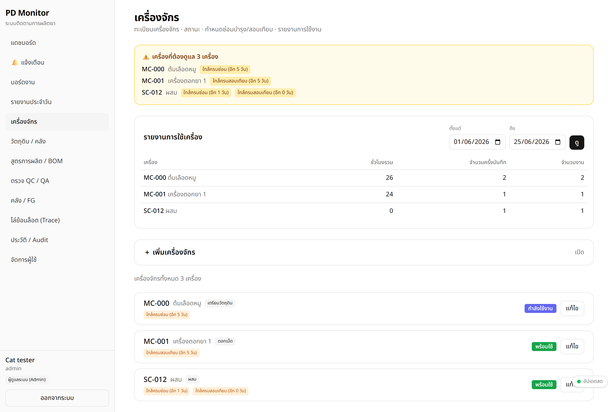

## 3.3 วัตถุดิบ / คลัง (RM/PM)

เมนูซ้าย → **วัตถุดิบ / คลัง** — รายการวัตถุดิบและบรรจุภัณฑ์ทุกล็อต:
- สต็อกคงเหลือ · สถานะ QC (ผ่าน/ไม่ผ่าน) · วันหมดอายุ
- เตือน: 🔴 หมดอายุแล้ว · 🟠 ใกล้หมดอายุ (≤ 30 วัน) · ⚠️ ไม่ผ่าน QC
- ฝ่ายคลัง/ผู้บริหารเพิ่ม/แก้ล็อตได้ · คนอื่นดูอย่างเดียว

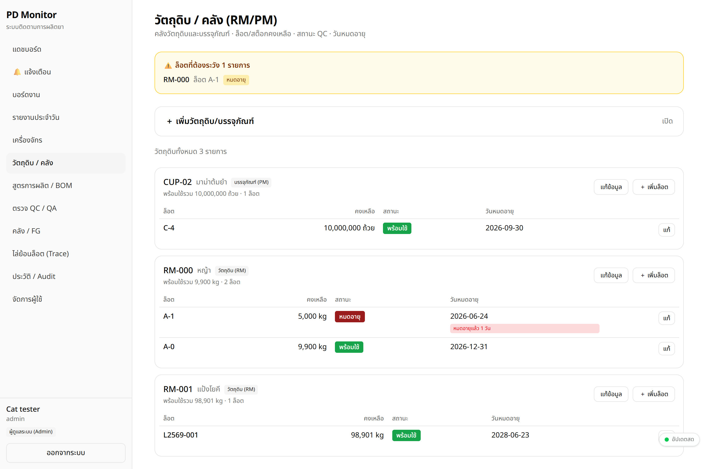

## 3.4 สูตรการผลิต / BOM

เมนูซ้าย → **สูตรการผลิต / BOM** — ตั้งครั้งเดียวใช้ยาว (ปกติผู้บริหาร/แอดมินตั้ง):
- **สูตร + ขนาดแบตช์** ของยาแต่ละตัว
- **BOM** (รายการวัตถุดิบที่ใช้ + ปริมาณต่อแบตช์)
- **รูปแบบบรรจุ** (Blister / Strip / ซอง / ขวด / กระปุก)
- **ขั้นตอนการผลิต (Route)** — เรียงลำดับสถานีย่อย (1.→2.→3.) เลื่อนลำดับได้

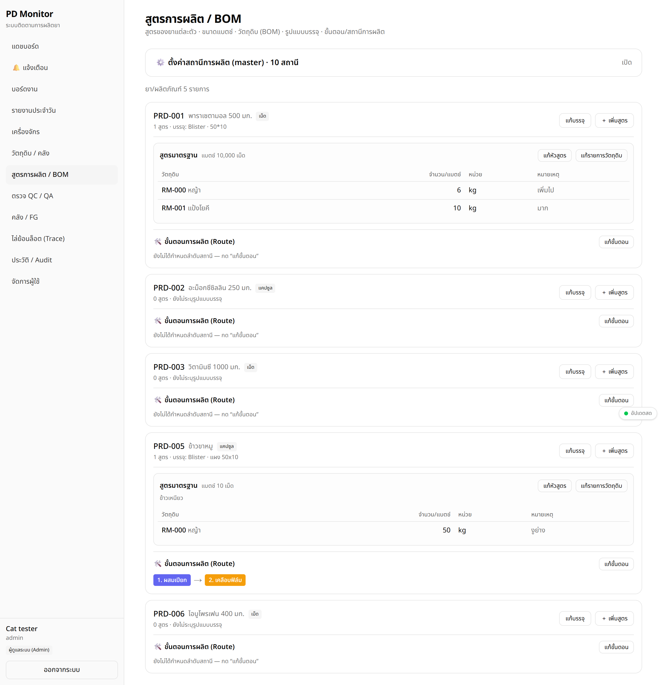

## 3.5 ไล่ย้อนล็อต (Trace) / Recall

เมนูซ้าย → **ไล่ย้อนล็อต (Trace)** (เห็นเฉพาะ QA / คลัง / ผู้บริหาร):
- พิมพ์ **เลขงาน** หรือ **เลขล็อต** ในช่องค้นหา → เห็นสายโซ่ **วัตถุดิบ → JOB → FG**
- **ขาไป:** งาน/ล็อต FG นี้ ใช้วัตถุดิบล็อตไหนบ้าง
- **ขาย้อน (สำคัญตอน recall):** วัตถุดิบล็อตนี้ ถูกใช้ในงานไหนบ้าง — ตามเก็บได้ครบ

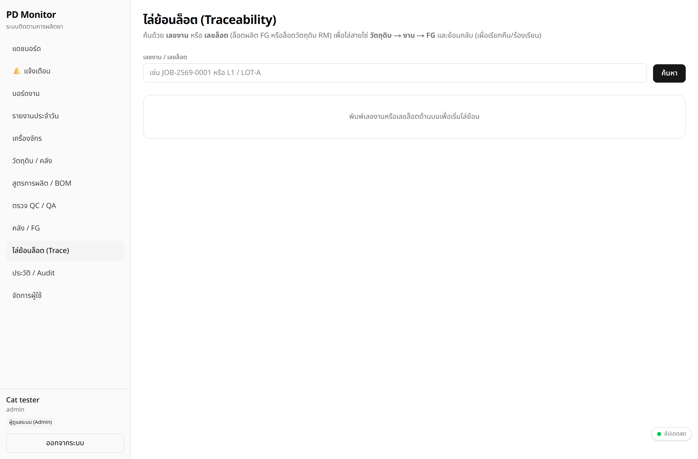

## 3.6 ประวัติ / Audit

เมนูซ้าย → **ประวัติ / Audit** (เห็นเฉพาะผู้บริหาร / QA):
- บันทึกทุกการเปลี่ยนแปลงในระบบ (ใคร · ทำอะไร · เมื่อไหร่) ตามมาตรฐาน GMP — **แก้/ลบไม่ได้**
- กรองตามประเภทข้อมูล (jobs / production_records / approvals ฯลฯ) และการกระทำ (เพิ่ม/แก้/ลบ)

## 3.7 จัดการผู้ใช้ (เปิดบัญชีให้ทีม) 👔 *(ผู้บริหาร)*

เมนูซ้าย → **จัดการผู้ใช้**:
1. **สร้างบัญชีใหม่** — อีเมล + รหัสผ่าน + ชื่อ + แผนก + บทบาท (บัญชีใหม่ล็อกอินได้ทันที)
2. **แก้บทบาท** · **แก้ชื่อ/แผนก** · **รีเซ็ตรหัสผ่าน** · **ระงับ/เปิดบัญชี**

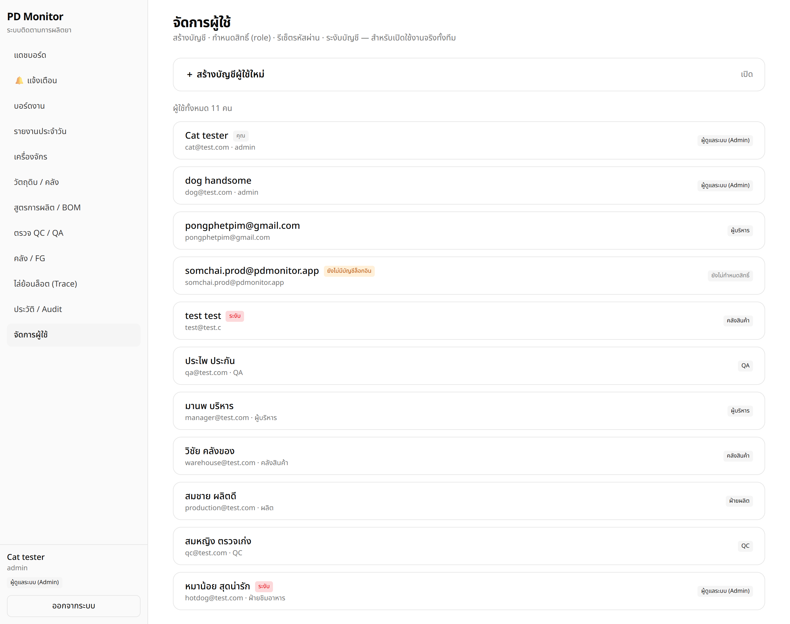

> ⚠️ ระบบกันไม่ให้คุณลดบทบาทตัวเองจนหลุดสิทธิ์ผู้บริหาร (กัน lockout)

---
---

# ส่วนที่ 4 — สรุปสั้น: แต่ละฝ่ายต้องทำอะไรบ้าง

**👔 ผู้บริหาร (manager)**
สร้างงาน → ยืนยันแผนผลิต → (ดูแดชบอร์ด/ต้นทุนค่าแรง) → จัดการผู้ใช้ · เข้าได้ทุกเมนู · ปิด deviation ได้

**🏭 ฝ่ายผลิต (production)**
เบิกวัตถุดิบ → Line Clearance → เริ่มผลิต → บันทึกผลผลิตรายวัน → ส่งตรวจ QC

**🔬 QC**
ตรวจระหว่างผลิต (in-process) → รับงานจากคิว "ตรวจ QC/QA" → **QC ผ่าน → ส่ง QA** หรือ **QC ตีกลับ** (ลงนาม)

**✅ QA**
เก็บตัวอย่าง → **QA ปล่อยผ่าน → FG** หรือ **QA ตีกลับ** (ลงนาม) → ปิด deviation → ไล่ย้อนล็อต

**📦 คลัง (warehouse)**
จ่ายวัตถุดิบให้ฝ่ายผลิต → รับสินค้าเข้าคลัง (FG) → ดูสต็อก/วันหมดอายุวัตถุดิบ

| ฉันคือ | อ่านส่วนพื้นฐาน 1.1–1.6 | แล้วเน้นอ่านขั้น |
|---|---|---|
| ผู้บริหาร | ✅ ทุกหัวข้อ | ขั้น 1–2, ทั้งส่วน 3 |
| ฝ่ายผลิต | ✅ ทุกหัวข้อ | ขั้น 3–6, 8, 12 |
| QC | ✅ ทุกหัวข้อ | ขั้น 7–8, 10, 12 |
| QA | ✅ ทุกหัวข้อ | ขั้น 9–10, 12, 3.5 |
| คลัง | ✅ ทุกหัวข้อ | ขั้น 3, 11, 3.3, 3.5 |

---
---

# ส่วนที่ 5 — ถาม–ตอบ & แก้ปัญหาที่พบบ่อย

**❓ เข้าระบบไม่ได้ / ลืมรหัสผ่าน**
→ แจ้งผู้บริหารหรือแอดมินให้รีเซ็ตรหัสในหน้า "จัดการผู้ใช้" · ตรวจว่าพิมพ์อีเมลถูกและไม่ติด Caps Lock

**❓ ไม่เห็นเมนูที่ควรเห็น (เช่น QC ไม่เห็น "ตรวจ QC / QA")**
→ บทบาท (role) อาจตั้งไม่ตรง — แจ้งผู้บริหารแก้บทบาทให้ (ข้อ 3.7)

**❓ กด "เริ่มผลิต" ไม่ได้**
→ ยังไม่ได้ทำ **Line Clearance** ให้ครบ (ต้องมี 2 ลายเซ็น คนทำ ≠ คนตรวจ) — ทำให้เสร็จก่อน (ขั้นที่ 4)

**❓ QA กด "ปล่อยผ่าน FG" ไม่ได้**
→ ยังมี **deviation เปิดค้าง** อยู่ — ต้องปิดให้หมดก่อน (กรอก root cause + CAPA) (ขั้นที่ 10)

**❓ กดบันทึกผลผลิตแล้วเน็ตหลุด ข้อมูลหายไหม?**
→ **ไม่หาย** ระบบเก็บค้างไว้และส่งเองเมื่อเน็ตกลับมา และจะไม่บันทึกซ้ำ (ขั้นที่ 6)

**❓ เลือกเครื่องจักรตอนบันทึกผลผลิตไม่เจอเครื่องที่ต้องการ**
→ เครื่องนั้นอาจอยู่สถานะ "ซ่อม/สอบเทียบ" ระบบกันไม่ให้เลือก — ตรวจสถานะที่เมนู "เครื่องจักร" (ข้อ 3.2)

**❓ ใช้บนมือถือได้ไหม?**
→ ได้เต็มรูปแบบ ปุ่มและช่องกรอกออกแบบมาให้แตะง่ายบนมือถือแล้ว (กดปุ่ม ☰ เพื่อเปิดเมนู)

**❓ ข้อมูลที่เพื่อนเพิ่งกรอก ทำไมขึ้นเองโดยไม่กดรีเฟรช?**
→ เป็นปกติ ระบบเป็น **เรียลไทม์** อัปเดตให้ทุกคนเห็นพร้อมกันทันที

---

> 📌 หากพบปัญหาที่คู่มือนี้ไม่ครอบคลุม หรืออยากให้เพิ่มหัวข้อ — แจ้งทีมผู้ดูแลระบบได้เลย
> เอกสารนี้จะปรับปรุงตามฟีเจอร์ใหม่ที่เพิ่มเข้ามาเรื่อย ๆ
