# 1 · พื้นฐานที่ทุกคนต้องรู้

## 1.1 เข้าสู่ระบบ

📍 เปิด `https://pd-monitor.vercel.app` → ✍️ อีเมลและรหัสผ่านของคุณ → 🖱️ **"เข้าสู่ระบบ"**

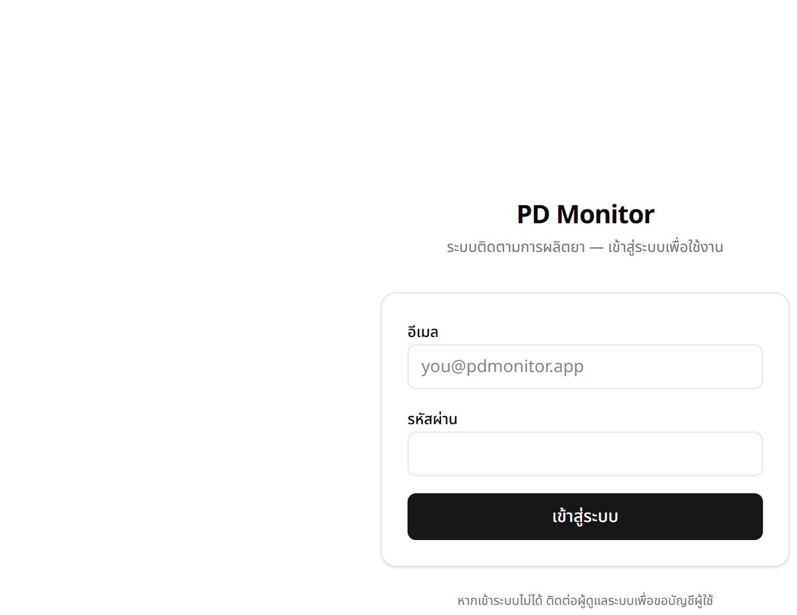

**3 อย่างที่อาจเจอหลังกดเข้าสู่ระบบ**

| เจอแบบนี้ | แปลว่า | ทำยังไง |
|---|---|---|
| เข้าหน้าแดชบอร์ดปกติ | เรียบร้อย | — |
| เด้งไปหน้า **"ตั้งรหัสผ่านใหม่"** | เป็นการเข้าครั้งแรก หรือหัวหน้าเพิ่งรีเซ็ตรหัสให้ | ตั้งรหัสใหม่ก่อน ถึงจะใช้งานได้ |
| ขึ้นจอ **"บัญชีถูกระงับ"** | หัวหน้า/ผู้ดูแลระบบระงับบัญชีไว้ | ติดต่อหัวหน้าแผนก |
| ขึ้น **"อีเมลหรือรหัสผ่านไม่ถูกต้อง"** | พิมพ์ผิด หรือบัญชีถูกลบ | ลองใหม่ · ถ้ายังไม่ได้ให้หัวหน้ารีเซ็ตรหัสให้ |

**เปลี่ยนรหัสผ่านเอง** — 🖱️ ปุ่ม **"เปลี่ยนรหัสผ่าน"** ท้ายแถบเมนูซ้าย

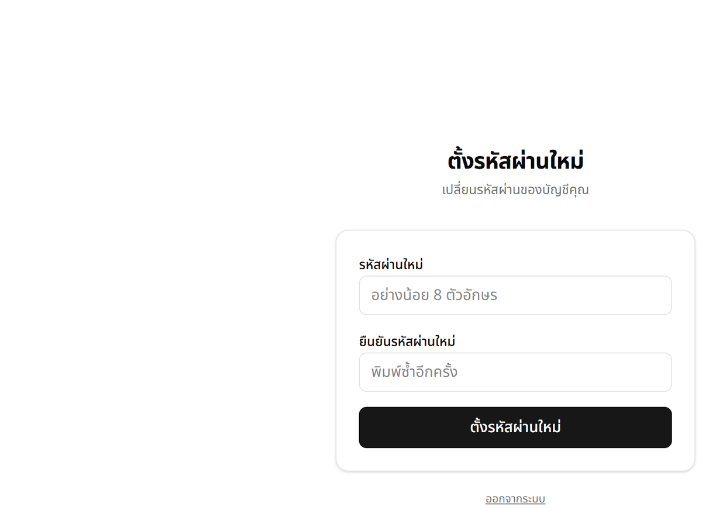

> ⚠️ **ห้ามใช้บัญชีร่วมกัน** — ทุกการกระทำถูกบันทึกในชื่อเจ้าของบัญชี และลายเซ็น QC/QA
> ต้องยืนยันด้วยรหัสผ่านของตัวเอง การใช้บัญชีคนอื่นทำให้ประวัติผิดและผิดหลัก GMP

---

## 1.2 ส่วนประกอบของหน้าจอ

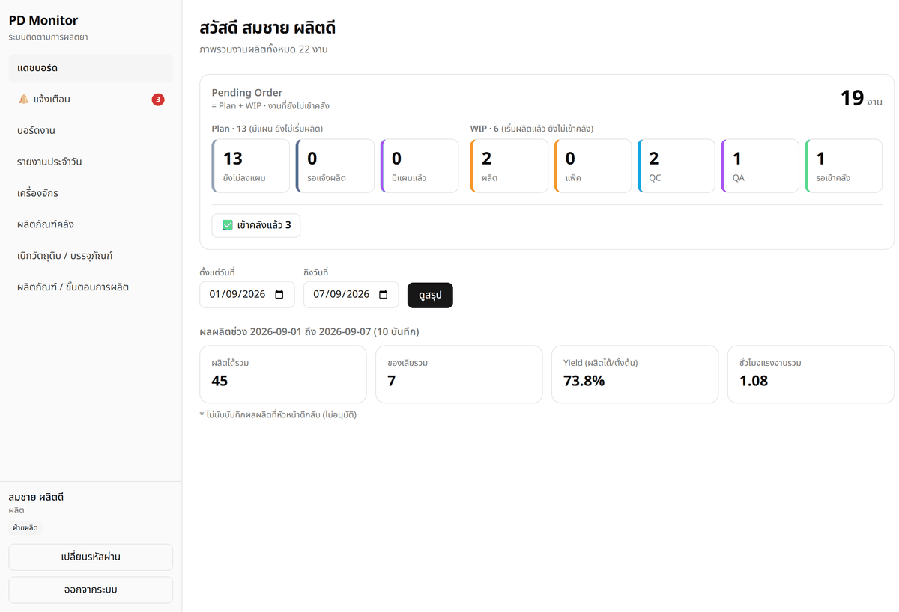

**บนคอมพิวเตอร์** แถบเมนูอยู่ซ้ายตลอด · **บนมือถือ/แท็บเล็ต** กดปุ่ม **☰** มุมซ้ายบนเพื่อเปิด
เลือกเมนูแล้วปิดเอง

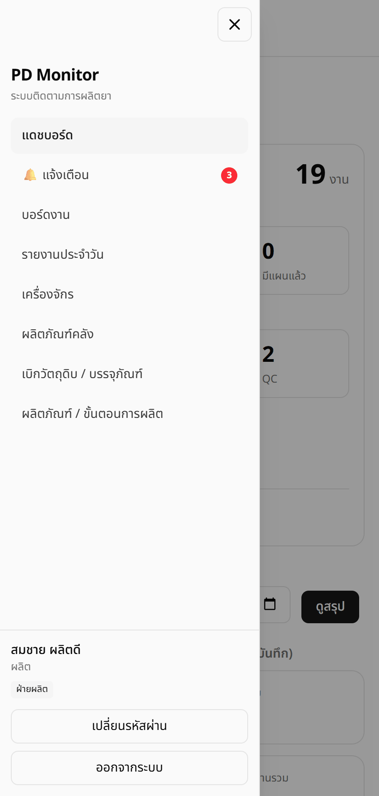

**ท้ายแถบเมนู** บอกว่าคุณเป็นใคร — ชื่อ-สกุล · แผนก · **ชิปสีแสดงสิทธิ์ทุกตัวที่คุณถือ**
(ถ้าขึ้นว่า "ยังไม่กำหนดสิทธิ์" ให้แจ้งหัวหน้าแผนก)

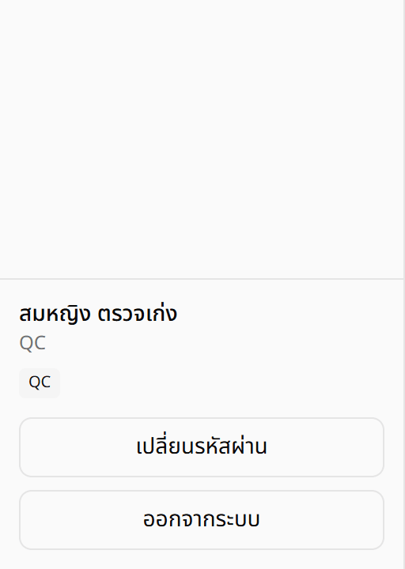

### เมนูทั้งหมด 15 รายการ — ใครเห็นอะไร

| เมนู | ไปหน้าอะไร | ใครเห็น |
|---|---|---|
| แดชบอร์ด | ภาพรวม + KPI | ทุกคน |
| **🔔 แจ้งเตือน** | กล่องแจ้งเตือน (มีตัวเลขแดง) | ทุกคน |
| บอร์ดงาน | งานทั้งหมดแยกตามสถานะ | ทุกคน |
| รายงานประจำวัน | สรุปบันทึกผลผลิตรายวัน | ทุกคน |
| เครื่องจักร | ทะเบียนเครื่อง + รายงานการใช้ | ทุกคน |
| ผลิตภัณฑ์คลัง | ล็อต/สต็อก | ทุกคน |
| เบิกวัตถุดิบ / บรรจุภัณฑ์ | หน้ารวมข้ามงาน | คลัง · ผลิต · ผู้บริหาร |
| ผลิตภัณฑ์ / ขั้นตอนการผลิต | ทะเบียนยา + Route + สถานี | ทุกคน |
| ตรวจ QC / QA | คิวงานรอตรวจ | QC · QA · ผู้บริหาร |
| คลัง / FG | รับสินค้าสำเร็จรูป | คลัง · ผู้บริหาร |
| ไล่ย้อนล็อต (Trace) | ผังไล่ย้อน | QA · คลัง · ผู้บริหาร |
| คำขอแก้ไข (Amendment) | อนุมัติคำขอ (มีตัวเลขเหลือง) | ผู้บริหาร · หัวหน้า QC · หัวหน้าฝ่ายผลิต |
| ประวัติ / Audit | บันทึกการเปลี่ยนแปลง | ผู้บริหาร · QA |
| จัดการผู้ใช้ | บัญชีและสิทธิ์ | ผู้บริหาร · หัวหน้าแผนกทุกฝ่าย |
| บริษัท / เลขงาน | ตั้งเลข Job No. | ผู้บริหารเท่านั้น |

**หน้าที่ไม่มีในเมนู — เข้าจากปุ่มเท่านั้น**

| หน้า | เข้าจากไหน |
|---|---|
| สร้างงานใหม่ | ปุ่ม **"＋ สร้างงานใหม่"** บนบอร์ดงาน |
| ปริ้นใบแจ้งผลิต | ปุ่ม **"🖨️ ปริ้นใบแจ้งผลิต"** บนบอร์ดงาน |
| ปริ้นตารางบอร์ดงาน | ปุ่ม **"📋 ปริ้นตารางบอร์ดงาน"** บนบอร์ดงาน |
| รายละเอียดงาน | กดการ์ดงาน · ลิงก์จากแจ้งเตือน · ลิงก์จากรายงานประจำวัน |
| eBR | ปุ่ม **"📄 ดู eBR"** บนหน้ารายละเอียดงาน |

> 💡 **เห็นเมนูไม่เท่าเพื่อนเป็นเรื่องปกติ** — ระบบซ่อนเมนูที่ฝ่ายคุณไม่ได้ใช้

---

## 1.3 สิทธิ์ (role) 15 แบบ

คนหนึ่งถือได้หลายสิทธิ์พร้อมกัน

| สิทธิ์ | ตัวย่อ | หน้าที่หลัก |
|---|---|---|
| ฝ่ายวางแผน | PLN | วางแผนการผลิต — เปิดงานเข้าระบบ |
| หัวหน้าฝ่ายวางแผน | PLN-L | + ดูแลบัญชีทีมวางแผน |
| ฝ่ายผลิต | PROD | ผลิตจริงหน้างาน — บันทึกผลผลิตรายวัน |
| หัวหน้าฝ่ายผลิต | PROD-L | + ยืนยัน Line Clearance · อนุมัติบันทึกผลผลิต |
| QC | QC | ตรวจคุณภาพระหว่างผลิต + ตัดสิน QC |
| หัวหน้า QC | QC-L | + อนุมัติผลตรวจ in-process |
| QA | QA | ปล่อยผ่านล็อต + ดูแลเอกสารคุณภาพ |
| หัวหน้า QA | QA-L | + ดูแลบัญชีทีม QA |
| คลังสินค้า | WH | คลังผลิตภัณฑ์ + รับสินค้าสำเร็จรูปเข้าคลัง |
| หัวหน้าคลังสินค้า | WH-L | + ดูแลบัญชีทีมคลัง |
| วิศวกรรม | ENG | ดูแลเครื่องจักร — ซ่อมบำรุง / สอบเทียบ |
| หัวหน้าฝ่ายวิศวกรรม | ENG-L | + ดูแลบัญชีทีมวิศวกรรม |
| บัญชีต้นทุน | COST | ดูต้นทุนค่าแรงทางตรง |
| ผู้บริหาร | MGR | ดูภาพรวมและอนุมัติงานส่วนใหญ่ |
| ผู้ดูแลระบบ | ADM | ผ่านทุกสิทธิ์ |

**กติกาสืบทอด 2 ข้อ**

1. **ผู้ดูแลระบบ (admin) ผ่านทุกสิทธิ์เสมอ**
2. **หัวหน้าฝ่ายมีสิทธิ์ของลูกน้องในฝ่ายตัวเองด้วย** — แต่ **ทางเดียวเท่านั้น**
   หัวหน้าฝ่ายผลิต ⊃ ฝ่ายผลิต · แต่ฝ่ายผลิตไม่ได้สิทธิ์ของหัวหน้า

> 🔒 **นี่คือเหตุผลที่กฎ 2 ลายเซ็นทำงานได้** — ถ้าพนักงานได้สิทธิ์หัวหน้าด้วย ก็จะรับรองงานตัวเองได้
> ระบบจึงออกแบบให้สืบทอดทางเดียว

> ⚠️ **ผู้บริหารทำแทนได้เกือบทุกอย่าง ยกเว้นลงนาม QC/QA** — ระบบบังคับว่าผู้ลงนามปล่อยผ่าน
> ต้องถือสิทธิ์ QC หรือ QA จริง ตามแนว GMP

---

## 1.4 สถานะงาน 6 ขั้น

| # | สถานะ | ความหมาย | ใครเลื่อนไปขั้นต่อไป |
|:---:|---|---|---|
| 1 | **รอแจ้งผลิต** | เปิดงานแล้ว ยังไม่ยืนยันแผน | ฝ่ายวางแผน · ผู้บริหาร |
| 2 | **มีแผนแล้ว** | ยืนยันแผนแล้ว รอเริ่มผลิต | ฝ่ายผลิต · ผู้บริหาร |
| 3 | **กำลังผลิต** | ผลิตอยู่ · บันทึกผลผลิตได้เฉพาะตอนนี้ | **ฝ่ายผลิตเท่านั้น** |
| 4 | **QC** | รอ QC ตัดสิน | **QC เท่านั้น** (ต้องลงนาม) |
| 5 | **QA** | รอ QA ปล่อยผ่าน | **QA เท่านั้น** (ต้องลงนาม) |
| 6 | **FG (เข้าคลัง)** | ปิดงาน — หายจากบอร์ด | — |

**ถอยหลังได้ทางเดียว: ตีกลับ** — QC หรือ QA ตีกลับ งานจะกลับไป **"กำลังผลิต"** และต้องระบุเหตุผล

**ป้ายปัญหา** (แยกจากสถานะ · ตั้งได้ทุกเมื่อ): 🔴 ติดปัญหา · 🟡 รอแก้ไข · 🟠 ล่าช้า

### "Status" ต่างจาก "สถานะ" อย่างไร

| | **สถานะ** (6 ขั้นข้างบน) | **Status** (ช่องในการ์ดข้อมูลงาน) |
|---|---|---|
| ใครกำหนด | ระบบบังคับ | ทีมพิมพ์/เลือกเอง |
| ตัวอย่าง | กำลังผลิต · QC | `ไม่มีแผน` · `มีแผน08/26` · `รอวัตถุดิบ` |
| มีผลกับด่าน GMP | **ใช่** | **ไม่** |
| ใช้ทำอะไร | คุมลำดับงานจริง | สื่อสารกันในทีม · กรองในตารางพิมพ์ |

> 💡 **Status บางค่าจะขอ "เดือนแผน" ด้วย** — เลือกแล้วบนบอร์ดจะแสดงเป็น `มีแผน08/26`
> (เดือน/ปี ค.ศ. 2 หลัก)

---

## 1.5 แดชบอร์ด

📍 หน้าแรกหลังล็อกอิน

**บล็อก Pending Order = Plan + WIP** — งานที่ยังไม่เข้าคลังทั้งหมด

| กลุ่ม | การ์ด | หมายถึง |
|---|---|---|
| **Plan** | ยังไม่ลงแผน | สถานะ "รอแจ้งผลิต" และ Status ยังไม่มีแผน |
| | รอแจ้งผลิต | ลงแผนแล้ว รอประกาศ |
| | มีแผนแล้ว | สถานะ "มีแผนแล้ว" |
| **WIP** | ผลิต | กำลังผลิต · ยังไม่ถึงสถานีบรรจุ |
| | แพ็ค | บันทึกผลผลิตล่าสุดอยู่ที่สถานีที่ติ๊ก "แพ็ค" |
| | QC · QA | ตามสถานะ |
| | รอเข้าคลัง | QA ปล่อยผ่านแล้ว คลังยังไม่รับเข้า |

🖱️ กดการ์ดใดก็ได้ → กระโดดไปบอร์ดงานที่กรองไว้แล้ว

**KPI ตามช่วงวันที่:** ผลิตได้รวม · ของเสียรวม · **Yield (ผลิตได้/ตั้งต้น)** · ชั่วโมงแรงงานรวม

> ⚠️ **ตัวเลขไม่นับบันทึกที่หัวหน้าไม่อนุมัติ** — เป็นตัวเลขที่ผ่านการรับรองแล้วเท่านั้น

> 🔑 **บล็อกต้นทุนค่าแรง (DL cost)** เห็นเฉพาะ **บัญชีต้นทุน** และ **ผู้บริหาร** · ปรับอัตรา ฿/ชม. ได้ที่นั่น

---

## 1.6 กล่องแจ้งเตือน 🔔

📍 **เมนูซ้าย → 🔔 แจ้งเตือน**

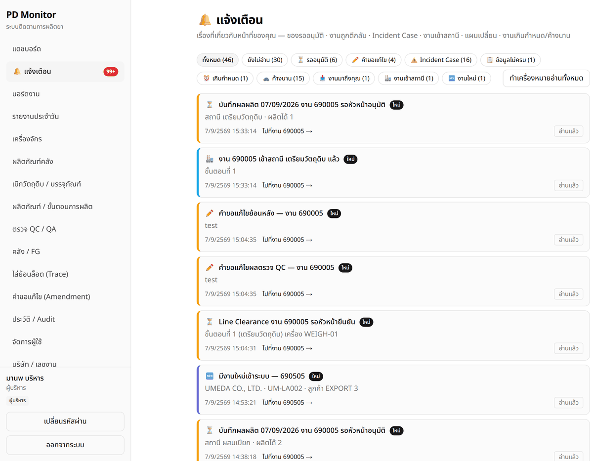

**13 ชนิด** (รายละเอียดครบอยู่ใน **ภาค 1 · E1**)

⏳ รออนุมัติ · ✏️ คำขอแก้ไข · ↩️ งานถูกตีกลับ · ⚠️ Incident Case · 📋 ข้อมูลไม่ครบ ·
⏰ เกินกำหนด · 🐢 ค้างนาน · 📥 งานมาถึงคุณ · 🏭 งานเข้าสถานี · 🆕 งานใหม่ · 📅 แผนเปลี่ยน ·
✅ ผลการอนุมัติ · 📝 ผลคำขอแก้ไข

**กติกาว่าใครเห็นใบไหน**

| ประเภทใบ | ใครเห็น |
|---|---|
| ใบทั่วไป | ทุกคนใน **ฝ่าย** ที่ถูกจ่าหน้า |
| ✅ ผลการอนุมัติ · 📝 ผลคำขอแก้ไข | **ผู้ยื่นคนเดียว** — ผู้บริหารก็ไม่เห็น |
| ทุกใบข้างต้น | **ผู้บริหารเห็นทุกฝ่าย** ยกเว้นใบรายบุคคล |
| ⏰ เกินกำหนด · 🐢 ค้างนาน | ฝ่ายผลิต · ผู้บริหาร (คำนวณสด · ไม่นับในตัวเลขแดง) |

> 💡 **ไม่แจ้งคนที่ก่อเหตุเอง** — สร้างงานเองไม่ได้ใบ "งานใหม่" · ทำ Line Clearance เองไม่ได้ใบ "รออนุมัติ"

---

## 1.7 อัปเดตสด · ออฟไลน์ · ใช้บนมือถือ

**🟢 อัปเดตสด** — ป้ายเล็ก ๆ มุมล่างขวา บอกว่าหน้านี้กำลังฟังการเปลี่ยนแปลงอยู่
ถ้ามีคนอื่นบันทึกอะไร หน้าจอคุณจะอัปเดตเองโดยไม่ต้องกดรีเฟรช

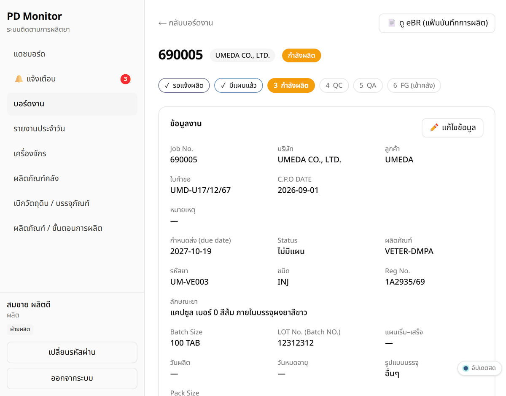

**ออฟไลน์** — เฉพาะ **ฟอร์มบันทึกผลผลิตรายวัน** ถ้าเน็ตหลุดตอนกดบันทึก ระบบเก็บไว้ในเครื่อง
แล้วส่งซ้ำให้เองเมื่อเน็ตกลับมา และกันไม่ให้เกิดแถวซ้ำ

**บนมือถือ** — เพิ่มเว็บลงหน้าจอโฮมได้ ใช้เหมือนแอป (เมนูของเบราว์เซอร์ → "เพิ่มลงในหน้าจอโฮม")

---

# 2 · อ้างอิงรายหน้าจอ

แต่ละหัวข้อบอก 4 อย่าง — **เข้าจากไหน · ใครเข้าได้ · ทำอะไรได้ · ข้อควรระวัง**

---

## 2.1 บอร์ดงาน

**เข้าจาก** เมนูซ้าย → บอร์ดงาน · **ใครเข้าได้** ทุกคน

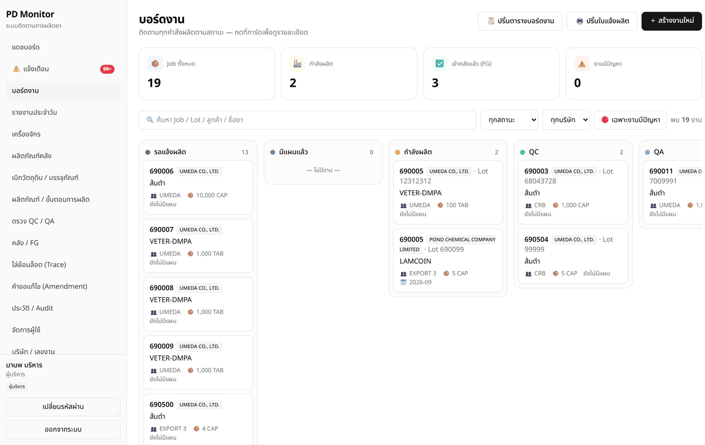

**ทำอะไรได้** — ดูงานทั้งหมดแยกตามสถานะ · KPI 4 ใบด้านบน · 🔍 ค้นหา (Job / Lot / ลูกค้า / ชื่อยา) ·
กรองตามสถานะ · กรองตามบริษัท · **"🔴 เฉพาะงานมีปัญหา"** · กดการ์ดเข้าหน้ารายละเอียดงาน

**ปุ่มบนหัวหน้า** — **"＋ สร้างงานใหม่"** (วางแผน/ผู้บริหาร) · **"🖨️ ปริ้นใบแจ้งผลิต"** (วางแผน/ผู้บริหาร) ·
**"📋 ปริ้นตารางบอร์ดงาน"** (ทุกคน)

> ⚠️ **งานที่เข้าคลัง FG แล้วจะไม่อยู่บนบอร์ด** — ไม่ได้ถูกลบ ยังค้นเจอและเปิด eBR ได้

---

## 2.2 สร้างงานผลิตใหม่

**เข้าจาก** ปุ่ม "＋ สร้างงานใหม่" บนบอร์ดงาน · **ใครเข้าได้** ฝ่ายวางแผน · ผู้บริหาร

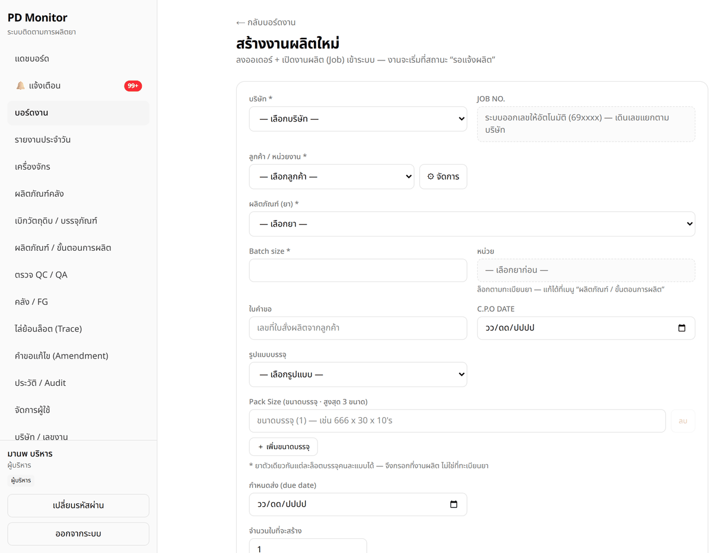

**ช่องบังคับ** — บริษัท · ลูกค้า/หน่วยงาน · ผลิตภัณฑ์ (ยา)

**ช่องอื่น** — จำนวนผลิต · ใบคำขอ · C.P.O DATE · กำหนดส่ง · รูปแบบบรรจุ + ขนาดบรรจุ 1–3 · หมายเหตุ ·
**จำนวนใบที่จะสร้าง (สูงสุด 50)**

> ⚠️ **บริษัทเปลี่ยนทีหลังไม่ได้** — เลขงานผูกกับชุดของบริษัทที่เลือกไปแล้ว

> ⚠️ **ไม่มีช่อง LOT No.** — เป็นหน้าที่ฝ่ายผลิตกรอกทีหลังที่หน้ารายละเอียดงาน

> 💡 **หน่วยถูกล็อกตามยาที่เลือก** — แก้ได้ที่ทะเบียนผลิตภัณฑ์เท่านั้น

---

## 2.3 หน้ารายละเอียดงาน

**เข้าจาก** กดการ์ดงานบนบอร์ด · **ใครเข้าได้** ทุกคน (ปุ่มต่างกันตามสิทธิ์)

หน้านี้คือศูนย์กลางของงาน 1 ใบ เรียงจากบนลงล่างตามลำดับการใช้จริง

| # | ส่วน | ใครใช้ |
|:---:|---|---|
| 1 | ปุ่ม "← กลับบอร์ดงาน" · **"📄 ดู eBR"** | ทุกคน |
| 2 | เลขงาน + ป้ายบริษัท + ป้ายสถานะ + ป้ายปัญหา | — |
| 3 | **แถบสถานะ 6 ขั้น** | — |
| 4 | **การ์ดข้อมูลงาน** + ปุ่ม "✏️ แก้ไขข้อมูล" | แก้ได้ตามฝ่าย |
| 5 | **ดำเนินการ** — ปุ่มเลื่อนสถานะ + แผงลงนาม + ปุ่ม "🗑️ ลบงานนี้" | ตามสถานะ/สิทธิ์ |
| 6 | **เบิกวัตถุดิบ/บรรจุภัณฑ์** | ผลิตลงรายการ · คลังกดพร้อม |
| 7 | **แท็บขั้นตอนการผลิต** | ทุกคน |
| 8 | **เครื่องจักรของขั้นตอนนี้** | ผลิต · ผู้บริหาร |
| 9 | **Line Clearance** | ผลิตทำ · หัวหน้ายืนยัน |
| 10 | **บันทึกผลผลิตรายวัน** + แถบอนุมัติหลายรายการ | ผลิตบันทึก · หัวหน้าอนุมัติ |
| 11 | **ตรวจระหว่างผลิต (In-process QC)** | QC ลงผล · หัวหน้า QC อนุมัติ |
| 12 | **จุดเก็บตัวอย่าง (ตรวจ Finished product)** | QA |
| 13 | **⚠️ Incident Case** | ทุกคนเปิดได้ · QA ตัดสิน |
| 14 | **ประวัติการแก้ไขย้อนหลัง** | ทุกคนดูได้ |
| 15 | **ลายเซ็นอนุมัติคุณภาพ (QC / QA)** | ทุกคนดูได้ |

**แถบเตือนที่อาจขึ้นด้านบน**

| แถบ | แปลว่า | แก้ยังไง |
|---|---|---|
| ไม่มีขั้นตอนการผลิต | ยาตัวนี้ยังไม่ได้ตั้ง Route | ผู้บริหารไปตั้งที่หน้าผลิตภัณฑ์ |
| ยังไม่มีเลขล็อต | ยังไม่ได้กรอก LOT No. | ฝ่ายผลิตกรอกในการ์ดข้อมูลงาน |

**สิทธิ์ราย field ในการ์ดข้อมูลงาน**

| ช่อง | ฝ่ายที่แก้ได้ | ล็อกเมื่อสถานะถึง |
|---|---|---|
| Status · เดือนแผน · หมายเหตุ | วางแผน + ผลิต | ไม่ล็อก |
| กำหนดส่ง | วางแผน | ไม่ล็อก |
| ลูกค้า · C.P.O DATE | วางแผน | FG |
| ใบคำขอ | วางแผน + ผลิต | FG |
| แผนเริ่ม · แผนเสร็จ | ผลิต | FG |
| Batch Size · รูปแบบบรรจุ · Pack Size (1)(2)(3) | วางแผน | **กำลังผลิต** |
| LOT No. (Batch NO.) | ผลิต | ไม่ล็อก |
| วันผลิต · วันหมดอายุ | วางแผน + ผลิต (ต้องมีเลขล็อตก่อน) | ไม่ล็อก |

> 🔒 **ช่องที่ล็อกแล้วยังแก้ได้ถ้าระบุเหตุผล** — เหตุผลถูกเก็บลงประวัติ / Audit

> ⚠️ **Job No. · รหัสยา · REG NO. · ลักษณะยา แก้ที่หน้านี้ไม่ได้**

---

## 2.4 eBR — แฟ้มบันทึกการผลิต

**เข้าจาก** ปุ่ม "📄 ดู eBR" บนหน้ารายละเอียดงาน · **ใครเข้าได้** ทุกคนที่ล็อกอิน

เอกสารอ่านอย่างเดียว 10 ส่วน + ปุ่มพิมพ์ (พิมพ์เฉพาะเอกสาร ไม่ติดเมนู) — รายการ 10 ส่วนดูที่ **ภาค 1 · D1**

---

## 2.5 ปริ้นใบแจ้งผลิต (F.PLN.01)

**เข้าจาก** ปุ่ม "🖨️ ปริ้นใบแจ้งผลิต" บนบอร์ดงาน · **ใครเข้าได้** ฝ่ายวางแผน · ผู้บริหาร

**ทำอะไรได้** — เลือกรูปแบบใบตามบริษัท · กรอง (ขั้นตอน · C.P.O DATE · ค้นหา) · ติ๊กงาน ·
ดูตัวอย่าง · พิมพ์/PDF · ตั้งขอบกระดาษ 4 ด้าน (ค่าเริ่มต้น 0.32 นิ้ว)

**ความต่างของ 2 ฟอร์ม**

| | **UMEDA** | **POND** |
|---|---|---|
| ความพร้อมผลิต | 3 บรรทัด — วัตถุดิบ / บรรจุภัณฑ์ปฐมภูมิ / ทุติยภูมิ | 2 บรรทัด — วัตถุดิบ / บรรจุภัณฑ์ |
| ช่องกำหนดส่ง | มี | ไม่มี |
| เลขงาน | ไม่มีอักษรนำ | ขึ้นต้นด้วย P |
| ท้ายฟอร์ม | F.PLN.01 REV.04 | ตามฟอร์มของบริษัท |

> 💡 **A4 หนึ่งแผ่น = 2 Job** มีเส้นประกลางไว้ฉีก · ช่อง LOT NO. / MFG. DATE / EXP.DATE เว้นไว้เขียนมือ

> 💡 **ถ้าเนื้อหายาวเกินครึ่งแผ่น ระบบย่อให้อัตโนมัติ** (ต่ำสุด 60%) และเตือนพร้อมเลขงานถ้ายังถูกตัด

> ⚠️ **ตอนกด Ctrl+P** — Margins = Default · Scale = 100% · เอาติ๊ก Headers and footers ออก

---

## 2.6 ปริ้นตารางบอร์ดงาน (F.PLN.10) + Excel

**เข้าจาก** ปุ่ม "📋 ปริ้นตารางบอร์ดงาน" บนบอร์ดงาน · **ใครเข้าได้** ทุกคนที่ล็อกอิน

**ทำอะไรได้** — เลือกรูปแบบตาราง 2 แบบ · เลือกบริษัท (บังคับ 1 บริษัท) · กรอง 5 ทาง · ติ๊กงาน ·
ออกได้ 3 ทาง (**ดูตัวอย่าง** · **Excel .xlsx** · **พิมพ์ / PDF**) · ปรับขนาดตัวอักษร · ตั้งขอบกระดาษ

| รูปแบบ | ต่างกันตรงไหน |
|---|---|
| **มีแผนแล้ว** | ไม่มีคอลัมน์ LOT · ถ้าขนาดบรรจุมีช่องเดียวจะพิมพ์แนวตั้ง |
| **รอแจ้งผลิต** | มีคอลัมน์ LOT · ท้ายกระดาษมี F.PLN.10 REV.03 |

> 💡 **ขนาดตัวอักษรอัตโนมัติ** — ระบบวัดข้อความจริงแล้วเลือกตัวใหญ่ที่สุดที่ทุกช่องยังอยู่บรรทัดเดียว ·
> กด − / + ปรับเองได้ (5–20pt) และกด "↺ อัตโนมัติ" เพื่อกลับ

> 💡 **คอลัมน์ "ขนาดบรรจุ (2)(3)" ถูกตัดทิ้งอัตโนมัติ** ถ้างานที่เลือกไม่มีใครใช้

> 💡 **ของที่ติ๊กไว้ไม่หายเมื่อเปลี่ยนตัวกรอง** — มีชิปเตือนถ้างานที่ติ๊กถูกซ่อนอยู่

---

## 2.7 รายงานประจำวัน

**เข้าจาก** เมนูซ้าย · **ใครเข้าได้** ทุกคน

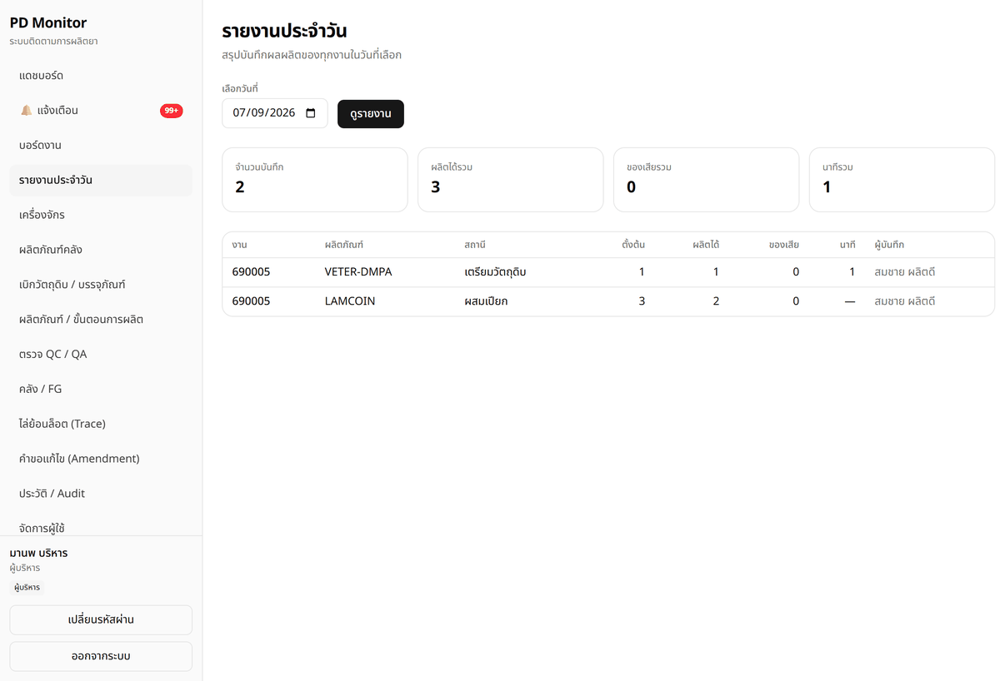

เลือกวันที่ → การ์ดสรุป 4 ใบ (จำนวนบันทึก · ผลิตได้ · ของเสีย · นาทีรวม) + ตารางรายบันทึก ·
กดที่เลขงานเพื่อกระโดดไปหน้ารายละเอียดงาน

---

## 2.8 เครื่องจักร

**เข้าจาก** เมนูซ้าย · **ใครเข้าได้** ดูได้ทุกคน

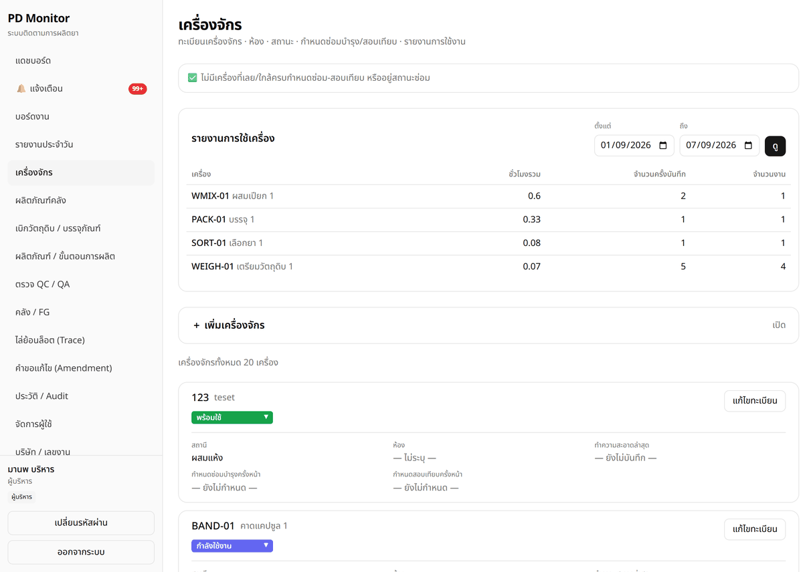

| ทำอะไร | ใครทำได้ |
|---|---|
| ดูทะเบียน + รายงานการใช้ | ทุกคน |
| เพิ่ม/แก้เครื่อง (รวมห้อง · สถานะ) | ฝ่ายผลิต · วิศวกรรม · ผู้บริหาร |
| **ตั้งวันซ่อมบำรุง / วันสอบเทียบครั้งหน้า** | **วิศวกรรม · ผู้บริหาร** |

**สถานะ 5 ค่า:** พร้อมใช้ · กำลังใช้งาน · ทำความสะอาด · ซ่อมบำรุง · ถึงกำหนดสอบเทียบ

> ⚠️ **เครื่องที่อยู่สถานะ "ซ่อมบำรุง" หรือ "ถึงกำหนดสอบเทียบ" จะไม่ขึ้นให้เลือกในฟอร์มบันทึกผลผลิต**

---

## 2.9 ผลิตภัณฑ์คลัง

**เข้าจาก** เมนูซ้าย · **ใครเข้าได้** ดูได้ทุกคน

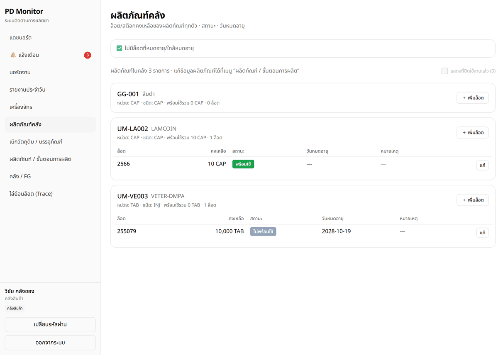

| ทำอะไร | ใครทำได้ |
|---|---|
| เพิ่ม/แก้ล็อต · สต็อก | คลังสินค้า · ผู้บริหาร |
| **ตั้งสถานะล็อต (พร้อมใช้ / ไม่พร้อมใช้)** | **ฝ่ายวางแผน · ผู้บริหาร** |

> 🔑 **คลังเพิ่มล็อตได้ แต่ปลดสถานะเป็นหน้าที่ฝ่ายวางแผน** — แยกกันโดยตั้งใจ

> 💡 มีแถบเตือน **ล็อตหมดอายุ / ใกล้หมดอายุ (ภายใน 30 วัน)** อยู่ด้านบน

---

## 2.10 เบิกวัตถุดิบ / บรรจุภัณฑ์ (หน้ารวม)

**เข้าจาก** เมนูซ้าย · **ใครเข้าได้** คลัง · ผลิต · ผู้บริหาร

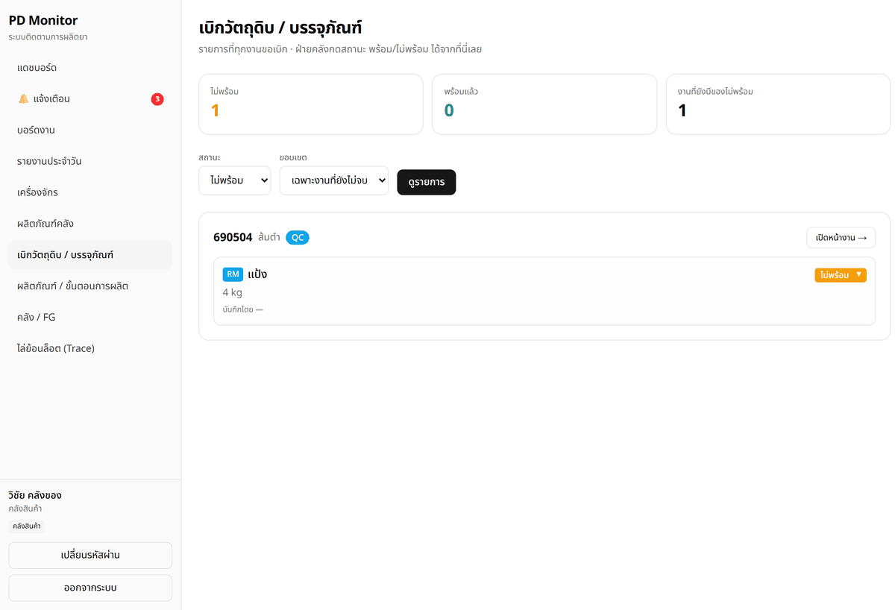

หน้านี้มีไว้ให้ **ฝ่ายคลังกดสถานะพร้อม/ไม่พร้อม ข้ามหลายงานจากที่เดียว**

> ⚠️ **เพิ่ม / แก้ / ลบรายการ ทำที่หน้ารายละเอียดงานเท่านั้น** — ที่นี่กดได้แค่สถานะ

---

## 2.11 ผลิตภัณฑ์ / ขั้นตอนการผลิต

**เข้าจาก** เมนูซ้าย · **ใครเข้าได้** ดูได้ทุกคน

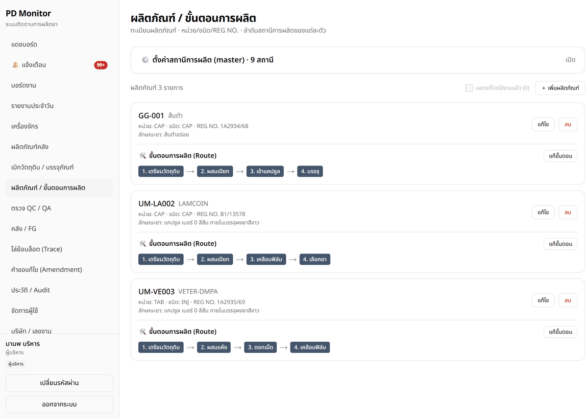

| ทำอะไร | ใครทำได้ |
|---|---|
| เพิ่ม/แก้/ลบผลิตภัณฑ์ | ฝ่ายวางแผน · คลัง · ผู้บริหาร |
| **แก้ขั้นตอนการผลิต (Route)** | **ผู้บริหารเท่านั้น** |
| **ตั้งค่าสถานีการผลิต (master)** | **ผู้บริหารเท่านั้น** |
| **ลบถาวร** | **ผู้บริหารเท่านั้น** (ยืนยันด้วยรหัสผ่าน) |

**ช่องของผลิตภัณฑ์:** รหัส · ชื่อ · หน่วย · REG NO. · ชนิด · **ลักษณะยา** (ไปโผล่บนใบแจ้งผลิต)

> ⚠️ **ยาที่ไม่มี Route จะบันทึกผลผลิตไม่ได้** และหน้างานจะขึ้นแถบเตือนสีแดง

> 💡 **ธง "แพ็ค" ของสถานี** เป็นตัวกำหนดช่อง "แพ็ค" บนแดชบอร์ด

---

## 2.12 ตรวจ QC / QA

**เข้าจาก** เมนูซ้าย · **ใครเข้าได้** QC · QA · ผู้บริหาร (คนอื่นจะเห็นจอแจ้งว่าไม่มีสิทธิ์)

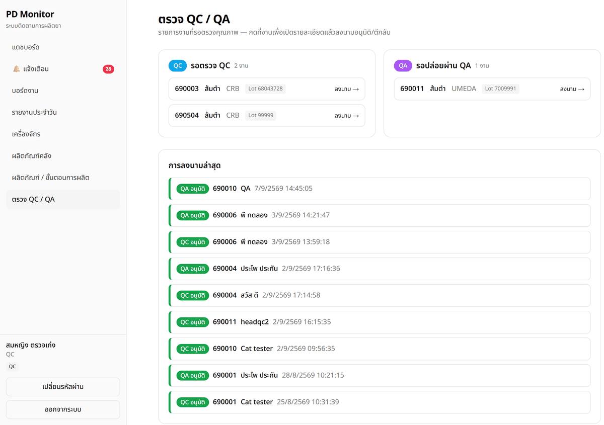

คิวงาน 2 คอลัมน์ (**รอ QC** / **รอ QA**) + ประวัติการลงนาม 30 รายการล่าสุด

---

## 2.13 คลัง / FG

**เข้าจาก** เมนูซ้าย · **ใครเข้าได้** คลัง · ผู้บริหาร

การ์ดสรุป 3 ใบ + ปุ่ม **"รับเข้าคลัง"** (จำนวน · หน่วย · ตำแหน่งจัดเก็บ · ล็อต · หมายเหตุ) ·
การรับเข้าคลังคือ **จุดปิดงาน** — งานจะหายจากบอร์ด

---

## 2.14 ไล่ย้อนล็อต (Trace)

**เข้าจาก** เมนูซ้าย · **ใครเข้าได้** QA · คลัง · ผู้บริหาร

ค้นด้วย **เลขงาน** หรือ **เลขล็อตผลิต** → ผัง **วัตถุดิบ → งาน → FG**

> ⚠️ **ค้นจากเลขล็อตวัตถุดิบไม่ได้แล้ว** — ระบบเบิกเปลี่ยนเป็นแบบลงรายการหน้างาน
> รายการเบิกจึงไม่ผูกกับล็อตในคลังอีกต่อไป

---

## 2.15 คำขอแก้ไข (Amendment)

**เข้าจาก** เมนูซ้าย (มีตัวเลขสีเหลืองบอกจำนวนค้าง) · **ใครเข้าได้** ผู้บริหาร · หัวหน้า QC · หัวหน้าฝ่ายผลิต

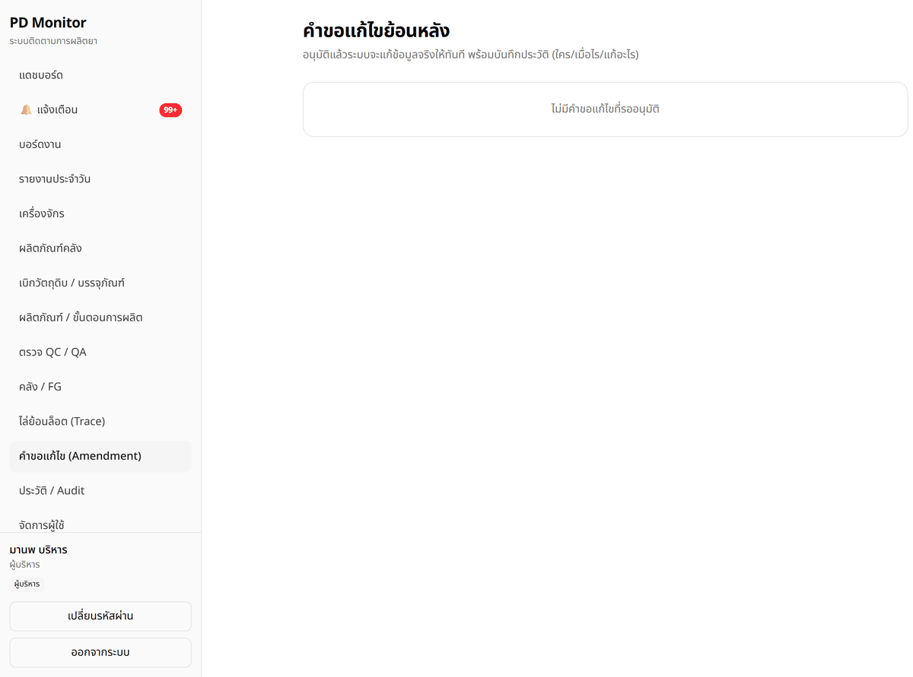

แสดง **ค่าเดิม → ค่าใหม่** ทีละช่อง พร้อมเหตุผล · กด **"✅ อนุมัติ + แก้ให้"** หรือ **ปฏิเสธ** (ต้องใส่หมายเหตุ)

| ชนิดคำขอ | ใครอนุมัติได้ |
|---|---|
| บันทึกผลผลิต | ผู้บริหาร · **หัวหน้าฝ่ายผลิต** |
| ผลตรวจ QC ระหว่างผลิต | ผู้บริหาร · **หัวหน้า QC** |

---

## 2.16 ประวัติ / Audit

**เข้าจาก** เมนูซ้าย · **ใครเข้าได้** ผู้บริหาร · QA

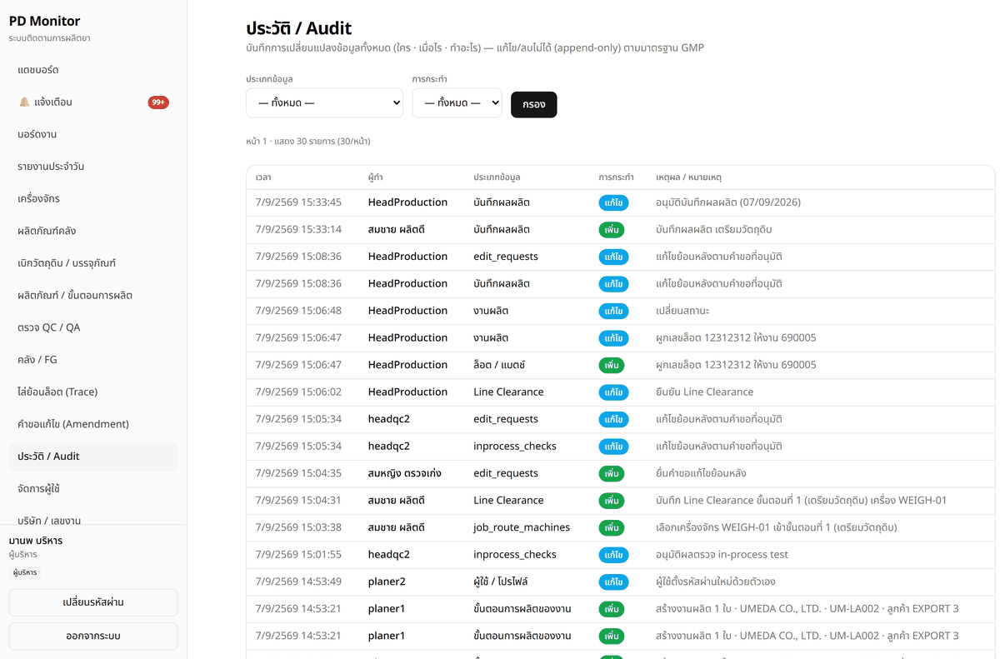

ทุกการเพิ่ม / แก้ไข / ลบ ถูกบันทึกไว้ **แก้ไม่ได้ ลบไม่ได้** · กรองตามประเภทข้อมูลและการกระทำ · แบ่งหน้า

---

## 2.17 จัดการผู้ใช้

**เข้าจาก** เมนูซ้าย · **ใครเข้าได้** ผู้บริหาร · **หัวหน้าแผนกทุกฝ่าย**

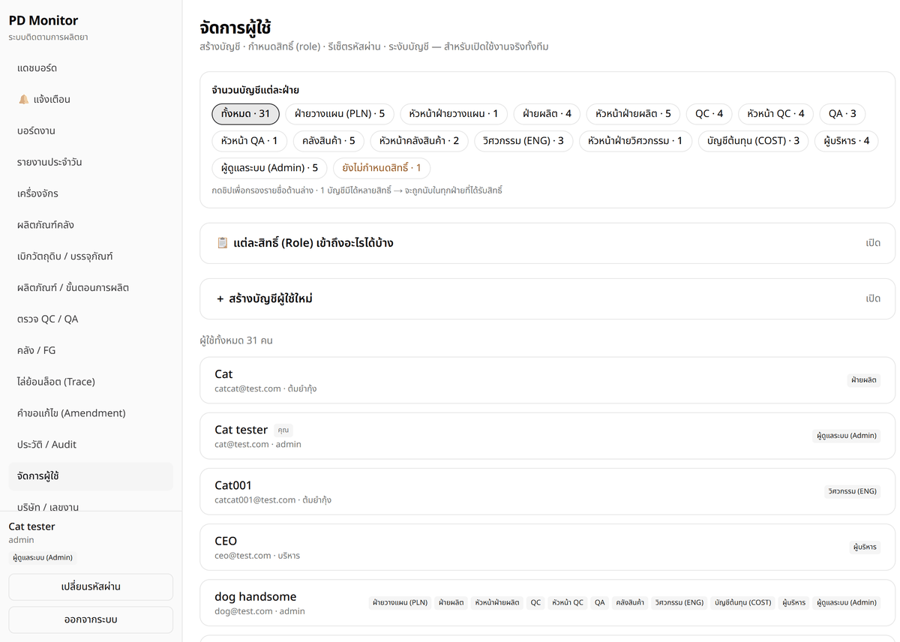

**ทำอะไรได้** — สร้างบัญชี · แก้ชื่อ/แผนก · กำหนดสิทธิ์ · รีเซ็ตรหัสผ่าน · ระงับบัญชี · **ลบบัญชี** ·
ดูจำนวนบัญชีแต่ละฝ่าย · กางตารางอธิบายสิทธิ์

| ใคร | เห็นใคร | ตั้งสิทธิ์อะไรได้ |
|---|---|---|
| ผู้บริหาร · ผู้ดูแลระบบ | ทุกคน | ทุกสิทธิ์ |
| หัวหน้าแผนก | **เฉพาะพนักงานในฝ่ายตัวเอง** | **เฉพาะสิทธิ์ของฝ่ายตัวเอง** |

> 💡 **บัญชีใหม่ถูกบังคับให้ตั้งรหัสผ่านเองตอนล็อกอินครั้งแรก**

> ⚠️ **ลบบัญชีที่เคยทำงานแล้ว = ปิดล็อกอิน + ล้างสิทธิ์ + ปลดอีเมล + ซ่อนชื่อ** —
> ประวัติและลายเซ็นยังอยู่ครบตาม GMP

> ⚠️ **ระงับหรือลบบัญชีตัวเองไม่ได้**

---

## 2.18 บริษัท / เลขงาน

**เข้าจาก** เมนูซ้าย · **ใครเข้าได้** ผู้บริหารเท่านั้น

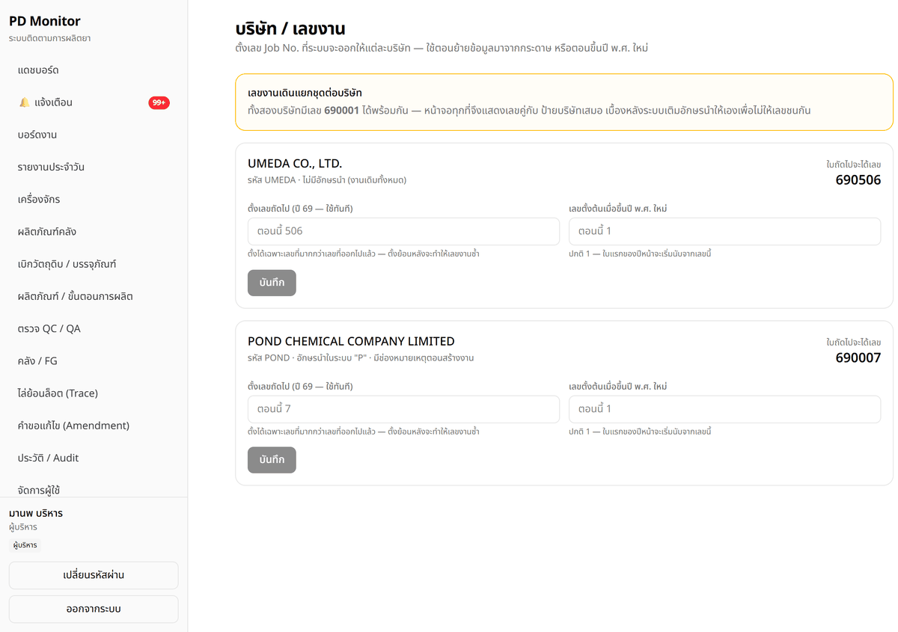

ตั้งอักษรนำหน้าเลขงาน และเลขตั้งต้นเมื่อขึ้นปี พ.ศ. ใหม่ ของแต่ละบริษัท

---

# 3 · กติกา GMP ที่ระบบบังคับ

หัวข้อนี้อธิบาย "ทำไมระบบถึงไม่ยอมให้กด" — ทุกข้อบังคับที่ **ฐานข้อมูล** ไม่ใช่แค่ซ่อนปุ่มบนหน้าจอ
ต่อให้เรียกตรงเข้าระบบก็ยังผ่านไม่ได้

---

## 3.1 กฎสองลายเซ็น — 5 ชุด

**คนทำกับคนรับรองต้องเป็นคนละคน** ทุกชุด

| ชุด | ผู้ทำ | ผู้รับรอง | ถ้าเป็นคนเดียวกันจะเจอ |
|---|---|---|---|
| **Line Clearance** | ฝ่ายผลิต | หัวหน้าฝ่ายผลิต · ผู้บริหาร | "ผู้ยืนยันต้องเป็นคนละคนกับผู้ทำ" |
| **บันทึกผลผลิตรายวัน** | ฝ่ายผลิต | หัวหน้าฝ่ายผลิต · ผู้บริหาร | "ผู้อนุมัติต้องเป็นคนละคนกับผู้บันทึก" |
| **ผลตรวจ In-process** | QC | หัวหน้า QC · ผู้บริหาร | "ผู้อนุมัติต้องเป็นคนละคนกับผู้ลงผล" |
| **ลงนาม QC / QA** | — | **QC / QA ตัวจริงเท่านั้น** | ปุ่มไม่ขึ้นให้เลย |
| **คำขอแก้ไขย้อนหลัง** | ทุกคนที่ล็อกอิน | ผู้บริหาร · หัวหน้าฝ่ายที่เกี่ยว | — |

> 💡 **แถบอนุมัติหลายรายการ** ของบันทึกผลผลิต จะ **ข้ามบันทึกของตัวเองให้อัตโนมัติ**
> แล้วรายงานว่าข้ามไปกี่รายการ ไม่ต้องมานั่งติ๊กออกทีละแถว

---

## 3.2 ด่านกั้นที่กดข้ามไม่ได้

| ด่าน | เงื่อนไข | ถ้าไม่ผ่านจะเจอ |
|---|---|---|
| **เริ่มผลิต** | ต้องมี **LOT No.** ก่อน | แถบเตือนสีเหลือง "ยังไม่มีเลขล็อต" |
| **บันทึกผลผลิต** | สถานะต้องเป็น **"กำลังผลิต"** เท่านั้น | ไม่มีปุ่มบันทึก |
| **บันทึกผลผลิต** | ผลิตภัณฑ์ต้องมี **Route** | แถบเตือนสีแดง "ไม่มีขั้นตอนการผลิต" |
| **ส่งตรวจ QC** | ต้องตรวจ in-process ครบทุกสถานีใน Route และ **หัวหน้า QC อนุมัติแล้ว** | แถบความคืบหน้า QC ยังไม่เต็ม |
| **ส่งตรวจ QC** | ต้องเป็น **ฝ่ายผลิต** เท่านั้น | ผู้บริหารไม่เห็นปุ่ม |
| **QA ปล่อยผ่าน → FG** | ต้องไม่มี **Incident Case ค้าง** | กดไม่ผ่าน |
| **ลงนาม QC / QA** | ต้องยืนยัน **รหัสผ่านของตัวเอง** | ลงนามไม่สำเร็จ |
| **Line Clearance** | ต้องติ๊กอย่างน้อย 1 ข้อ | ยืนยันไม่ได้ |
| **เลือกเครื่องจักรให้ขั้นตอน** | เครื่องต้องอยู่ **สถานีเดียวกับขั้นตอน** | ไม่ขึ้นในรายการให้เลือก |
| **บันทึกผลผลิต** | เครื่องที่ **ซ่อมบำรุง / ถึงกำหนดสอบเทียบ** จะไม่ขึ้นให้เลือก | — |

---

## 3.3 ประวัติที่ลบไม่ได้ (Audit trail)

- ทุกการ **เพิ่ม / แก้ไข / ลบ** ถูกบันทึกพร้อม **ใคร · เมื่อไร · ค่าเดิม → ค่าใหม่**
- **แก้ไม่ได้ ลบไม่ได้** แม้แต่ผู้ดูแลระบบ
- **ลบบัญชีที่เคยทำงานแล้ว ไม่ลบประวัติทิ้ง** — ระบบปิดล็อกอิน ล้างสิทธิ์ ปลดอีเมล แล้วซ่อนชื่อแทน
- **การแก้ช่องที่ถูกล็อก** ต้องระบุเหตุผล และเหตุผลนั้นถูกเก็บไว้ในประวัติด้วย
- **การลบจุดเก็บตัวอย่าง** ต้องระบุเหตุผล
- **การยกเลิก / ปิดข้ามขั้น Incident Case** ต้องระบุเหตุผล และเหตุผลไปอยู่ใน timeline ของเคส

---

## 3.4 คำขอแก้ไขย้อนหลัง (Amendment)

ข้อมูล 2 ชนิดที่แก้เองไม่ได้ ต้องขออนุมัติ

| ชนิด | ผู้ยื่น | ผู้อนุมัติ |
|---|---|---|
| **บันทึกผลผลิต** | ผู้บันทึก | ผู้บริหาร · หัวหน้าฝ่ายผลิต |
| **ผลตรวจ QC ระหว่างผลิต** | QC (ฝ่ายอื่นยื่นไม่ได้) | ผู้บริหาร · หัวหน้า QC |

**ขั้นตอน** — กด "✏️ ขอแก้ไข" ที่แถวนั้น → แก้ค่า + **ระบุเหตุผล** → ส่งคำขอ →
ผู้อนุมัติเห็นในเมนู "คำขอแก้ไข" พร้อม diff ค่าเดิม/ค่าใหม่ → อนุมัติ (ระบบแก้ให้เลย) หรือปฏิเสธ (ต้องใส่หมายเหตุ)
→ **ผลส่งกลับถึงผู้ยื่นคนเดียว**

> ⚠️ **แก้บันทึกผลผลิตที่อนุมัติไปแล้ว = แถวเด้งกลับเป็น "รออนุมัติ" ใหม่** และหัวหน้าได้แจ้งเตือนอีกครั้ง

---

# 4 · สรุปรายฝ่าย

หน้าในหัวข้อนี้ออกแบบให้ **ฉีกไปแปะข้างเครื่อง / ติดบอร์ดของแผนก** ได้เลย

---

## 4.1 ฝ่ายวางแผน (PLN / PLN-L)

**หน้าที่หลัก** วางแผนการผลิต — เปิดงานเข้าระบบ

**บันทึก / แก้ไขได้**
- สร้างงานผลิตใหม่ทีละหลายใบ (ออเดอร์ + งาน · เลขล็อตเป็นของฝ่ายผลิต)
- เพิ่ม / แก้ / ลบผลิตภัณฑ์ในทะเบียน
- ตั้งสถานะล็อตในคลัง (พร้อมใช้ / ไม่พร้อมใช้)
- ยืนยันแผนผลิต (รอแจ้งผลิต → มีแผนแล้ว)
- ปริ้นใบแจ้งผลิต F.PLN.01
- แก้ข้อมูลงานฝั่งวางแผน — ลูกค้า · C.P.O DATE · กำหนดส่ง · Batch Size · รูปแบบ/ขนาดบรรจุ

**หัวหน้าฝ่ายวางแผนได้เพิ่ม** สร้าง / ดูแล / ลบบัญชีพนักงานในฝ่ายวางแผน

**ทำไม่ได้** กรอก LOT No. · ทำ Line Clearance · บันทึกผลผลิต · ลงนาม QC/QA

---

## 4.2 ฝ่ายผลิต (PROD / PROD-L)

**หน้าที่หลัก** ผลิตจริงหน้างาน — บันทึกผลผลิตรายวัน

**บันทึก / แก้ไขได้**
- กรอก LOT No. ให้งาน (ก่อนเริ่มผลิต)
- ทำ Line Clearance (ผู้ปฏิบัติ) → เริ่มผลิต
- บันทึกผลผลิตรายสถานี (กะ · ช่วงเวลา/OT · เครื่องจักร · ยอด · ของเสีย · นาที · จำนวนคน)
- ลงรายการวัตถุดิบ/บรรจุภัณฑ์ที่ต้องเบิก **(กดสถานะพร้อมไม่ได้)**
- ผูก / ถอดเครื่องจักรกับขั้นตอนการผลิตของงาน
- **ส่งตรวจ QC** (ขั้นนี้ฝ่ายผลิตเท่านั้น)
- เพิ่ม / แก้ทะเบียนเครื่องจักร (ยกเว้นกำหนดซ่อม / สอบเทียบ)
- เปิด Incident Case · ขออนุมัติแก้ไขย้อนหลัง

**หัวหน้าฝ่ายผลิตได้เพิ่ม**
- **ยืนยัน Line Clearance** ที่พนักงานติ๊กไว้ (ต้องคนละคนกับผู้ทำ)
- **อนุมัติ / ไม่อนุมัติบันทึกผลผลิต** (ต้องคนละคนกับผู้บันทึก)
- **อนุมัติคำขอแก้ไขบันทึกผลผลิตย้อนหลัง**
- สร้าง / ดูแล / ลบบัญชีพนักงานในฝ่ายผลิต

**ทำไม่ได้** กดสถานะความพร้อมของรายการเบิก (เป็นของคลัง) · ลงนาม QC/QA

---

## 4.3 QC (QC / QC-L)

**หน้าที่หลัก** ตรวจคุณภาพระหว่างผลิต + ตัดสิน QC

**บันทึก / แก้ไขได้**
- บันทึกผลตรวจ in-process QC รายสถานี (หัวข้อ · ค่า · ผล · Valid date)
- **QC ผ่าน → ส่ง QA** และ **QC ตีกลับ** (ต้องลงนามด้วยรหัสผ่าน)
- เปิด Incident Case
- ขอแก้ไขผลตรวจ in-process ย้อนหลัง (ฝ่ายอื่นขอไม่ได้)

**หัวหน้า QC ได้เพิ่ม**
- **อนุมัติ / ไม่อนุมัติผลตรวจ in-process** ที่ QC ลงไว้
- **อนุมัติคำขอแก้ไขผลตรวจ in-process**
- สร้าง / ดูแล / ลบบัญชีพนักงานในฝ่าย QC

**เห็นเพิ่ม** หน้าตรวจ QC / QA

---

## 4.4 QA (QA / QA-L)

**หน้าที่หลัก** ปล่อยผ่านล็อต + ดูแลเอกสารคุณภาพ

**บันทึก / แก้ไขได้**
- บันทึก / แก้ไข / ลบ จุดเก็บตัวอย่าง (ตรวจ Finished product) — ลบต้องระบุเหตุผล
- **QA ปล่อยผ่าน → FG** และ **QA ตีกลับ** (ต้องลงนามด้วยรหัสผ่าน)
- **ตรวจสอบ Incident Case** — ระบุประเภท DEV / OOS / NC + เลขที่เอกสาร + แผนกที่รับผิดชอบ (หลายแผนกได้)
  แล้วอนุมัติปิดเคส หรือส่งกลับให้แผนกแก้ใหม่

**หัวหน้า QA ได้เพิ่ม** สร้าง / ดูแล / ลบบัญชีพนักงานในฝ่าย QA

**เห็นเพิ่ม** ประวัติ / Audit · ไล่ย้อนล็อต (Trace) · คำขอแก้ไข (ดูได้ ไม่ใช่ผู้อนุมัติ)

> 🔑 **QA ไม่ได้เป็นผู้อนุมัติคำขอแก้ไขแล้ว** — คำขอแก้ผลตรวจ in-process เป็นเรื่องภายในของฝ่าย QC

---

## 4.5 คลังสินค้า (WH / WH-L)

**หน้าที่หลัก** คลังผลิตภัณฑ์ + รับสินค้าสำเร็จรูปเข้าคลัง

**บันทึก / แก้ไขได้**
- เพิ่ม / แก้ / ลบผลิตภัณฑ์ในทะเบียน (แก้ขั้นตอนการผลิตไม่ได้)
- ล็อต / สต็อกของผลิตภัณฑ์ทุกตัว
- **กดสถานะ พร้อม / ไม่พร้อม ให้รายการเบิกของแต่ละงาน** (เพิ่ม/แก้/ลบรายการไม่ได้)
- **รับ FG เข้าคลัง** = ปิดงาน

**หัวหน้าคลังได้เพิ่ม** สร้าง / ดูแล / ลบบัญชีพนักงานในฝ่ายคลัง

**เห็นเพิ่ม** คลัง / FG · เบิกวัตถุดิบ / บรรจุภัณฑ์ · ไล่ย้อนล็อต (Trace)

> ⚠️ **ตั้งสถานะล็อตไม่ได้** — เป็นของฝ่ายวางแผน

---

## 4.6 วิศวกรรม (ENG / ENG-L)

**หน้าที่หลัก** ดูแลเครื่องจักร — ซ่อมบำรุง / สอบเทียบ

**บันทึก / แก้ไขได้**
- เพิ่ม / แก้ทะเบียนเครื่องจักร (รวมห้อง · สถานะ)
- **กำหนดวันซ่อมบำรุง + วันสอบเทียบครั้งหน้า** (ฝ่ายผลิตทำข้อนี้ไม่ได้)
- บันทึกหมายเหตุ Incident Case ในนามฝ่ายวิศวกรรม

**หัวหน้าฝ่ายวิศวกรรมได้เพิ่ม** สร้าง / ดูแล / ลบบัญชีพนักงานในฝ่ายวิศวกรรม

**เห็นเพิ่ม** รายงานการใช้เครื่อง

---

## 4.7 บัญชีต้นทุน (COST)

**หน้าที่หลัก** ดูต้นทุนค่าแรงทางตรง

**บันทึก / แก้ไขได้** ปรับอัตราค่าแรง (฿/ชม.) ที่ใช้คำนวณบนแดชบอร์ด

**เห็นเพิ่ม** ต้นทุนค่าแรงทางตรง (DL cost) รวม + แยกรายสถานี · คน-ชั่วโมงและชั่วโมงทำงานตามช่วงวันที่

---

## 4.8 ผู้บริหาร (MGR) และผู้ดูแลระบบ (ADM)

**ผู้บริหาร — ทำแทนได้เกือบทุกอย่าง**
- สร้างงาน / ยืนยันแผน / เริ่มผลิต / เครื่องจักร / ผลิตภัณฑ์
- **ยืนยัน Line Clearance · อนุมัติบันทึกผลผลิต · อนุมัติผลตรวจ in-process** (แทนหัวหน้าฝ่ายได้)
- จัดการผู้ใช้ + กำหนดสิทธิ์ · รีเซ็ตรหัสผ่าน · ระงับ / ลบบัญชี
- สถานีการผลิต (master) + ขั้นตอนการผลิต (Route) ของแต่ละผลิตภัณฑ์
- ตั้งบริษัท / เลขงาน · อนุมัติคำขอแก้ไขย้อนหลังทุกชนิด · ลบงาน
- เห็นแจ้งเตือนของทุกฝ่าย (ยกเว้นใบที่จ่าหน้าถึงตัวบุคคล)

> 🔒 **สิ่งเดียวที่ผู้บริหารทำไม่ได้: ลงนามขั้น QC / QA**
> ระบบบังคับว่าผู้ลงนามต้องถือสิทธิ์ QC หรือ QA จริง ตามแนว GMP ที่ผู้ปล่อยผ่านต้องเป็นผู้มีคุณสมบัติของฝ่ายนั้น

**ผู้ดูแลระบบ (Admin)** ผ่านทุกสิทธิ์ · เห็นทุกหน้าในระบบ

---

# 5 · ถาม–ตอบ และแก้ปัญหาที่พบบ่อย

**เข้าระบบไม่ได้ / ขึ้นว่าบัญชีถูกระงับ**
ติดต่อหัวหน้าแผนกหรือผู้ดูแลระบบให้เปิดใช้งานบัญชีหรือรีเซ็ตรหัสผ่านให้

**เห็นเมนูน้อยกว่าเพื่อน**
ปกติ — ระบบซ่อนเมนูที่ฝ่ายคุณไม่ได้ใช้ ถ้าคิดว่าควรเห็น ให้หัวหน้าตรวจสิทธิ์ในหน้าจัดการผู้ใช้

**กด "เริ่มผลิต" ไม่ได้**
ยังไม่ได้กรอก **LOT No.** — ฝ่ายผลิตกรอกที่การ์ดข้อมูลงาน

**ไม่มีปุ่ม "บันทึกผลผลิต"**
① สถานะงานยังไม่ใช่ "กำลังผลิต" หรือ ② ผลิตภัณฑ์ยังไม่มี **ขั้นตอนการผลิต (Route)** — ดูแถบเตือนด้านบนของหน้า

**เลือกเครื่องจักรที่ต้องการไม่เจอ**
เครื่องนั้นยังไม่ได้ผูกกับ **สถานี** ของขั้นตอนนี้ (ตั้งที่หน้าเครื่องจักร) ·
หรือเครื่องอยู่สถานะ **ซ่อมบำรุง / ถึงกำหนดสอบเทียบ**

**ยืนยัน Line Clearance เองไม่ได้**
ถูกต้องแล้ว — ผู้ยืนยันต้องเป็น **หัวหน้าฝ่ายผลิต** และต้องเป็นคนละคนกับผู้ทำ

**กด "ส่งตรวจ QC" ไม่ได้**
① ต้องเป็นบัญชี **ฝ่ายผลิต** (ผู้บริหารกดแทนไม่ได้) ② ผลตรวจ in-process ต้องครบทุกสถานีใน Route
**และหัวหน้า QC อนุมัติแล้ว** — ดูแถบความคืบหน้าในการ์ด In-process QC

**QA กด "ปล่อยผ่าน" ไม่ได้**
ยังมี **Incident Case ค้าง** อยู่ — ต้องปิดหรือยกเลิกเคสให้หมดก่อน

**ผู้บริหารกดลงนาม QC/QA แทนไม่ได้**
ถูกต้องแล้ว — ต้องเป็น QC หรือ QA ตัวจริงเท่านั้น ตามแนว GMP

**บันทึกผิด แก้เองไม่ได้**
ใช้ปุ่ม **"✏️ ขอแก้ไข"** ที่แถวนั้น แล้วให้ผู้มีสิทธิ์อนุมัติ (ดู §3.4)

**ตัวเลขบนกระดิ่งไม่ตรงกับที่เห็นในกล่อง**
ไม่ควรเกิดแล้ว · ถ้ายังเจอ ให้ลองรีเฟรชหนึ่งครั้ง — และจำไว้ว่า ⏰ เกินกำหนด กับ 🐢 ค้างนาน
**ไม่ถูกนับ** ในตัวเลขสีแดงโดยตั้งใจ

**แจ้งเตือนไม่หายสักที**
แจ้งเตือนชุดใหม่ต้องกด **"อ่านแล้ว"** เอง ไม่หายอัตโนมัติ

**งานหายจากบอร์ด**
งานที่รับเข้าคลัง (FG) แล้วจะถูกซ่อนออกจากบอร์ด — ยังค้นหาเจอและเปิด eBR ได้

**ปริ้นแล้วมีชื่อเรื่อง / เวลา / URL ติดมาบนกระดาษ**
เอาติ๊ก **"Headers and footers"** ออกในหน้าต่างพิมพ์ของเบราว์เซอร์

**ปริ้นแล้วขนาดไม่ตรงฟอร์มกระดาษ**
ตั้ง **Margins = Default** และ **Scale = 100%** ในหน้าต่างพิมพ์

**ค้นหาด้วยเลขล็อตวัตถุดิบใน Trace ไม่เจอ**
ทำไม่ได้แล้ว — ใช้ **เลขงาน** หรือ **เลขล็อตผลิต** แทน

**เน็ตหลุดตอนกดบันทึกผลผลิต**
ระบบเก็บไว้ในเครื่องแล้วส่งซ้ำให้เองเมื่อเน็ตกลับมา และกันไม่ให้เกิดแถวซ้ำ

> 📌 **ถ้าเจอปัญหาที่คู่มือนี้ไม่ครอบคลุม** — จดเลขงานและเวลาที่เกิด แล้วแจ้งผู้ดูแลระบบ
> ข้อความสีแดงที่ระบบขึ้นให้ตอนกดไม่ผ่านมักบอกสาเหตุไว้แล้ว ให้ถ่ายภาพหน้าจอส่งไปด้วย

---

# ภาคผนวก

## ก. ตารางสิทธิ์ฉบับเต็ม

| ทำอะไร | ใครทำได้ |
|---|---|
| สร้างงาน / ยืนยันแผนผลิต | วางแผน · ผู้บริหาร |
| เพิ่ม/แก้/ลบผลิตภัณฑ์ | วางแผน · คลัง · ผู้บริหาร |
| แก้ขั้นตอนการผลิต (Route) · สถานี (master) | **ผู้บริหารเท่านั้น** |
| เพิ่ม/แก้เครื่องจักร | ผลิต · วิศวกรรม · ผู้บริหาร |
| ตั้งวันซ่อมบำรุง / สอบเทียบ | วิศวกรรม · ผู้บริหาร |
| ตั้งสถานะล็อต | วางแผน · ผู้บริหาร |
| กรอก LOT No. ให้งาน | ผลิต · ผู้บริหาร |
| เพิ่ม/แก้/ลบรายการเบิก | ผลิต · ผู้บริหาร |
| กดสถานะ พร้อม/ไม่พร้อม ของรายการเบิก | **คลัง · ผู้บริหาร** |
| ผูกเครื่องจักรกับขั้นตอนของงาน | ผลิต · ผู้บริหาร |
| **ทำ** Line Clearance | ผลิต · ผู้บริหาร |
| **ยืนยัน** Line Clearance | **หัวหน้าฝ่ายผลิต · ผู้บริหาร** |
| **ลงผล** in-process QC | QC · หัวหน้า QC · ผู้บริหาร |
| **อนุมัติ** in-process QC | **หัวหน้า QC · ผู้บริหาร** |
| **อนุมัติ** บันทึกผลผลิต | **หัวหน้าฝ่ายผลิต · ผู้บริหาร** |
| บันทึกจุดเก็บตัวอย่าง | QA · ผู้บริหาร |
| ส่งตรวจ QC | **ฝ่ายผลิตเท่านั้น** |
| ลงนาม QC (ผ่าน/ตีกลับ) | **QC เท่านั้น** |
| ลงนาม QA (ปล่อยผ่าน/ตีกลับ) | **QA เท่านั้น** |
| รับ FG เข้าคลัง | คลัง · ผู้บริหาร |
| เปิด Incident Case | **ทุกคนที่ล็อกอิน** |
| ตรวจสอบ / ปิด Incident Case | QA · ผู้บริหาร |
| เพิ่มหมายเหตุใน Incident Case | ทุกคนที่ล็อกอิน |
| จัดการทะเบียน Status ของงาน | ทุกคนที่ล็อกอิน |
| เห็นต้นทุนค่าแรง | บัญชีต้นทุน · ผู้บริหาร |
| อนุมัติคำขอแก้ไข | ผู้บริหาร · หัวหน้า QC (in-process) · หัวหน้าฝ่ายผลิต (บันทึกผลผลิต) |
| จัดการผู้ใช้ | ผู้บริหาร · หัวหน้าแผนก (เฉพาะฝ่ายตัวเอง) |
| ตั้งบริษัท / เลขงาน | **ผู้บริหารเท่านั้น** |
| ลบงาน | ผู้บริหาร · ผู้ดูแลระบบ |
| ดูประวัติ / Audit | ผู้บริหาร · QA |

---

## ข. คำศัพท์ที่ใช้ในระบบ

| คำ | หมายถึง |
|---|---|
| **Job No.** | เลขงานผลิต ระบบออกให้อัตโนมัติ แยกชุดตามบริษัท |
| **LOT No. / Batch NO.** | เลขล็อตผลิต — ฝ่ายผลิตกรอก ใช้ไล่ย้อนได้ |
| **Batch Size** | จำนวนที่สั่งผลิตของงานใบนั้น |
| **Route / ขั้นตอนการผลิต** | ลำดับสถานีที่ยาตัวนั้นต้องเดินผ่าน |
| **สถานี** | ขั้นตอนการผลิตหนึ่งขั้น เช่น ตอกเม็ด · เคลือบฟิล์ม · บรรจุ |
| **Line Clearance** | การเคลียร์และเตรียมสายการผลิตก่อนเริ่มงานใหม่ |
| **In-process QC** | การตรวจคุณภาพระหว่างผลิต แยกตามสถานี |
| **Finished product** | การตรวจสินค้าสำเร็จรูป — ในระบบอยู่ในการ์ด "จุดเก็บตัวอย่าง" |
| **Incident Case** | เหตุผิดปกติ (เดิมเรียก Deviation) — flow 5 ขั้น |
| **DEV / OOS / NC** | ประเภทเอกสารของ Incident Case ที่ QA เป็นผู้คัดแยก |
| **FG** | Finished Goods — สินค้าสำเร็จรูปที่รับเข้าคลังแล้ว |
| **eBR** | Electronic Batch Record — แฟ้มบันทึกการผลิตของงาน 1 ใบ |
| **Amendment** | คำขอแก้ไขข้อมูลย้อนหลัง |
| **Audit trail** | ประวัติการเปลี่ยนแปลงที่แก้ไม่ได้ ลบไม่ได้ |
| **Yield** | ผลิตได้ ÷ ยอดตั้งต้น |
| **WIP** | Work In Progress — งานที่เริ่มผลิตแล้วแต่ยังไม่เข้าคลัง |
| **C.P.O DATE** | วันที่ลูกค้าสั่งผลิต |
| **F.PLN.01 / F.PLN.10** | รหัสฟอร์มกระดาษ — ใบแจ้งผลิต / ตารางบอร์ดงาน |

---

## ค. สิ่งที่เปลี่ยนไปจากคู่มือฉบับก่อน (กรกฎาคม 2569)

ถ้าคุณเคยอ่านคู่มือชุดเดิม สิ่งเหล่านี้ **เปลี่ยนไปแล้ว**

**ของที่เอาออกจากระบบ**

| เดิมมี | ตอนนี้ |
|---|---|
| สูตรการผลิต / BOM | **ยกเลิกทั้งชุด** — ใช้ "ขั้นตอนการผลิต (Route)" แทน |
| ประเภทผลิตภัณฑ์ | ยกเลิก |
| กลุ่มหลัก | ยกเลิก — ใช้สถานีจริงอย่างเดียว |
| ใบเบิกที่ผูกกับล็อตในคลัง | เปลี่ยนเป็น **ลงรายการเบิกหน้างาน** ⇒ Trace ไล่ย้อนจากเลขล็อตวัตถุดิบไม่ได้แล้ว |
| Deviation (3 สถานะ) | เปลี่ยนเป็น **Incident Case (5 สถานะ)** + QA คัดประเภท DEV/OOS/NC |

**ของใหม่ที่คู่มือเดิมไม่มี**

- **ระบบแจ้งเตือนรายฝ่าย 13 ชนิด** + ชิปตัวกรอง + แจ้งเตือนรายบุคคล
- **ปริ้นใบแจ้งผลิต F.PLN.01** (UMEDA / POND) และ **ปริ้นตารางบอร์ดงาน F.PLN.10 + ออก Excel**
- **บริษัท UMEDA / POND** แยกชุดเลขงาน
- **สิทธิ์หัวหน้าแผนก 6 ฝ่าย** (รวมเป็น 15 สิทธิ์) + หัวหน้าดูแลบัญชีลูกน้องได้
- **การอนุมัติบันทึกผลผลิตโดยหัวหน้าฝ่ายผลิต** และ **การอนุมัติผลตรวจ in-process โดยหัวหน้า QC**
- **แดชบอร์ด Pending Order (Plan + WIP)**
- **แท็บขั้นตอนการผลิต** + **Line Clearance แยกตามขั้นตอน × เครื่อง**
- บันทึกผลผลิตแบบ **กะ / OT / นาที** และ **หน่วยแยกรายช่อง**
- **ลักษณะยา** ในทะเบียนผลิตภัณฑ์
- **ลบบัญชีผู้ใช้** · **ตั้ง Status ย่อย + เดือนแผน** ของงาน
